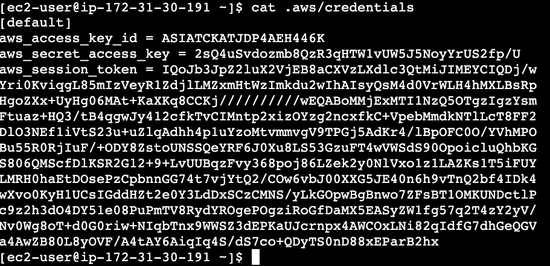
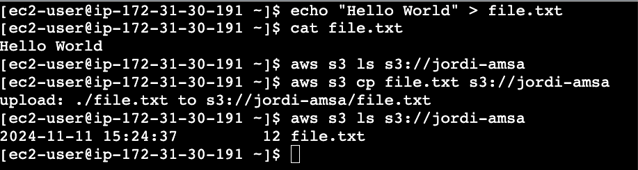
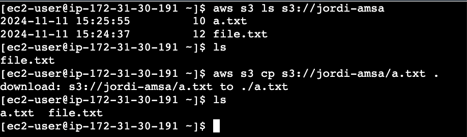
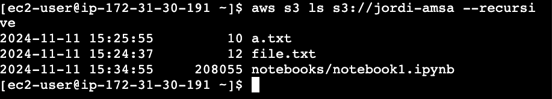

# AWS S3

Amazon Simple Storage Service (S3) és un servei de magatzematge d'objectes que ofereix escalabilitat, disponibilitat i durabilitat. Aquest servei permet emmagatzemar i recuperar dades a través d'una interfície web.

Per a més informació, consulta la [documentació oficial d'Amazon S3](https://docs.aws.amazon.com/es_es/AmazonS3/latest/userguide/Welcome.html).

La capa gratuita d'AWS inclou 5 GB de magatzematge d'objectes, 20.000 sol·licituds GET i 2.000 sol·licituds PUT al mes. Superades aquestes limitacions, es facturaran segons el consum.

## Configuració d'una instància EC2 per accedir a S3

Per accedir a S3 des d'una instància EC2, primer cal configurar les credencials d'accés a S3 a la instància. Aquests són els passos a seguir:

1. Executa el següent comandament per configurar les credencials AWS a la instància:

    ```bash
    aws configure
    ```

    Completa els camps amb les teves credencials:

    ```plaintext
    AWS Access Key ID [None]: <ACCESS_KEY>
    AWS Secret Access Key [None]: <SECRET_KEY>
    Default region name [None]: us-east-1
    Default output format [None]: None
    ```

    

2. Alternativament, pots configurar directament la teva `Access Token`:

    ```bash
    aws configure set aws_session_token <ACCESS_TOKEN>
    ```

Un cop configurades les credencials, la instància EC2 estarà preparada per accedir a S3.

**Nota**: Per obtenir les credencials d'accés a AWS, heu de visitar *AWS Details*.

### Operacions bàsiques amb S3

1. **Copiar un document d'EC2 a S3:**

    ```bash
    echo "Hello World" > file.txt
    aws s3 cp file.txt s3://<bucket-name>/file.txt
    ```

    

2. **Copiar un document de S3 a EC2:**

    ```bash
    # Assumeix que `a.txt` ja existeix a S3.
    dir=/home/ec2-user
    aws s3 cp s3://<bucket-name>/a.txt $dir/a.txt
    ```

    

3. **Crear una carpeta a S3:**

    ```bash
    aws s3 mb s3://<bucket-name>/folder
    ```

4. **Eliminar un document de S3:**

    ```bash
    aws s3 rm s3://<bucket-name>/file.txt
    ```

5. **Eliminar documents de S3 de manera recursiva:**

    ```bash
    aws s3 rm s3://<bucket-name>/ --recursive
    ```

6. **Llistar els documents d'un bucket de S3:**

    ```bash
    aws s3 ls s3://<bucket-name>
    ```

7. **Llistar els documents d'un bucket de S3 de forma recursiva:**

    ```bash
    aws s3 ls s3://<bucket-name> --recursive
    ```

8. **Sincronitzar un directori local amb un bucket de S3:**

    ```bash
    aws s3 sync /home/ec2-user s3://<bucket-name>
    ```

9. **Sincronitzar un bucket de S3 amb un directori local:**

    ```bash
    aws s3 sync s3://<bucket-name> /home/ec2-user
    ```

Per exemple, podem descarregar un notebook de Jupyter a la instància EC2 i pujar-lo a S3 sincronitzant la carpeta local (notebooks) amb el bucket de S3 (jordi-amsa/notebooks):

```bash
aws s3 mb s3://jordi-amsa/notebooks
mkdir notebooks
cd notebooks
wget https://github.com/JordiMateoUdL/Model-reusability-on-the-edge/blob/master/notebooks/Generating%20synthethic%20data.ipynb
mv 'Generating synthethic data.ipynb' notebook1.ipynb
aws s3 sync notebooks s3://jordi-amsa/notebooks
```


