# Arquitectura Escalable per a WordPress

En aquesta pràctica, dissenyarem i implementarem una arquitectura escalable i segura per a una aplicació WordPress, utilitzant els serveis d’AWS. Aquesta arquitectura constarà dels següents components:

- **Balancejador de Càrrega (Load Balancer)**: Serà responsable de distribuir uniformement el tràfic entrant entre múltiples instàncies EC2. Això assegura una alta disponibilitat i resiliència davant augments de càrrega.

- **Instàncies EC2**: Aquestes màquines virtuals allotjaran l’aplicació WordPress. Estaran dins d’un grup d’autoscaling, que permetrà ajustar dinàmicament el nombre d’instàncies en funció de la demanda.

- **Base de Dades RDS**: Utilitzarem Amazon RDS per gestionar la base de dades de WordPress.

@TODO: Afegir diagrama de l'arquitectura

## Creació de la VPC i les subxarxes

En primer lloc, definirem la VPC per a la nostra arquitectura. Aquesta VPC la definirem amb la xarxa **10.0.0.0/16**. Això ens permetrà tenir fins a 65.536 adreces IP disponibles suficients per al nostre cas d'ús.

Podem definir la VPC utilitzant AWS CloudFormation:

```yaml
AMSAVPC:
    Type: AWS::EC2::VPC
    Properties:
        CidrBlock: 10.0.0.0/16
    Tags:
        - Key: Name
          Value: AMSA-VPC
```

o bé, utilitzant la interfície i els formularis d'AWS:

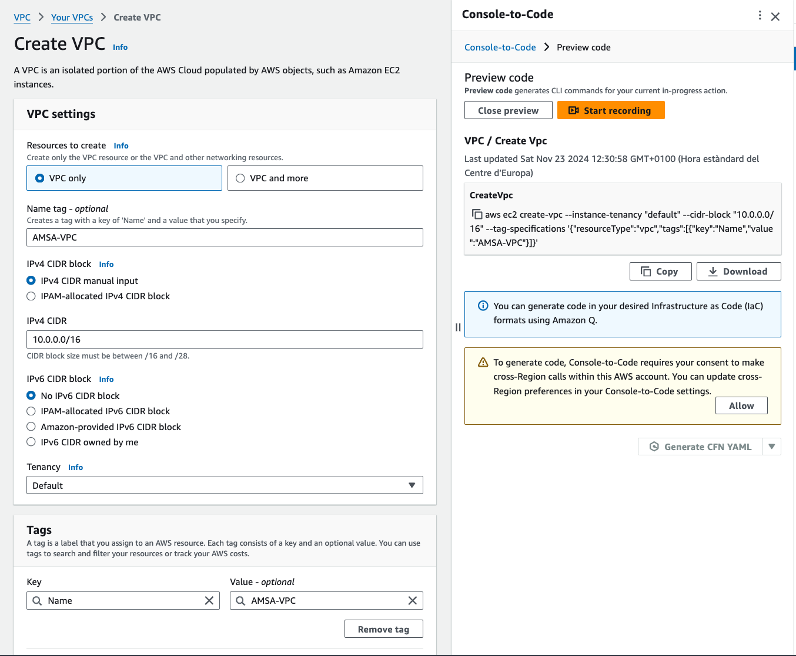

Com no hem indicat cap zona de disponibilitat, la VPC es crearà a la zona de disponibilitat per defecte de la regió seleccionada. Per a més informació sobre els parametres de la VPC, podeu consultar la [documentació d'AWS](https://docs.aws.amazon.com/AWSCloudFormation/latest/UserGuide/aws-resource-ec2-vpc.html).

A continuació crearem les subxarxes per a la nostra arquitectura:

- **AMSA-Front-01**: Subxarxa privada per a les instàncies de WordPress a la zona de disponibilitat **us-east-1a**.

    ```yaml
    AMSAFront01:
        Type: AWS::EC2::Subnet
        Properties:
            AvailabilityZone: us-east-1a
            CidrBlock: 10.0.1.0/24
            VpcId: !Ref AMSAVPC
        Tags:
            - Key: Name
            Value: AMSA-Front-01
    ```

    

- **AMSA-Front-02**: Subxarxa privada per a les instàncies de WordPress a la zona de disponibilitat **us-east-1b**.

    ```yaml
    AMSAFront02:
        Type: AWS::EC2::Subnet
        Properties:
            AvailabilityZone: us-east-1b
            CidrBlock: 10.0.2.0/24
            VpcId: !Ref AMSAVPC
        Tags:
            - Key: Name
            Value: AMSA-Front-02
    ```

    

- **AMSA-DATA**: Subxarxa privada per a la base de dades RDS a la zona de disponibilitat **us-east-1c**.

    ```yaml
    AMSADATA:
        Type: AWS::EC2::Subnet
        Properties:
            AvailabilityZone: us-east-1c
            CidrBlock: 10.0.3.0/24
            VpcId: !Ref AMSAVPC
        Tags:
            - Key: Name
            Value: AMSA-Data
    ```

    

En la següent figura es mostren les subxarxes creades a la VPC amb les seves propietats CIDR i la zona de disponibilitat associada:

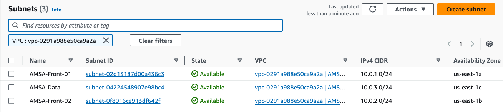

> **Nota**: Assegureu-vos de tenir en aquest punt la VPC i les subxarxes creades correctament abans de continuar amb la configuració dels altres components.

## Taules de rutes i associació de subxarxes

Per poder crear rutes personalitzades i decidir com es distribueix el tràfic a les subxarxes, crearem taules de rutes i les associarem a les subxarxes corresponents. En la primera fase, necessitarem que Front-01 i Front-02 tinguin accés a Internet, i que DATA no en tingui. DATA únicament necessitarà enrutar tràfic local i cap a les subxarxes Front-01 i Front-02.

En primer lloc crearem un Gateway d'Internet per a la nostra VPC:

```yaml
AMSAIG:
    Type: AWS::EC2::InternetGateway
    Properties:
        Tags:
            - Key: Name
              Value: AMSA-IG
```


I l'associarem a la nostra VPC:

```yaml
AMSAIGAttachment:
    Type: AWS::EC2::VPCGatewayAttachment
    Properties:
        VpcId: !Ref AMSAVPC
        InternetGatewayId: !Ref AMSAIG
```

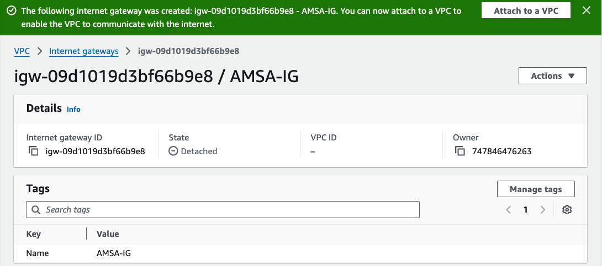

- **Taula de rutes per a la subxarxa AMSA-Front-01**:

    ```yaml
    AMSAFront01RouteTable:
        Type: AWS::EC2::RouteTable
        Properties:
            VpcId: !Ref AMSAVPC
        Tags:
            - Key: Name
            Value: AMSA-Front-01-RouteTable
    ```

    

  - **Associació de la taula de rutes amb la subxarxa AMSA-Front-01**:

    ```yaml
    AMSAFront01RouteTableAssociation:
        Type: AWS::EC2::SubnetRouteTableAssociation
        Properties:
            RouteTableId: !Ref AMSAFront01RouteTable
            SubnetId: !Ref AMSAFront01
    ```

    Per fer-ho, navegarem a la consola de VPC d'AWS, seleccionarem la subxarxa **AMSA-Front-01** anireu a la secció *Subnet Associations* i clicareu a *Edit subnet associations*. A continuació, seleccionarem la taula de rutes **AMSA-Front-01-RouteTable** i clicarem a *Save*.

    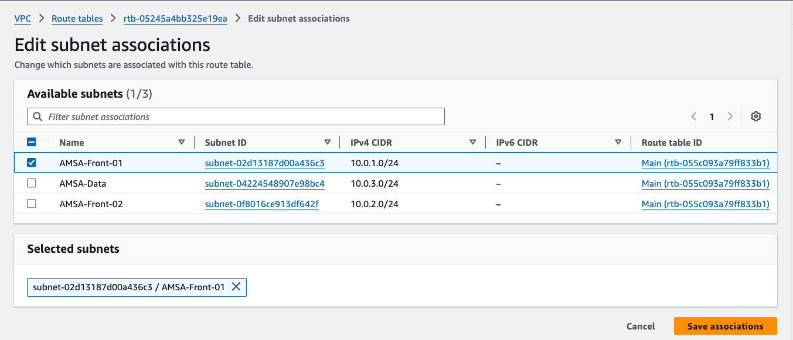

    - **Permetem el tràfic de sortida a Internet**:
  
      ```yaml
      AMSAFront01Route:
          Type: AWS::EC2::Route
          Properties:
              RouteTableId: !Ref AMSAFront01RouteTable
              DestinationCidrBlock: 0.0.0.0/0
              GatewayId: !Ref AMSAIG
      ```

      Per fer-ho, navegarem a la consola de VPC d'AWS, seleccionarem la subxarxa **AMSA-Front-01** anireu a la secció *Routes* i clicareu a *Edit routes*. A continuació, **Add route** i editareu (Destination: 0.0.0.0/0; Target:Seleccionar el **AMSA-IG**).

      

Haureu de repetir els passos descrits anteriorment per crear la resta de subxarxes necessàries per a la vostra arquitectura. Tingueu en compte que la subxarxa Data (destinada a la base de dades) no necessita una ruta al Gateway d'Internet, ja que no requereix cap connexió directa amb l'exterior.

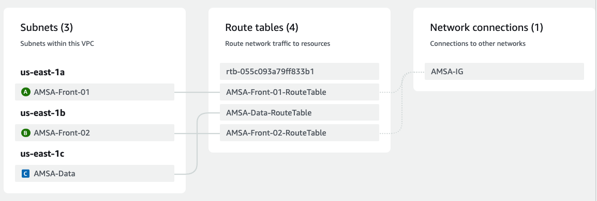

> **Nota**: Assegureu-vos de tenir en aquest punt les associacions creades correctament abans de continuar amb la configuració dels altres components.

## Grups de Seguretat

En aquest punt, crearem els grups de seguretat per a les instàncies EC2 i la base de dades RDS. Aquests grups de seguretat permetran controlar el tràfic de xarxa que entra i surt de les instàncies.

- **Grup de Seguretat per a les instàncies EC2**: Aquest grup de seguretat permetrà el tràfic de xarxa per als serveis web (HTTP i HTTPS) i SSH.

    ```yaml
    AMSAWebSG:
        Type: AWS::EC2::SecurityGroup
        Properties:
            GroupDescription: Security Group for AMSA Web Servers
            VpcId: !Ref AMSAVPC
            SecurityGroupIngress:
                - IpProtocol: tcp
                  FromPort: 80
                  ToPort: 80
                  CidrIp: 0.0.0.0/0
                - IpProtocol: tcp
                    FromPort: 443
                    ToPort: 443
                    CidrIp: 0.0.0.0/0
                - IpProtocol: tcp
                    FromPort: 22
                    ToPort: 22
                    CidrIp: 0.0.0.0/0
        Tags:
            - Key: Name
              Value: AMSA-Web-SG
    ```

    Per fer-ho, navegarem a la consola de VPC d'AWS, seleccionarem la secció *Security Groups* i clicarem a *Create security group*. A continuació, omplirem els camps amb la informació necessària i clicarem a *Create security group*.

    

- **Grup de Seguretat per a la base de dades RDS**: Aquest grup de seguretat permetrà el tràfic de xarxa per a la base de dades MySQL (port 3306) només des de les instàncies EC2 que pertanyin al grup de seguretat anterior (AMSAWebSG).

    ```yaml
    AMSADbSG:
        Type: AWS::EC2::SecurityGroup
        Properties:
            GroupDescription: Allow MySQL
            VpcId: !Ref AMSAVPC
            SecurityGroupIngress:
                - IpProtocol: tcp
                FromPort: '3306'
                ToPort: '3306'
                SourceSecurityGroupId: !Ref AMSAWebSG
        Tags:
            - Key: Name
              Value: AMSA-DB-SG
    ```

    Per fer-ho, navegarem a la consola de VPC d'AWS, seleccionarem la secció *Security Groups* i clicarem a *Create security group*. A continuació, omplirem els camps amb la informació necessària i clicarem a *Create security group*.

    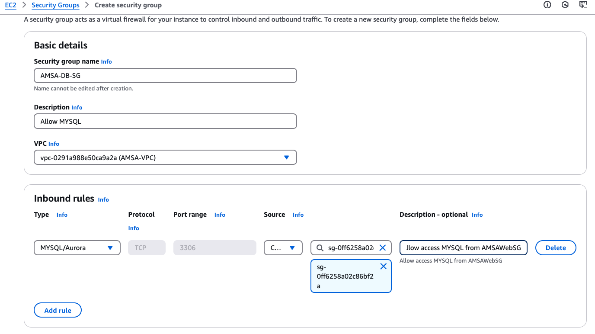

## Creació de la Base de Dades RDS

En aquest punt, crearem la base de dades RDS que utilitzarà WordPress per emmagatzemar les dades. Utilitzarem una instància de base de dades MySQL amb les següents característiques:

- **Choose a database creation method**: Standard Create
- **Motor de base de dades**: MariaDB
- **Version**: MariaDB 10.11.9
- **Templates**: Free tier


- **DB instance Identifier**: AMSA-DB
- **Credentials Management**: Self-managed
- **Master Username**: admin
- **Master Password**: h0dc?r00t?p4ssw0rd


La resta de paràmetres es poden deixar per defecte a les seccions de *Instance Configuration*, i *Storage*.


- **Compute resources**: Don't connect to an EC2 compute resource
- **VPC**: AMSA-VPC
- **Subnet Group**: Create new DB Subnet Group
- **Public accessibility**: No
- **VPC security group**: AMSA-DB-SG
- **Availability Zone**: No preference


La resta de paràmetres es poden deixar per defecte a les seccions de *Database authentication*, i *Backup*.


```yaml
AMSADataBase:
    Type: AWS::RDS::DBInstance
    Properties:
        DBInstanceIdentifier: AMSA-DB
        DBInstanceClass: db.t2.micro
        Engine: mariadb
        EngineVersion: 10.11.9
        MasterUsername: admin
        MasterUserPassword: h0dc?r00t?p4ssw0rd
        AllocatedStorage: 20
        DBSubnetGroupName: !Ref AMSASubnetGroup
        VPCSecurityGroups:
            - !Ref AMSADbSG
        PubliclyAccessible: false
        MultiAZ: false
    Tags:
        - Key: Name
          Value: AMSA-DB
```


> Nota: Assegureu-vos de tenir en aquest punt la base de dades RDS creada correctament abans de continuar amb la configuració dels altres components.

## Creació de les instàncies EC2

En aquest punt, crearem una instancia EC2 amb el grup de seguretat **AMSAWebSG**  amb AMI **Amazon Linux 2023** i el tipus d'instància **t2.micro**, instal·larem el client mysql i testarem la connexió amb la base de dades RDS.

- **Nom de la instància**: AMSA-WS-WP01
- **AMI**: Amazon Linux 2023 (64-bit x86)
- **Tipus d'instància**: t2.micro

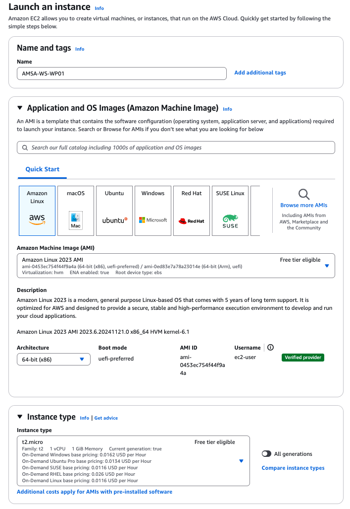

- **Key Pair**: AMSA-KEY

- **VPC**: AMSA-VPC
- **Subxarxa**: AMSA-Front-01
- **Grup de Seguretat**: AMSAWebSG
- **IP Pública**: Enable

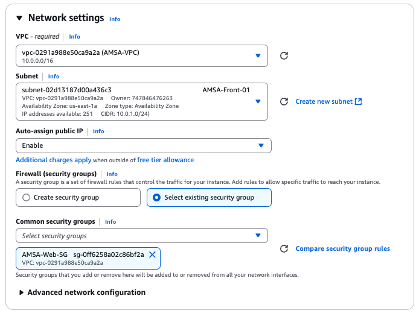

La resta de paràmetres es poden deixar per defecte a la resta de seccions.

```yaml
AMSAWebServer:
    Type: AWS::EC2::Instance
    Properties:
        InstanceType: t2.micro
        ImageId: ami-0c55b159cbfafe1f0
        KeyName: AMSA-KEY
        NetworkInterfaces:
            - AssociatePublicIpAddress: true
              DeviceIndex: 0
              GroupSet:
                  - !Ref AMSAWebSG
              SubnetId: !Ref AMSAFront01
    Tags:
        - Key: Name
          Value: AMSA-WS-WP01
```

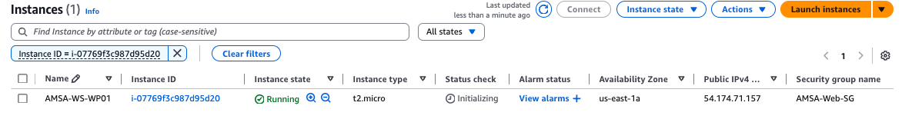

Per accedir a la instància EC2, podeu utilitzar una shell SSH amb la clau privada associada al vostre Key Pair o bé la consola web d'AWS.


Un cop dins de la instància, instal·larem el client MySQL i provarem la connexió amb la base de dades RDS:

```bash
sudo dnf install mariadb105 -y
```

Un cop instal·lat el client MySQL, provarem la connexió amb la base de dades RDS:

```bash
# Modifiqueu les dades d'accés segons les vostres credencials i el vostre endpoint
# mysql -h <endpoint> -u <usuari> -p
mysql -h amsa-db.cztwlalq0ipf.us-east-1.rds.amazonaws.com -u admin -p
```

Si tot ha anat bé, hauríeu de poder connectar-vos a la base de dades RDS amb les credencials proporcionades:


En aquest punt, podem aprofitar i configurar una base de dades per a WordPress. Això ens permetrà tenir la base de dades preparada per a la instal·lació de WordPress en les instàncies EC2.

```sql
CREATE DATABASE wordpress;
CREATE USER 'amsa-wordpress-user'@'%' IDENTIFIED BY 'h0dc-w0rdpr3ss-p4ssw0rd';
GRANT ALL PRIVILEGES ON wordpress.* TO 'amsa-wordpress-user'@'%';
FLUSH PRIVILEGES;
exit
```

> **Nota**: Assegureu-vos de que totes les comandes s'executen correctament i obteniu un Query OK per a cada comanda.

## Configuració del Servidor Web amb WordPress

En aquest punt, volem crear un servidor web amb WordPress. Per fer-ho, instal·larem el servidor web Apache, el llenguatge de programació PHP. A continuació, descarregarem i configurarem WordPress per a la nostra aplicació. Aquests passos ja els vam realitzar en la pràctica anterior de forma manual. Ara, els automatitzarem creant una plantilla que ens permeti desplegar instàncies EC2 amb WordPress ja configurat i preparades per connectar amb la nostra base de dades RDS.

```bash
#!/bin/bash
# sudo bash install_wp.sh

# Ajusteu les dades següents segons les vostres dades
DB_NAME="wordpress"
DB_USER="amsa-wordpress-user"
DB_ROOT_USER="admin"
DB_USER_PASSWORD="h0dc-w0rdpr3ss-p4ssw0rd"
DB_ROOT_PASSWORD="h0dc?r00t?p4ssw0rd"
DB_HOST="amsa-db.cztwlalq0ipf.us-east-1.rds.amazonaws.com" 

if [ "$(id -u)" -ne 0 ]; then
    echo "Please run this script with sudo or as root."
    exit 1
fi

dnf install -y wget php-mysqlnd httpd php-fpm php-mysqli php-json php php-devel php-gd expect

cd /tmp
wget https://wordpress.org/latest.tar.gz
tar -xzf latest.tar.gz

# Configure WordPress
cp wordpress/wp-config-sample.php wordpress/wp-config.php
sed -i "s/database_name_here/$DB_NAME/g" wordpress/wp-config.php
sed -i "s/username_here/$DB_USER/g" wordpress/wp-config.php
sed -i "s/password_here/$DB_USER_PASSWORD/g" wordpress/wp-config.php
sed -i "s/localhost/$DB_HOST/g" wordpress/wp-config.php

sudo cp -r wordpress/* /var/www/html/

sudo sed -i 's/AllowOverride None/AllowOverride All/g' /etc/httpd/conf/httpd.conf

sudo chown -R apache:apache /var/www
sudo chmod 2775 /var/www

sudo systemctl restart httpd
```

Aquest script ens permetrà instal·lar i configurar un servidor web amb WordPress a les nostres instàncies EC2. Aneu a **Launch Templates** i creeu una nova plantilla amb la configuració de la instància EC2 i el script anterior.

- **Nom de la plantilla**: AMSA-WS-WP-Template
- **Auto Scaling Guidance**: Yes

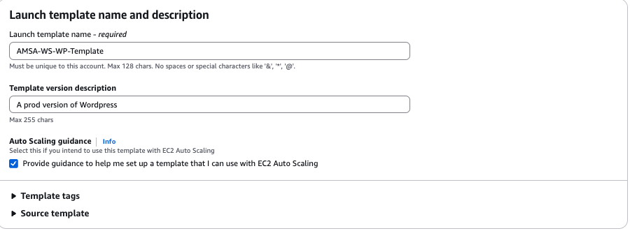

- **AMI**: Amazon Linux 2023 (64-bit x86)

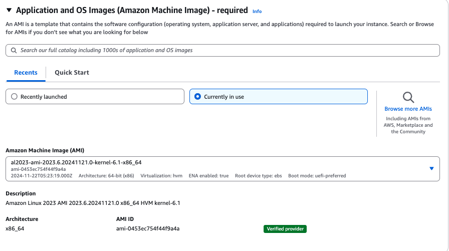

- **Tipus d'instància**: t2.micro
- **Key Pair**: AMSA-KEY


- **Subxarxa**: No seleccionar cap subxarxa (es seleccionarà dinàmicament)
- **Grup de Seguretat**: AMSAWebSG


Aneu a la secció de **Advanced Details** i afegiu el script anterior a la secció de UserData.

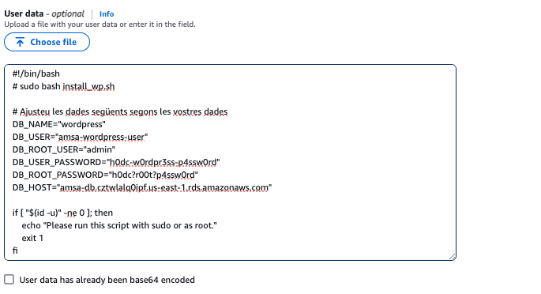

```yaml
AMSAWebServerTemplate:
    Type: AWS::EC2::LaunchTemplate
    Properties:
        LaunchTemplateName: AMSA-WS-WP-Template
        LaunchTemplateData:
            ImageId: ami-0c55b159cbfafe1f0
            InstanceType: t2.micro
            KeyName: AMSA-KEY
            SecurityGroupIds:
                - !Ref AMSAWebSG
            UserData:
                Fn::Base64: !Sub |
                    #!/bin/bash
                    # sudo bash install_wp.sh
                    dnf install -y wget php-mysqlnd httpd php-fpm php-mysqli php-json php php-devel php-gd expect
                    cd /tmp
                    wget https://wordpress.org/latest.tar.gz
                    tar -xzf latest.tar.gz
                    cp wordpress/wp-config-sample.php wordpress/wp-config.php
                    sed -i "s/database_name_here/wordpress/g" wordpress/wp-config.php
                    sed -i "s/username_here/amsa-wordpress-user/g" wordpress/wp-config.php
                    sed -i "s/password_here/h0dc-w0rdpr3ss-p4ssw0rd/g" wordpress/wp-config.php
                    sed -i "s/localhost/amsa-db.cztwlalq0ipf.us-east-1.rds.amazonaws.com/g" wordpress/wp-config.php
                    cp -r wordpress/* /var/www/html/
                    sed -i 's/AllowOverride None/AllowOverride All/g' /etc/httpd/conf/httpd.conf
                    chown -R apache:apache /var/www
                    chmod 2775 /var/www
                    systemctl restart httpd
```

Un cop creada la plantilla de llançament, podeu utilitzar-la per crear instàncies EC2 amb WordPress ja configurat i preparades per connectar amb la vostra base de dades RDS.


Aneu a la secció **EC2** de la consola d'AWS i seleccioneu **Launch Instance**.

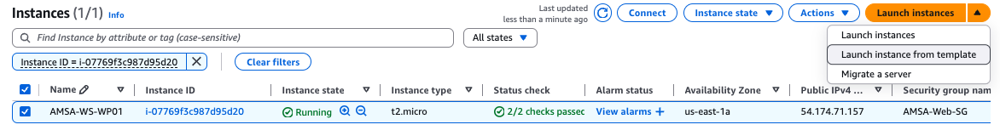

A continuació, seleccioneu la plantilla de llançament **AMSA-WS-WP-Template** i configureu la resta de paràmetres segons les vostres necessitats (seleccioneu la subxarxa **Front-02** per a aquest exemple). A més a més, seleccioneu que s'assigni una IP pública a la instància.

Un cop creada la instància:


Observeu que la instància EC2 s'ha creat sense nom assignat. Això és degut a que el nom de la instància no l'hem definit.

Si tot ha anat bé, hauríeu de poder accedir a la instància EC2 a través del navegador web i veure la pàgina d'instal·lació de WordPress:


> **Nota**: No realitzarem la instal·lació de WordPress en aquest punt, ja que primer configurarem el balancejador de càrrega. Quan s'instal·la wordpress guarda i configurar la ip de la instància, per tant, si després es vol posar un balancejador de càrrega, no funcionarà correctament i haurem de reconfigurar wordpress. Per tant, primer configurarem el balancejador de càrrega i després instal·larem wordpress per tal de que quan s'instal·li, es guardi la ip del balancejador de càrrega que és la que es mantindrà constant.

## Creació del Balancejador de Càrrega

En aquest punt, crearem un balancejador de càrrega per a les nostres instàncies EC2. Aquest balancejador de càrrega serà responsable de distribuir uniformement el tràfic entre les instàncies EC2 que allotgen WordPress.

Existeixen 3 tipus de balancejadors de càrrega a AWS: **Application Load Balancer (ALB)**, **Network Load Balancer (NLB)** i **Gateway Load Balancer (GWLB)**. En aquest cas, utilitzarem un **Application Load Balancer (ALB)**, ja que és el recomanat per a aplicacions web que utiltizen HTTP i HTTPS.

- **Nom del balancejador de càrrega**: AMSA-ALB
- **Scheme**: Internet-facing
- **IP Address Type**: IPv4


- **VPC**: AMSA-VPC
- **Availability Zones**: Seleccionar les zones de disponibilitat on tenim les subxarxes Front-01 i Front-02.


- **Grups de Seguretat**: Nou grup de seguretat (**AMSA-ALB-SG**), aquest grup de seguretat permetrà el tràfic d'entrada per als ports 80 (HTTP) i 443 (HTTPS) des de qualsevol origen però restringirà el tràfic de sortida a les instàncies EC2 (grup de seguretat **AMSAWebSG**).

    ```yaml
    AMSALBSG:
        Type: AWS::EC2::SecurityGroup
        Properties:
            GroupDescription: Security Group for AMSA ALB
            VpcId: !Ref AMSAVPC
            SecurityGroupIngress:
                - IpProtocol: tcp
                  FromPort: 80
                  ToPort: 80
                  CidrIp: 0.0.0.0/0
                - IpProtocol: tcp
                    FromPort: 443
                    ToPort: 443
                    CidrIp: 0.0.0.0/0
            SecurityGroupEgress:
                - IpProtocol: -1
                  FromPort: -1
                  ToPort: -1
                  DestinationSecurityGroupId: !Ref AMSAWebSG
        Tags:
            - Key: Name
              Value: AMSA-ALB-SG
    ```

    

- **Listeners**: Crearem un listener per al port 80 (HTTP), que redirigirà el tràfic al port 80 de les instàncies EC2. Al port 443 (HTTPS) de moment no configurarem cap redirecció. Per fer-ho, primer haureu de crear un **Target Group**. Aquest grup es necessari per indicar al balancejador de càrrega on enviar el tràfic.

  - *Target Group*:
    - **Target Type**: Instance
    - **Nom**: AMSA-WS-WP-TG
    - **Protocol**: HTTP
    - **Port**: 80
    - **VPC**: AMSA-VPC

    

    - Health Check: Per defecte, el balancejador de càrrega comprova la salut de les instàncies EC2 a través del port 80 i la ruta **/**. Això significa que el balancejador de càrrega enviarà tràfic a les instàncies EC2 que responguin correctament a les peticions HTTP a la ruta **/**. Com que les nostres instàncies EC2 tenen WordPress instal·lat, aquestes instàncies respondran correctament a les peticions HTTP a la ruta **/**. *Podem deixar la configuració per defecte*.

    > Nota: La instal·lació de wordpress retorna 302, per tant, el health check no funcionarà correctament. Per solucionar-ho, temporalment, podem modificar el health check perquè comprovi la resposta 302 en lloc de la 200.

  - *Registrar targets*: Afegeix les instàncies EC2 al target group. De les dues instàncies EC2 que tenim, seleccionarem les dues. Una instancia es marcarà com a healthy i l'altra com a unhealthy ja que la primera instancia no té wordpress instal·lat (l'hem creat per testar la connexió amb la base de dades RDS). Un cop ho comprovem, la desregistrem i només deixem la instància amb wordpress instal·lat.

      

  Finalment, crearem el target group:

  

  ```yaml
    AMSAWSWPTG:
        Type: AWS::ElasticLoadBalancingV2::TargetGroup
        Properties:
            HealthCheckIntervalSeconds: 30
            HealthCheckPath: /
            HealthCheckProtocol: HTTP
            HealthCheckTimeoutSeconds: 5
            HealthyThresholdCount: 2
            Name: AMSA-WS-WP-TG
            Port: 80
            Protocol: HTTP
            TargetType: instance
            UnhealthyThresholdCount: 2
            VpcId: !Ref AMSAVPC
    ```

Un cop creat el target group, el seleccionarem com a target del listener del balancejador de càrrega.


```yaml
AMSAALB:
    Type: AWS::ElasticLoadBalancingV2::LoadBalancer
    Properties:
        Name: AMSA-ALB
        Scheme: internet-facing
        IpAddressType: ipv4
        SecurityGroups:
            - !Ref AMSALBSG
        Subnets:
            - !Ref AMSAFront01
            - !Ref AMSAFront02
        Tags:
            - Key: Name
              Value: AMSA-ALB
    DependsOn: AMSAWSWPTG
```

Abans de crear el balancejador de càrrega, assegureu-vos de tenir un resum amb totes les configuracions necessàries:


Un cop creat el balancejador de càrrega, heu d'esperar uns minuts fins que el seu estat passi de **Provisioning** a **Active**. Un cop l'estat sigui **Active**, podeu accedir al balancejador de càrrega a través de la seva adreça DNS.


Un cop l'estat del balancejador de càrrega sigui **Active**, veure que tenim una target group amb una instància healthy i una unhealthy. Això és degut a que una de les instàncies EC2 no té WordPress instal·lat. Per solucionar-ho, desregistreu la instància unhealthy i només deixeu la instància healthy.


Ara ja podem accedir al balancejador de càrrega a través de la seva adreça DNS i veure la pàgina d'instal·lació de WordPress:


Procedirem a instal·lar WordPress a través del balancejador de càrrega. Podem definir el nom del lloc, l'usuari i la contrasenya de l'administrador, i la nostra adreça de correu electrònic:

- **Site Title**: AMSA WordPress
- **Username**: amsa-wp-admin
- **Password**: smveMMyD79@%4OauH3
- **Your Email**: amsa-wp-admin@gmail.com


Un cop instal·lat WordPress, haureu de veure la pàgina d'inici de WordPress:


Ara ja teniu el servidor web configurat amb WordPress i el balancejador de càrrega per distribuir el tràfic entre les instàncies EC2. Recordeu de modificar el health check del target group perquè comprovi la resposta del 200 en lloc de la 302. Haureu de deregistrar i tornar a registrar les instàncies EC2 perquè el health check es torni a comprovar.

## Test de Càrrega

Per testar com es distribueix el tràfic entre les instàncies EC2, creeu una nova instància EC2 amb la plantilla de llançament **AMSA-WS-WP-Template** a la subxarxa **Front-01**. Afegeix aquesta instància al target group **AMSA-WS-WP-TG** i comproveu que el balancejador de càrrega distribueix el tràfic entre les dues instàncies EC2.

Una forma simple de comprovar com es distribueix el tràfic és accedir a la pàgina d'inici de WordPress i refrescar la pàgina. Veureu com el balancejador de càrrega envia el tràfic a les dues instàncies EC2. Per comprovar-ho, podeu accedir a la consola de les instàncies EC2 i comprovar els logs d'accés al servidor web.

Heu d'anar a la consola d'EC2 d'AWS, seleccionar la instància EC2 i clicar a *Connect*. A continuació, podeu accedir a la instància EC2 a través de la consola web d'AWS.

```bash
sudo tail -f /var/log/httpd/access_log
```

## Auto Scaling

Per configurar l'escalat automàtic de les instàncies EC2, crearem un grup d'auto scaling amb les següents característiques:

- **Nom del grup d'auto scaling**: AMSA-WS-WP-ASG
- **Launch Template**: AMSA-WS-WP-Template
- **Desired Capacity**: 2
- **Min Size**: 2
- **Max Size**: 4
- **Availability Zones**: Seleccionar les zones de disponibilitat on tenim les subxarxes Front-01 i Front-02.
- **Health Check Type**: EC2
- **Health Check Grace Period**: 300
- **Cooldown**: 300
- **Target Group**: AMSA-WS-WP-TG

Per testar l'escalat automàtic, podeu modificar el **Desired Capacity** a 1 i comprovar com el grup d'auto scaling crea una nova instància EC2 per mantenir el **Desired Capacity**.

```yaml
AMSAWSWPASG:
    Type: AWS::AutoScaling::AutoScalingGroup
    Properties:
        AutoScalingGroupName: AMSA-WS-WP-ASG
        DesiredCapacity: 2
        LaunchTemplate:
            LaunchTemplateId: !Ref AMSAWebServerTemplate
            Version: !GetAtt AMSAWebServerTemplate.LatestVersionNumber
        MinSize: 2
        MaxSize: 4
        VPCZoneIdentifier:
            - !Ref AMSAFront01
            - !Ref AMSAFront02
        HealthCheckType: EC2
        HealthCheckGracePeriod: 300
        Cooldown: 300
        TargetGroupARNs:
            - !Ref AMSAWSWPTG
    Tags:
        - Key: Name
          Value: AMSA-WS-WP-ASG
    DependsOn: AMSAWSWPTG
```

## Aïllant les EC2

En aquest punt, les instancies EC2 són accessibles des de l'exterior a través del port 80, 443 i 22. Ara bé, únicament volem que les instàncies EC2 siguin accessibles a través del balancejador de càrrega. Per fer-ho, editarem el grup de seguretat **AMSAWebSG** i eliminarem les regles d'entrada que permeten el tràfic des de qualsevol origen.

- Regles d'entrada per al port 80 (HTTP) i 443 (HTTPS): Únicament del grup de seguretat del balancejador de càrrega (**AMSA-ALB-SG**). Eliminarem la regla ssh de moment perquè no es pugui accedir a les instàncies EC2 per ssh.

- Regles de sortida: Eliminarem la regla de sortida que connecta amb el IG (**AMSA-IG**).

Ara, les instàncies EC2 únicament seran accessibles a través del balancejador de càrrega.

## VPN per administrar la nostra infraestructura

Per administrar la nostra infraestructura de forma segura, per fer-ho utilitzarem una màquina EC2 com a VPN. Aquesta màquina EC2 actuarà com a servidor VPN i ens permetrà connectar-nos a la nostra VPC de forma segura. 

  