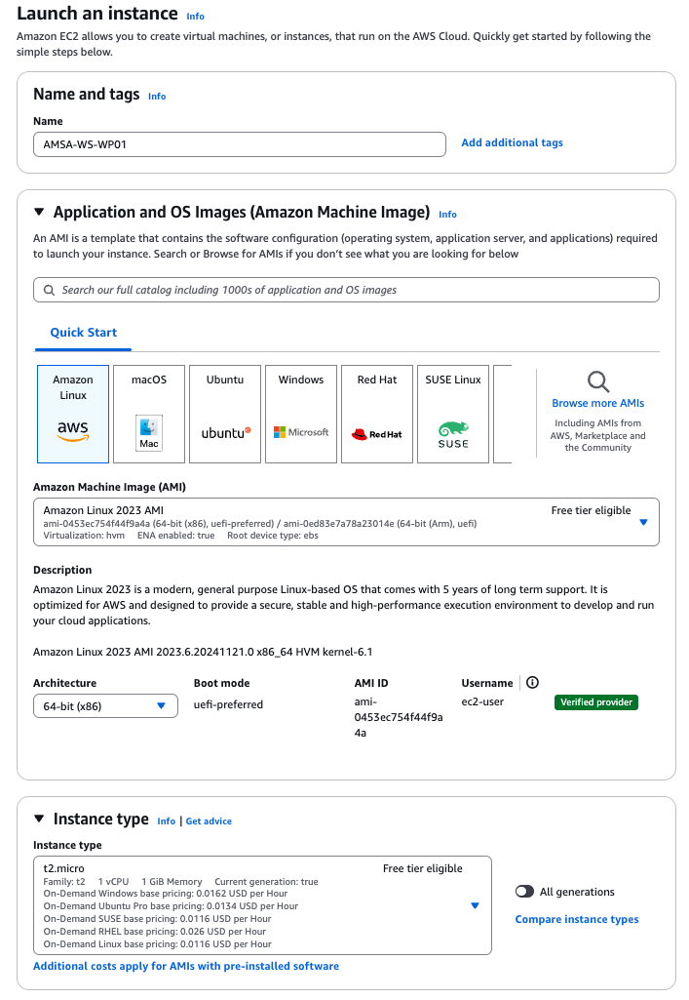
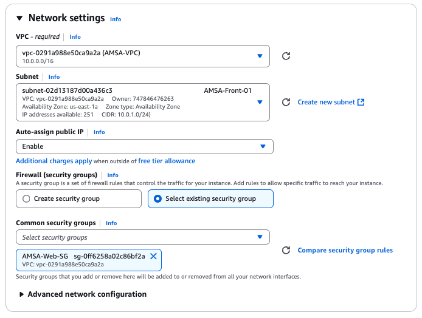
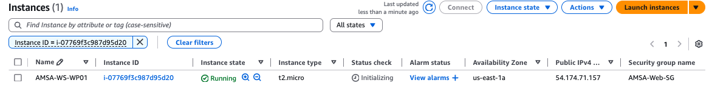
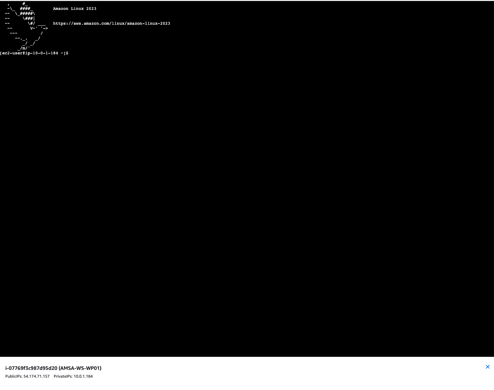
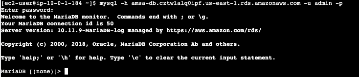

# Creació de l'instància EC2

En aquest punt, crearem una instancia EC2 amb el grup de seguretat **AMSAWebSG**  amb AMI **Amazon Linux 2023** i el tipus d'instància **t2.micro**, instal·larem el client mysql i testarem la connexió amb la base de dades RDS.

- **Nom de la instància**: AMSA-WS-WP01
- **AMI**: Amazon Linux 2023 (64-bit x86)
- **Tipus d'instància**: t2.micro



- **Key Pair**: AMSA-KEY

- **VPC**: AMSA-VPC
- **Subxarxa**: AMSA-Front-01
- **Grup de Seguretat**: AMSAWebSG
- **IP Pública**: Enable



La resta de paràmetres es poden deixar per defecte a la resta de seccions.

```yaml
AMSAWebServer:
    Type: AWS::EC2::Instance
    Properties:
        InstanceType: t2.micro
        ImageId: ami-0c55b159cbfafe1f0
        KeyName: AMSA-KEY
        NetworkInterfaces:
            - AssociatePublicIpAddress: true
              DeviceIndex: 0
              GroupSet:
                  - !Ref AMSAWebSG
              SubnetId: !Ref AMSAFront01
    Tags:
        - Key: Name
          Value: AMSA-WS-WP01
```



Per accedir a la instància EC2, podeu utilitzar una shell SSH amb la clau privada associada al vostre Key Pair o bé la consola web d'AWS.



Un cop dins de la instància, instal·larem el client MySQL i provarem la connexió amb la base de dades RDS:

```bash
sudo dnf install mariadb105 -y
```

Un cop instal·lat el client MySQL, provarem la connexió amb la base de dades RDS:

```bash
# Modifiqueu les dades d'accés segons les vostres credencials i el vostre endpoint
# mysql -h <endpoint> -u <usuari> -p
mysql -h amsa-db.cztwlalq0ipf.us-east-1.rds.amazonaws.com -u admin -p
```

Si tot ha anat bé, hauríeu de poder connectar-vos a la base de dades RDS amb les credencials proporcionades:



En aquest punt, podem aprofitar i configurar una base de dades per a WordPress. Això ens permetrà tenir la base de dades preparada per a la instal·lació de WordPress en les instàncies EC2.

```sql
CREATE DATABASE wordpress;
CREATE USER 'amsa-wordpress-user'@'%' IDENTIFIED BY 'h0dc-w0rdpr3ss-p4ssw0rd';
GRANT ALL PRIVILEGES ON wordpress.* TO 'amsa-wordpress-user'@'%';
FLUSH PRIVILEGES;
exit
```

> **Nota**: Assegureu-vos de que totes les comandes s'executen correctament i obteniu un Query OK per a cada comanda.
