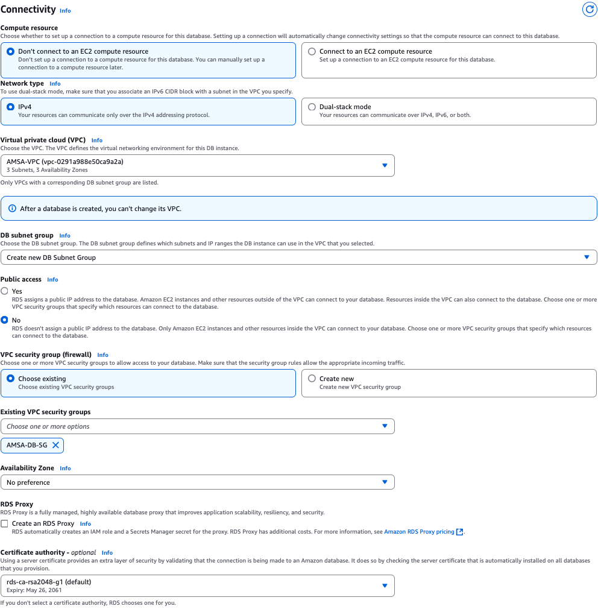

# Creació de la Base de Dades RDS

En aquest punt, crearem la base de dades RDS que utilitzarà WordPress per emmagatzemar les dades. Utilitzarem una instància de base de dades MySQL amb les següents característiques:

- **Choose a database creation method**: Standard Create
- **Motor de base de dades**: MariaDB
- **Version**: MariaDB 10.11.9
- **Templates**: Free tier


- **DB instance Identifier**: AMSA-DB
- **Credentials Management**: Self-managed
- **Master Username**: admin
- **Master Password**: h0dc?r00t?p4ssw0rd


La resta de paràmetres es poden deixar per defecte a les seccions de *Instance Configuration*, i *Storage*.


- **Compute resources**: Don't connect to an EC2 compute resource
- **VPC**: AMSA-VPC
- **Subnet Group**: Create new DB Subnet Group
- **Public accessibility**: No
- **VPC security group**: AMSA-DB-SG
- **Availability Zone**: No preference



La resta de paràmetres es poden deixar per defecte a les seccions de *Database authentication*, i *Backup*.


```yaml
AMSADataDB:
    Type: AWS::RDS::DBInstance
    Properties:
      AllocatedStorage: '20'
      DBInstanceIdentifier: AMSA-DB
      DBInstanceClass: db.t4g.micro
      Engine: mariadb
      EngineVersion: 10.11.9
      MasterUsername: admin
      MasterUserPassword: h0dc?r00t?p4ssw0rd
      VPCSecurityGroups:
        - !GetAtt AMSADataSG.GroupId
      DBSubnetGroupName: !Ref AMSADBSubnetGroup
      MultiAZ: false
      PubliclyAccessible: false
      Tags:
        - Key: Name
          Value: AMSA-Data-DB
    DependsOn: 
        - AMSADataSG
        - AMSADBSubnetGroup
```


> Nota: Assegureu-vos de tenir en aquest punt la base de dades RDS creada correctament abans de continuar amb la configuració dels altres components.
