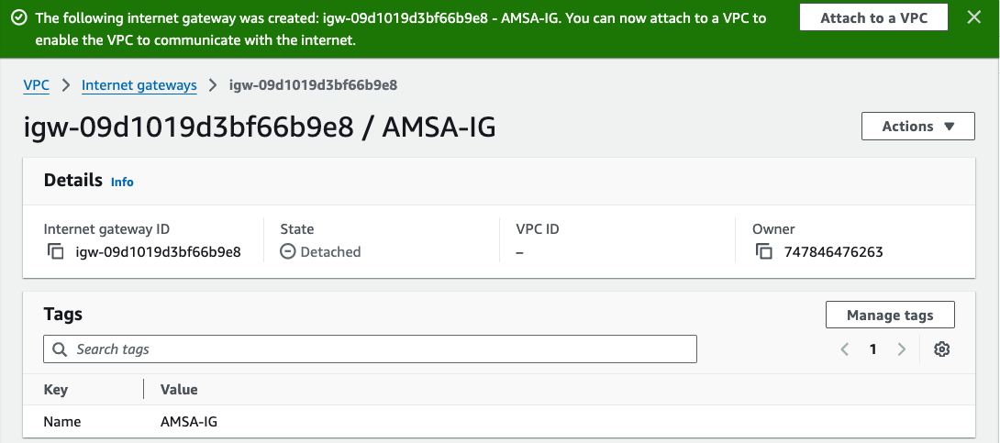
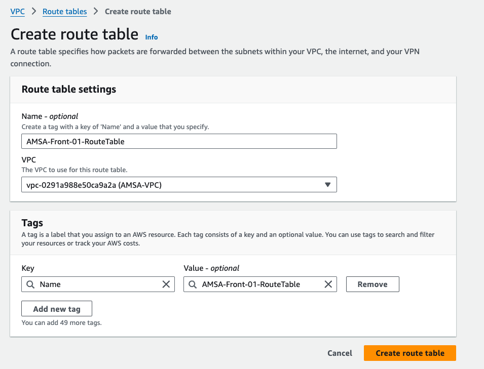
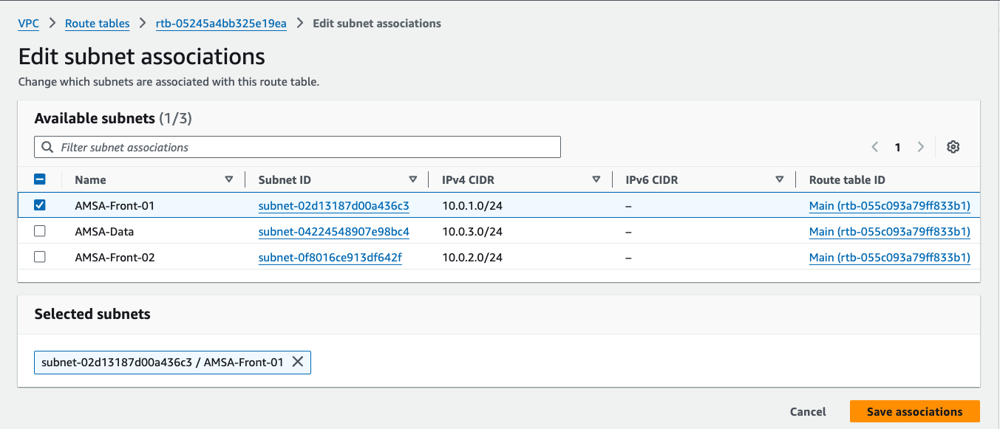
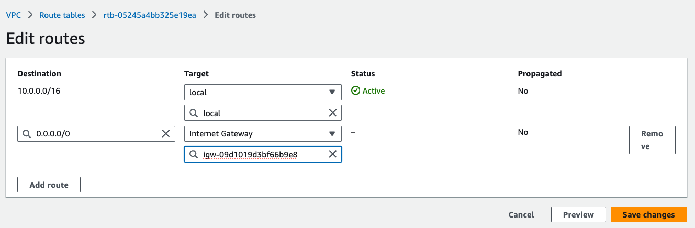
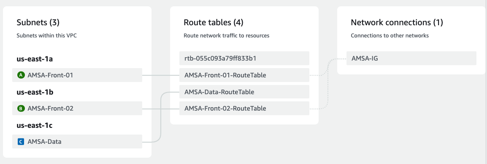

# Taules d'Enrutament i Associacions

Per gestionar les rutes del tràfic i determinar com es distribueix entre les subxarxes, crearem taules de rutes i les associem a les subxarxes corresponents. En aquesta fase inicial, cal assegurar:

- **Front-01 i Front-02** tenen accés a Internet.
- **Data** no té accés a Internet; només necessita rutes locals per comunicar-se amb *Front-01 i Front-02.*

> Recordeu que dins d'una VPC, les subxarxes poden comunicar-se entre elles sense necessitat de rutes explícites.

En primer lloc crearem un Gateway d'Internet per a la nostra VPC:

```yaml
AMSAIG:
    Type: AWS::EC2::InternetGateway
    Properties:
        Tags:
            - Key: Name
              Value: AMSA-IG
```


I l'associarem a la nostra VPC:

```yaml
AMSAIGAttachment:
    Type: AWS::EC2::VPCGatewayAttachment
    Properties:
        VpcId: !Ref AMSAVPC
        InternetGatewayId: !Ref AMSAIG
```



- **Taula de rutes per a la subxarxa AMSA-Front-01**:

    ```yaml
    AMSAFront01RouteTable:
        Type: AWS::EC2::RouteTable
        Properties:
            VpcId: !Ref AMSAVPC
        Tags:
            - Key: Name
            Value: AMSA-Front-01-RouteTable
    ```

    

  - **Associació de la taula de rutes amb la subxarxa AMSA-Front-01**:

    ```yaml
    AMSAFront01RouteTableAssociation:
        Type: AWS::EC2::SubnetRouteTableAssociation
        Properties:
            RouteTableId: !Ref AMSAFront01RouteTable
            SubnetId: !Ref AMSAFront01
    ```

    Per fer-ho, navegarem a la consola de VPC d'AWS, seleccionarem la subxarxa **AMSA-Front-01** anireu a la secció *Subnet Associations* i clicareu a *Edit subnet associations*. A continuació, seleccionarem la taula de rutes **AMSA-Front-01-RouteTable** i clicarem a *Save*.

    

    - **Permetem el tràfic de sortida a Internet**:
  
      ```yaml
      AMSAFront01Route:
          Type: AWS::EC2::Route
          Properties:
              RouteTableId: !Ref AMSAFront01RouteTable
              DestinationCidrBlock: 0.0.0.0/0
              GatewayId: !Ref AMSAIG
      ```

      Per fer-ho, navegarem a la consola de VPC d'AWS, seleccionarem la subxarxa **AMSA-Front-01** anireu a la secció *Routes* i clicareu a *Edit routes*. A continuació, **Add route** i editareu (Destination: 0.0.0.0/0; Target:Seleccionar el **AMSA-IG**).

      

## Repetir el procés per a AMSA-Front-02

Els passos per a la subxarxa AMSA-Front-02 són idèntics als anteriors:

- Crear una taula de rutes específica.
- Associar-la a la subxarxa.
- Configurar una ruta de sortida al Gateway d'Internet.

## Taula de rutes per a AMSA-Data

La subxarxa **AMSA-Data** no requereix accés directe a Internet. Només necessita rutes locals per comunicar-se amb altres subxarxes dins de la VPC. Per a això, crearem una taula de rutes i l'associarem a **AMSA-Data**, però sense definir cap ruta al Gateway d'Internet.

En la següent figura es mostra la configuració de les taules de rutes i les associacions amb les subxarxes:



> **Nota**: Assegureu-vos de tenir en aquest punt les associacions creades correctament abans de continuar amb la configuració dels altres components.
