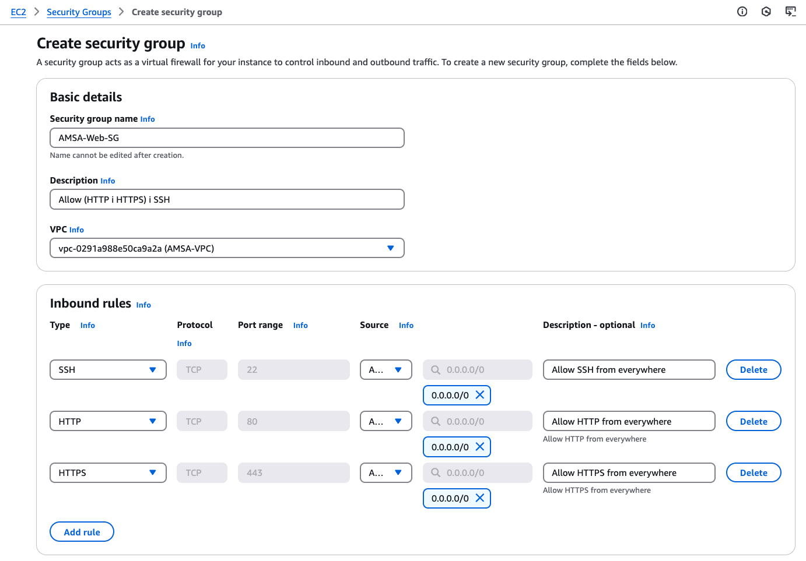
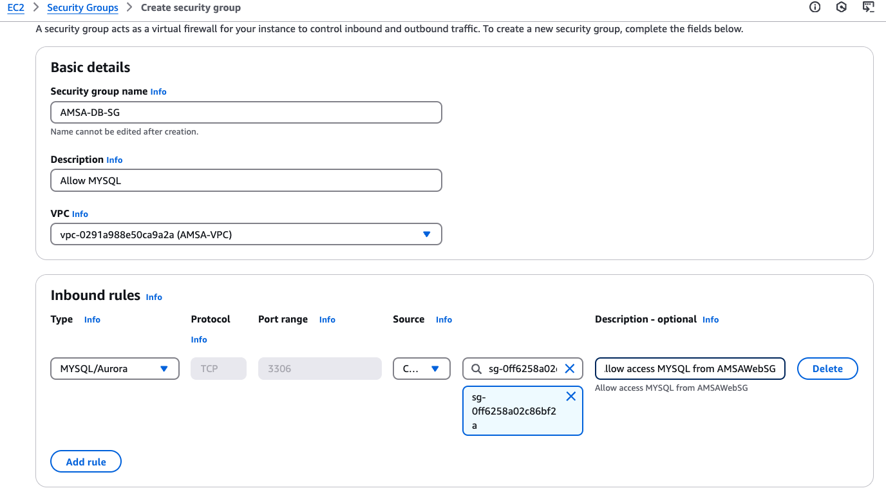

# Grups de Seguretat

Els grups de seguretat (Security Groups) són una eina per controlar el tràfic de xarxa de les instàncies i altres recursos d’AWS. A cada grup de seguretat se li poden definir regles per especificar:

- **Trafic inbound**: Permet decidir quins tipus de connexions entrants (cap al recurs) són permeses.
- **Trafic outbound**: Controla quines connexions sortints (des del recurs cap a altres destinacions) estan autoritzades.
  
A continuació, configurarem els grups de seguretat per a les instàncies EC2 i la base de dades RDS.

## Grup de Seguretat per a les instàncies EC2

Aquest grup de seguretat permetrà:

- **Connexions entrants (inbound)** per als serveis web HTTP (port 80) i HTTPS (port 443), accessibles des de qualsevol origen.
- **Connexions SSH (port 22)** per a administració remota, també accessibles des de qualsevol origen (inicialment, però més endavant es restringiran).
- Totes les connexions sortints (**outbound**), que per defecte estan permeses a AWS, cosa que permet a les instàncies EC2 comunicar-se amb altres recursos com ara RDS.

```yaml
AMSAWebSG:
    Type: AWS::EC2::SecurityGroup
    Properties:
        GroupDescription: Security Group for AMSA Web Servers
        VpcId: !Ref AMSAVPC
        SecurityGroupIngress:
            - IpProtocol: tcp
                FromPort: 80
                ToPort: 80
                CidrIp: 0.0.0.0/0
            - IpProtocol: tcp
                FromPort: 443
                ToPort: 443
                CidrIp: 0.0.0.0/0
            - IpProtocol: tcp
                FromPort: 22
                ToPort: 22
                CidrIp: 0.0.0.0/0
        SecurityGroupEgress:
            - IpProtocol: -1
                FromPort: -1
                ToPort: -1
                CidrIp: 0.0.0.0/0
    Tags:
        - Key: Name
        Value: AMSA-Web-SG
```

Per fer-ho, navegarem a la consola de VPC d'AWS, seleccionarem la secció *Security Groups* i clicarem a *Create security group*. A continuació, omplirem els camps amb la informació necessària i clicarem a *Create security group*.



> **Nota**: En aquest moment, estem permetent tot el tràfic de xarxa per als serveis web i SSH. Quan ho tinguem tot configurat, restringirem aquest accés únicament al trafic entrant provinent del balancejador de càrrega pels serveis web i a la nostra xarxa interna per a SSH.

## Grup de Seguretat per a la base de dades RDS

Aquest grup de seguretat limitarà:

- **Connexions inbound**: Només permetrà tràfic al port 3306 (MySQL) i exclusivament des de les instàncies EC2 que pertanyin al grup de seguretat **AMSAWebSG**.
- **Connexions outbound**: Per defecte, AWS permetrà totes les connexions sortints, cosa que garanteix que la base de dades pugui comunicar-se amb altres recursos si és necessari.

```yaml
    AMSADbSG:
        Type: AWS::EC2::SecurityGroup
        Properties:
            GroupDescription: Allow MySQL
            VpcId: !Ref AMSAVPC
            SecurityGroupIngress:
                - IpProtocol: tcp
                FromPort: '3306'
                ToPort: '3306'
                SourceSecurityGroupId: !Ref AMSAWebSG
            SecurityGroupEgress:
                - IpProtocol: -1
                FromPort: -1
                ToPort: -1
                CidrIp: 0.0.0.0/0
        Tags:
            - Key: Name
              Value: AMSA-DB-SG
```

Per fer-ho, navegarem a la consola de VPC d'AWS, seleccionarem la secció *Security Groups* i clicarem a *Create security group*. A continuació, omplirem els camps amb la informació necessària i clicarem a *Create security group*.



## Resum

| Grup de Seguretat | Inbound | Outbound |
|-------------------|---------|----------|
| AMSA-Web-SG       | HTTP (80) i HTTPS (443) des de 0.0.0.0/0; SSH (22) des de 0.0.0.0/0| Totes permeses |
| AMSA-DB-SG        | MySQL (3306) des de AMSA-Web-SG | Totes permeses |
