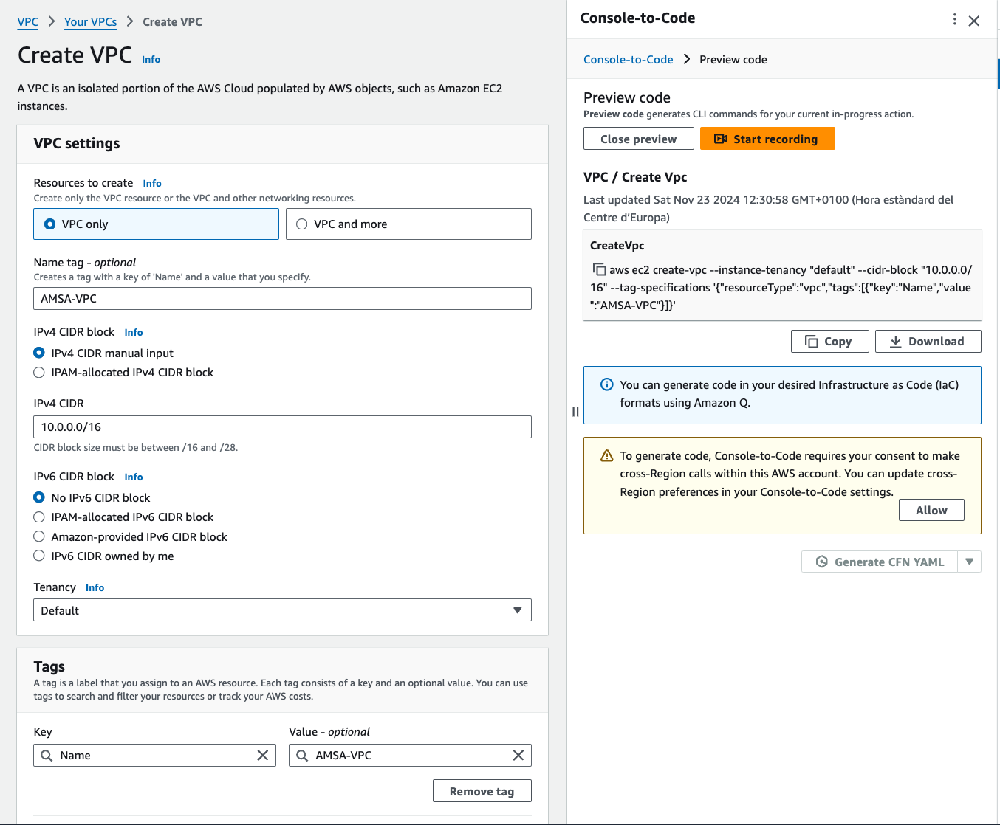
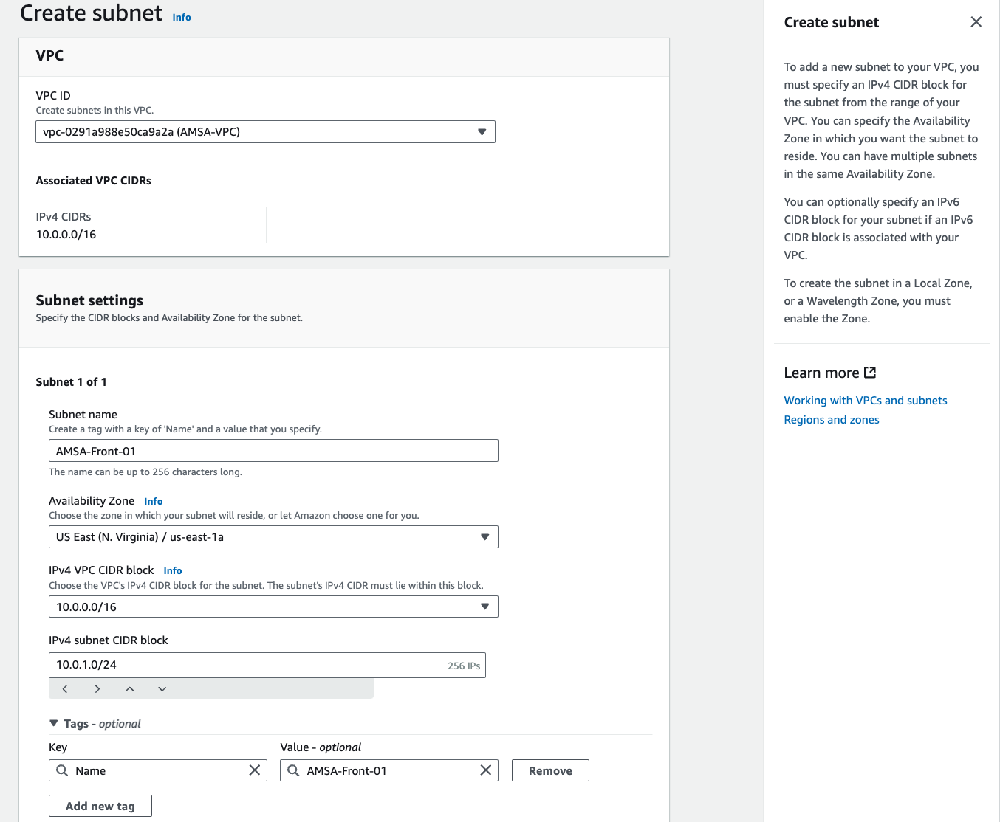
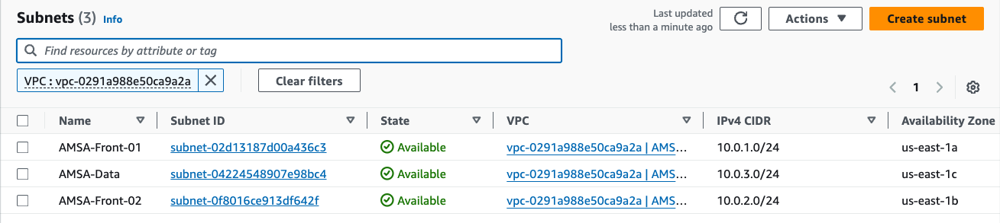

# Creació de la VPC i les subxarxes

Com a primer pas per a la nostra arquitectura, definirem una VPC (Virtual Private Cloud). La configurarem amb la xarxa **10.0.0.0/16**, la qual ens proporciona fins a 65.536 adreces IP, més que suficients per al nostre cas d'ús.

Podem definir la VPC utilitzant *AWS CloudFormation* amb el següent codi YAML:

```yaml
AMSAVPC:
    Type: AWS::EC2::VPC
    Properties:
        CidrBlock: 10.0.0.0/16
    Tags:
        - Key: Name
          Value: AMSA-VPC
```

Alternativament, també podem crear-la manualment a través de la interfície web d'AWS, utilitzant els formularis disponibles:



> **Nota**: Si a la plantilla de CloudFormation no especifiquem cap zona de disponibilitat, la VPC es crearà a la zona de disponibilitat per defecte de la regió seleccionada. Per a més informació sobre els paràmetres de la VPC, podeu consultar la [documentació d'AWS](https://docs.aws.amazon.com/AWSCloudFormation/latest/UserGuide/aws-resource-ec2-vpc.html).

## Creació de les subxarxes

A continuació, afegirem les subxarxes necessàries per a la nostra arquitectura. Cadascuna estarà associada a una zona de disponibilitat diferent per garantir alta disponibilitat:

- **AMSA-Front-01**: Subxarxa privada per a les instàncies de WordPress a la zona de disponibilitat **us-east-1a**.

    ```yaml
    AMSAFront01:
        Type: AWS::EC2::Subnet
        Properties:
            AvailabilityZone: us-east-1a
            CidrBlock: 10.0.1.0/24
            VpcId: !Ref AMSAVPC
        Tags:
            - Key: Name
            Value: AMSA-Front-01
    ```

    

- **AMSA-Front-02**: Subxarxa privada per a les instàncies de WordPress a la zona de disponibilitat **us-east-1b**.

    ```yaml
    AMSAFront02:
        Type: AWS::EC2::Subnet
        Properties:
            AvailabilityZone: us-east-1b
            CidrBlock: 10.0.2.0/24
            VpcId: !Ref AMSAVPC
        Tags:
            - Key: Name
            Value: AMSA-Front-02
    ```

    

- **AMSA-Data**: Subxarxa privada per a la base de dades RDS a la zona de disponibilitat **us-east-1c**.

    ```yaml
    AMSAData:
        Type: AWS::EC2::Subnet
        Properties:
            AvailabilityZone: us-east-1c
            CidrBlock: 10.0.3.0/24
            VpcId: !Ref AMSAVPC
        Tags:
            - Key: Name
            Value: AMSA-Data
    ```

    

A continuació es mostra un diagrama amb les subxarxes creades, incloent-hi els seus blocs CIDR i zones de disponibilitat associades:



> **Nota**: Assegureu-vos de tenir en aquest punt la VPC i les subxarxes creades correctament abans de continuar amb la configuració dels altres components.