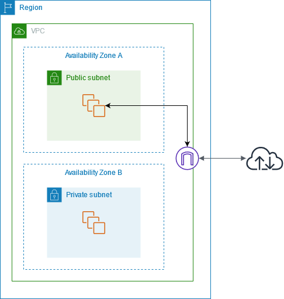

# Xarxa a AWS

## Virtual Private Cloud (VPC)

Una VPC és una xarxa virtual que es pot configurar a AWS. Per defecte, AWS crea una VPC per a cada compte, però també es poden crear noves VPCs. Una VPC es pot configurar amb subxarxes, taules de rutes, grups de seguretat, etc.


En la imatge es mostren 4 VPCs diferents. Cada VPC està aïllada de les altres. Una VPC es crea dins d'una regió específica i pot abastar múltiples zones de disponibilitat dins d'aquesta regió.

A més, en l'arquitectura de la imatge, el tràfic es comparteix entre dues VPCs a la mateixa regió però en diferents zones de disponibilitat. No obstant això, les VPCs de les regions 1 i 2 no poden connectar-se entre elles.

Per crear una VPC, es pot utilitzar la consola de AWS, la interfície de línia de comandes o l'API de AWS.

1. **Consola de AWS**:
   1. Anar a la consola de AWS.
   2. Anar a la secció de VPC.
   3. Seleccionar "Your VPCs".
   4. Clicar a "Create VPC".
   5. Omplir els camps necessaris.
   6. Clicar a "Create VPC".

2. **Interfície de línia de comandes**:

    ```bash
    aws ec2 create-vpc --cidr-block 10.0.0.0/16 --region us-east-1 --tag-specifications "ResourceType=vpc,Tags=[{Key=Name,Value=amsa-vpc}]"
    ```

En aquest exemple, s’utilitza una màscara de xarxa /16, que permet disposar de fins a 65,536 adreces IP. No obstant això, algunes d’aquestes IP seran reservades per AWS per a serveis interns, de manera que el nombre efectiu d’adreces disponibles serà lleugerament inferior.

Per defecte, les VPC no tenen connexió a Internet. Per proporcionar accés, es poden configurar una Internet Gateway (IGW) per connectar la VPC a Internet o una Virtual Private Gateway (VGW) per connectar-la a una xarxa privada, com una VPN. Aquestes passarel·les permeten establir la connectivitat necessària segons les necessitats de l'entorn de xarxa.

## Subxarxes

Les subxarxes són una part d'una VPC. Una VPC pot tenir múltiples subxarxes. Cada subxarxa es pot configurar amb una zona de disponibilitat específica. Això permet distribuir les càrregues de treball en diferents zones de disponibilitat. Un exemple útil de subxarxes és la creació de subxarxes públiques i privades en funció de les necessitats de seguretat i operacionals.


En la imatge es mostra una VPC amb un bloc CIDR de 10.0.0.0/24 que suporta 256 adreces IP. Aquest bloc CIDR es pot dividir en dues subxarxes, cadascuna amb 128 adreces IP. Una subxarxa utilitza el bloc CIDR 10.0.0.0/25 (per a les adreces 10.0.0.0 - 10.0.0.127) i l'altra utilitza el bloc CIDR 10.0.0.128/25 (per a les adreces 10.0.0.128 - 10.0.0.255).

Per crear una subxarxa, es pot utilitzar la consola de AWS, la interfície de línia de comandes o l'API de AWS.

1. **Consola de AWS**:
   1. Anar a la consola de AWS.
   2. Anar a la secció de VPC.
   3. Seleccionar "Subnets".
   4. Clicar a "Create subnet".
   5. Omplir els camps necessaris.
   6. Clicar a "Create subnet".

2. **Interfície de línia de comandes**:

    ```bash
    aws ec2 create-subnet --vpc-id <vpc-id> --cidr-block 10.0.1.0/24 --availability-zone us-east-1a
    # Per exemple:
    # aws ec2 create-subnet --vpc-id vpc-013ece49204bdf533 --cidr-block 10.0.1.0/24 --availability-zone us-east-1a
    ```

## Desplegant una EC2 a una VPC

En aquesta activitat, es desplegarà una VPC amb dues subxarxes, una pública i una privada. A més, es configurarà una Internet Gateway per connectar la VPC a Internet.



En aquesta figura, es mostra una VPC amb dues subxarxes, una pública i una privada. La subxarxa pública té una connexió a Internet a través d'una Internet Gateway. La subxarxa privada no té connexió a Internet. Per defecte, les VPC no tenen connexió a Internet. Per proporcionar accés, es poden configurar una Internet Gateway (IGW) i una taula de rutes per connectar la VPC a Internet.

Per desplegar aquesta arquitectura, es pot utilitzar CloudFormation. A continuació, es mostra un exemple de plantilla de CloudFormation per desplegar aquesta arquitectura.

1. Creació del Internet Gateway (IGW):

    - Anar a VPC > Internet Gateways.
    - Clicar a "Create internet gateway".
    - Omplir els camps necessaris (AMSA-IGW).
    - Attach el AMSA-IGW a AMSA-VPC.

2. Crear l'enrutador de la taula de rutes:

    - Anar a VPC > Route Tables.
    - Clicar a "Create route table".
      - Nom: AMSA-PublicNet-RT-TO-Internet.
      - VPC: AMSA-VPC.
    - Clicar a "Edit routes".
    - Afegir una nova ruta:
      - Destination: 0.0.0.0/0.
      - Target: AMSA-IGW.
  
Cadascuna de les subxarxes de la VPC es pot associar a una taula de rutes. Una subxarxa es pot associar explícitament a una taula de rutes personalitzada o implícitament a la taula de rutes principal.

- Una associació explícita implica que una subxarxa està associada a una taula de rutes personalitzada. En l'exemple, la subxarxa pública està associada a la taula de rutes personalitzada AMSA-PublicNet-RT-TO-Internet, que redirigeix tot el tràfic a l'Internet Gateway. Aquesta associació explícita fa que la subxarxa sigui una subxarxa pública.

- Una associació implícita implica que la subxarxa està associada a la taula de rutes principal. En l'exemple, la subxarxa privada està associada a la taula de rutes principal, que redirigeix tot el tràfic al Virtual Private Gateway. No obstant això, no té una ruta a l'Internet Gateway, fent que la subxarxa sigui una subxarxa només per a VPN.

La diferència clau entre les associacions explícites i implícites rau en la taula de rutes implicada. La taula de rutes principal està associada implícitament a totes les subxarxes de la VPC, mentre que les taules de rutes personalitzades estan associades explícitament a subxarxes específiques.


La imatge mostra una arquitectura de xarxa dins d’una VPC, amb una configuració que inclou subxarxes, taules de rutes, gateways per connectar un entorn privat a Internet i a un centre de dades mitjançant una VPN.

- Subxarxa pública: En aquesta subxarxa és on es troben les instàncies **EC2** accessibles des d’Internet. Té una associació explícita amb una taula de rutes (Route Table A) que inclou una ruta cap a l'**Internet Gateway**, permetent a les instàncies connectar-se a Internet. Està associada amb el **Security Group A**, que defineix les polítiques de seguretat per a les instàncies en aquesta subxarxa.

- Subxarxa privada: En aquesta subxarxa és per a recursos que necessiten seguretat addicional i que no haurien de ser accessibles directament des d'Internet. Té una associació implícita amb una taula de rutes (Route Table B), que no inclou una ruta cap a l'**Internet Gateway**, de manera que les instàncies no poden accedir a Internet directament. Està associada amb el **Security Group B**, que gestiona les regles de seguretat d'aquest entorn privat.

Per tant, la taula de rutes A permet a les instàncies de la subxarxa pública accedir a Internet a través de l'Internet Gateway, mentre que la taula de rutes B permet a les instàncies de la subxarxa privada comunicar-se amb el centre de dades corporatiu a través de la VPN Gateway.

> **Nota**:
> La **VPN Connection** és el túnel que connecta la **VPN Gateway** de la VPC amb el **Customer Gateway** situat al centre de dades corporatiu. El **Customer Gateway** és un dispositiu de xarxa (pot ser un router o un firewall) situat a les instal·lacions del client, que gestiona el trànsit cap a la VPC. Aquesta configuració permet als recursos de la subxarxa privada accedir al centre de dades corporatiu i viceversa, de manera segura, sense exposar aquests recursos a Internet.

## Desplegant Wordpress a una VPC Privada


1. Creació de la VPC i les Subxarxes

    - Crea una VPC amb un rang d'adreces IP, per exemple, 10.0.0.0/16.
    - Configura dues subxarxes públiques per a les instàncies de l'aplicació a diferents zones de disponibilitat (AZ).
        - Subxarxa 1 (pública) en AZ 1 amb rang d'IP 10.0.1.0/24 (us-east-1a).
        - Subxarxa 2 (pública) en AZ 2 amb rang d'IP 10.0.2.0/24 (us-east-1b).
        - Configura una subxarxa privada per a la base de dades en una zona de disponibilitat específica. (us-east-1c).

2. Configuració de la Taula de Rutes

    - Crea una Internet Gateway i associa-la amb la VPC.
    - Configura una taula de rutes per a les subxarxes públiques (HDCB-APPS-R1 i HDCB-APPS-R2).
    - Configura una taula de rutes separada per la subxarxa privada (HDCB-DATA-R). Aquesta taula no tindrà rutes a Internet. Només tindrà rutes per accedir internament als recursos de la VPC.

3. Configuració del Balancer de Càrrega (Load Balancer)

    - Crea un Application Load Balancer (ALB) i selecciona les dues subxarxes públiques.
    - Configura el balançador perquè escolti al port 80 per HTTP.
    - Crea un grup objectiu (Target Group) per a les instàncies de l'aplicació.
    - Defineix L'objectiu com a Instances i el protocol com a HTTP al port 80.
    - Assigna les instàncies que crearem a continuació al grup objectiu perquè el balançador distribueixi el tràfic entre elles.

4. Crea Instàncies EC2 per a Wordpress una a cada instància.