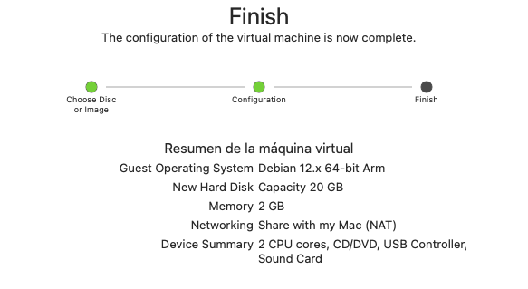
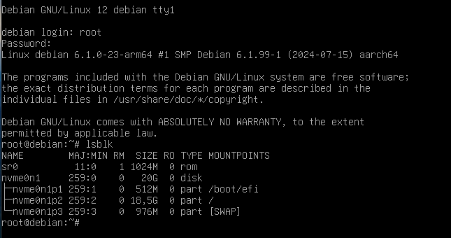

# GRUB

El GRUB (Grand Unified Bootloader) és un gestor d'arrancada que s'utilitza en la majoria de les distribucions de GNU/Linux. El UEFI és l'encarregat de carregar el GRUB, En aquest laboratori veurem com funciona el GRUB i com podem configurar-lo per a arrancar amb diferents sistemes operatius.

> **👁️ Observació**:
>
> GRUB no és l'únic gestor d'arrancada que es pot utilitzar en un sistema GNU/Linux. Però és el més comú i el que s'utilitza per defecte en la majoria de les distribucions. Altres gestors d'arrancada com el LILO (Linux Loader) o rEFInd també són compatibles amb GNU/Linux.

## Preparació

1. **Entorn de treball**: Màquina virtual amb una distribució GNU/Linux instal·lada pot ser Debian o AlmaLinux. La màquina virtual pot tenir una configuració per defecte. Característiques de la màquina virtual:

    - Disc dur virtual de 20 GB.
    - 1 CPU.
    - 1 GB de memòria RAM.

    

    A més, inicialitzeu com a mínim un usuari **root** amb contrasenya (pot ser *1234*).

    

> **✏️ Nota**:
>
> En el meu cas he utilitzat una màquina virtual amb la imatge de **Debian 12** proporcionada al inici de curs al campus virtual.

## Tasques

1. [Modificació de les opcions del GRUB](./grub/modificacio.md)
2. [Accés no autoritzat a través del GRUB](./grub/acces.md)
3. [Dual Boot](./grub/dual-boot.md)
4. [Anàlisi del procediment](./grub/analisi.md)
5. [Actualitzant el GRUB](./grub/actualitzant.md)

