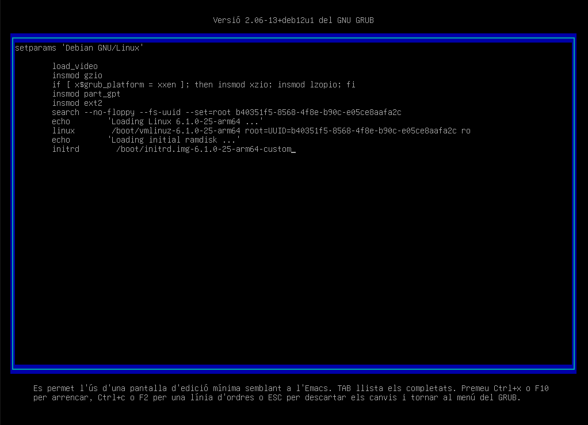
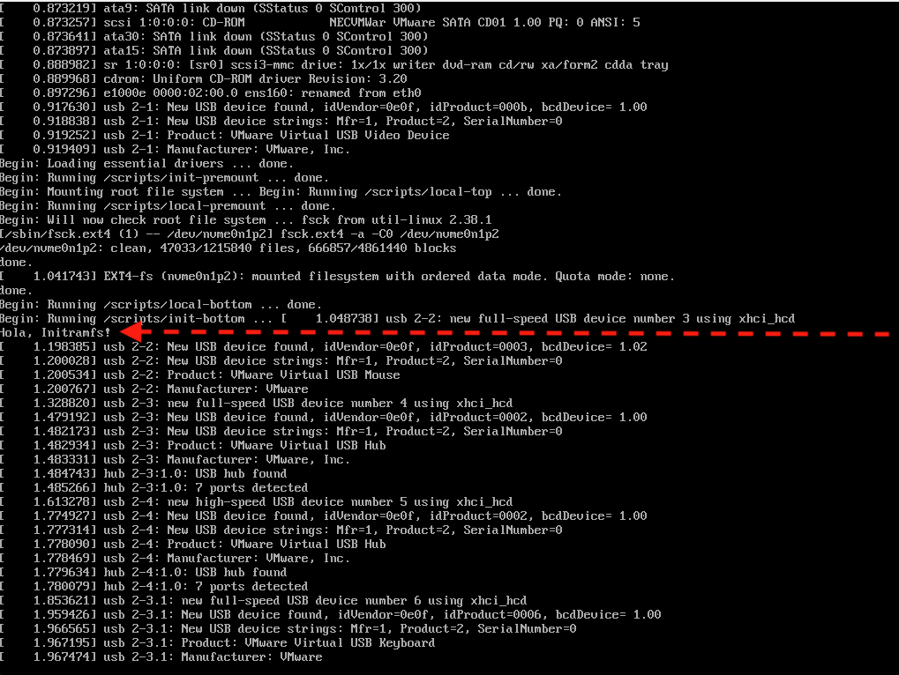

# Personalitzar la initramfs

En aquesta secció, personalitzarem la initramfs afegint un missatge personalitzat que es mostrarà durant el procés d'inici. Això ens permetrà veure com podem modificar la initramfs per incloure scripts i binaris addicionals que es poden executar durant l'arrencada del sistema.

> **Nota**:
>
> Realitzeu les accions següents com a superusuari `su -`.

1. **Crea un nou directori per construir la initramfs personalitzada**:

    ```bash
    mkdir /tmp/initramfs
    cd /tmp/initramfs
    ```

    Això crea un espai de treball temporal on es construirà la nova imatge de la initramfs.

2. **Extreu la imatge actual de la initramfs**:

    ```bash
    unmkinitramfs /boot/initrd.img-$(uname -r) .
    ```

    > ℹ️ **Nota**:
    >
    > `unmkinitramfs` és una eina que permet descomprimir la imatge de la initramfs a un directori de treball. Això permet modificar els fitxers continguts en la initramfs.

    ---

    > Compte!:
    > Es possible que al descomprimir la imatge us generi dos carpetes `main` i `stable`. En aquest cas, heu de treballar amb la carpeta `main`.
    > Cerqueu dins de `main` la carpeta `scripts` i dins d'aquesta la carpeta `init-top`. Aquesta és la carpeta on s'executen els scripts durant l'arrencada de la initramfs.

3. **Crea un nou fitxer de script amb un missatge personalitzat**:

    ```bash
    echo 'echo "Hola, Initramfs!"' > scripts/init-top/custom_message.sh
    # Afegeix una pausa per veure el missatge
    echo '/usr/bin/sleep 10' >> scripts/init-top/custom_message.sh
    # Atorga permisos d'execució al script
    chmod +x scripts/init-top/custom_message.sh
    ```

4. **Actualitza el manifest de la initramfs**:

    ```bash
    # Nota: order no existeix, és ORDER amb majúscules 
    echo 'scripts/init-top/custom_message.sh' >> scripts/init-top/ORDER
    ```

    Això afegeix el nou script al manifest de la initramfs, assegurant-se que s'executi durant el procés d'inici.

5. **Crea una nova imatge de la initramfs amb el script personalitzat**:

    Realitzeu **una** de les següents opcions:

    * Nova imatge de la initramfs (nom acaba en custom):

    ```bash
    find . | cpio -o -H newc | gzip > /boot/initrd.img-$(uname -r)-custom
    ```

    * Sobreescriure la imatge original:

    ```bash
    find . | cpio -o -H newc | gzip > /boot/initrd.img-$(uname -r)
    ```

    > ℹ️ **Nota**:
    >
    > Aquest pas utilitza `cpio` per empaquetar tots els fitxers del directori de treball en un sol arxiu, i `gzip` per comprimir-lo. La nova imatge es guarda a `/boot` amb un nom personalitzat. Si voleu sobreescriure la imatge original, podeu utilitzar el nom `initrd.img-$(uname -r)`. Si feu anar custom, al grub també cal indicar-ho.

6. **Actualitza la configuració de GRUB per utilitzar la nova imatge de la initramfs**:

    Com editarem la initramfs de forma temporal, no actualitzarem la configuració de GRUB de forma permanent. **Per tant, no ens calen aquests passos**.

    ```bash
    update-initramfs -u -k $(uname -r)
    update-grub
    ```

    > ℹ️ **Nota**:
    >
    > Per fer l'experiment no actualizarem el grub de forma permanent. Simplement, editarem la configuració de GRUB durant l'arrencada per utilitzar la nova imatge de la initramfs.

7. **Reinicia el sistema**: Reinicia el sistema per aplicar els canvis.

    ```bash
    reboot
    ```

8. **GRUB**: A l'arrencada, accedeix a la configuració de GRUB i modifica la línia de comandament per utilitzar la nova imatge de la initramfs. Recorda prement la tecla `e` per editar la configuració de GRUB.

    ```bash
    # Elimina les opcions `quiet` i `splash` per veure el missatge personalitzat
    # Afegeix custom al final de la línia de comandament de la initramfs
    initrd /boot/initrd.img-$(uname -r)-custom
    ```

    

9. **Comprova el missatge personalitzat durant l'arrencada**: Després de reiniciar el sistema, observa el missatge personalitzat que s'ha afegit a la initramfs durant el procés d'inici.

    

## Activitat opcional

* Quin seria el procediment si volem modificar de forma permanent la initramfs de la primera entrada de GRUB? Documenteu el procediment. *Aquesta activitat comptarà únicament a la primera persona que faci un PR amb la resposta correcta.* No compte a HandsOn, això es part de la millora dels continguts (un dels punts extres de la nota final).