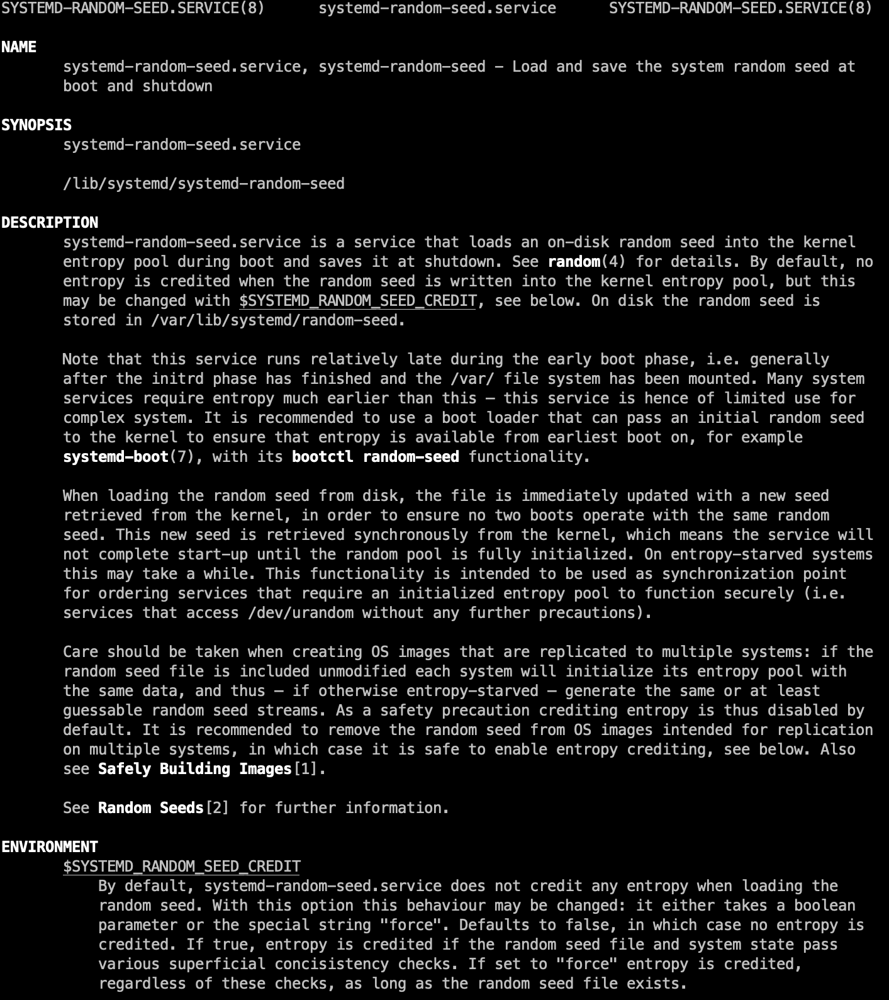
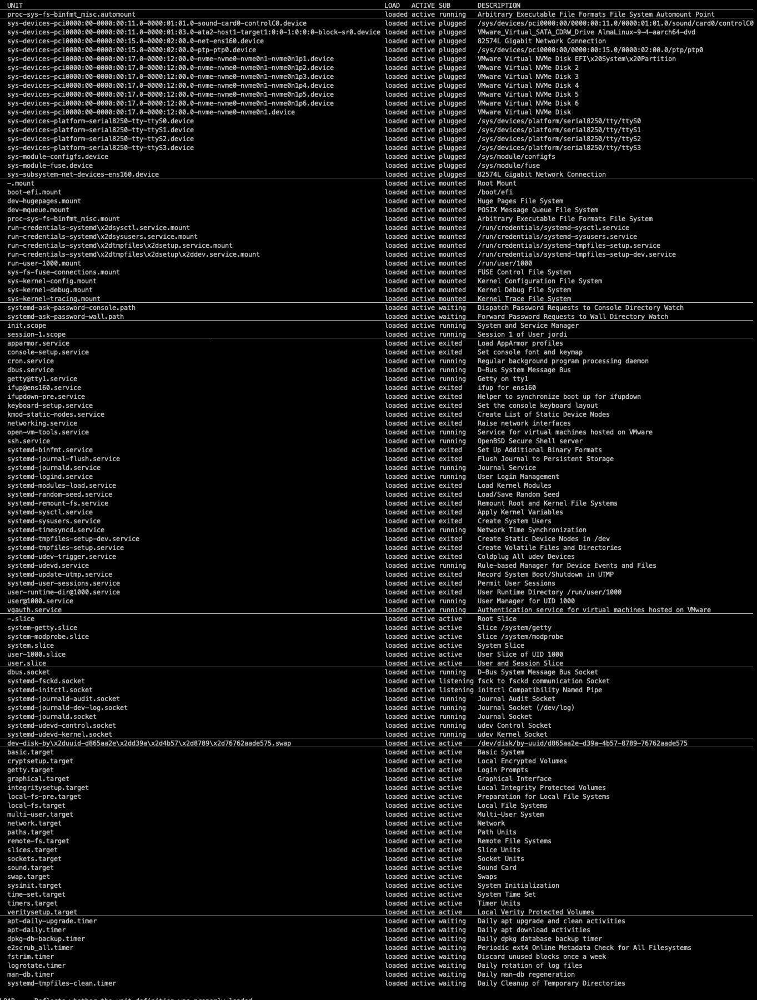

# Analitzant el procés d'arrancada

La comanda `systemd` ens permet gestionar els serveis del sistema i controlar el procés d'arrencada. Podeu comprovar les seves possibilitats amb la comanda `man systemd`. Una de les funcionalitats més útils de `systemd` és la capacitat de generar informació detallada sobre el procés d'arrencada del sistema.

El primer pas per analitzar el procés d'arrencada amb `systemd` és utilitzar la comanda `systemd-analyze` per obtenir informació sobre el temps que ha trigat el sistema a arrencar. Aquesta comanda mostrarà informació sobre el temps que ha trigat el sistema a arrencar, incloent el temps que ha trigat el kernel i l'espai d'usuari.

```bash
Startup finished in 899ms (kernel) + 2.074s (userspace) = 2.973s
graphical.target reached after 2.068s in userspace.
```

| Kernel | Espai d'usuari | Total |
|--------|---------------|-------|
| 899ms  | 2.074s        | 2.973s|

En aquest cas, els primers 899ms s'utilitzen per carregar les funcions del kernel com ara els controladors de dispositius i el sistema de fitxers. Els següents 2.074s s'utilitzen per carregar l'espai d'usuari, com ara els serveis i els processos del sistema. En total, el sistema ha trigat 2.973s a arrencar.

Ara que tenim aquesta informació, podem utilitzar la comanda `systemd-analyze blame` per obtenir informació detallada sobre el temps que ha trigat cada unitat a carregar durant el procés d'arrencada. Aquesta opció ens llistarà les unitats ordenades per temps d'arrencada, de major a menor.

| Temps | Unitat |
|-------|--------|
| 1.876s| systemd-random-seed.service |
| 784ms | dbus.service |
| 782ms | e2scrub_reap.service |
| 778ms | systemd-logind.service |
| ...   | ... |
| 4ms   | systemd-update-utmp-runlevel.service |

Amb aquesta informació, podem identificar les unitats que poden estar retardant el procés d'arrencada i optimitzar-les si cal. Per obtenir més informació sobre una unitat específica, podeu utilitzar la comanda `systemctl status` seguida del nom de la unitat. Per exemple, si volem informació sobre la unitat `systemd-random-seed.service`, podem executar:

```bash
systemctl status systemd-random-seed.service
```


Aquesta informació ens mostrarà:

1. L'estat actual de la unitat (inactiu, actiu, desactivat, error o recarregant).
2. La linia **Loaded** ens indica la ruta al fitxer on es desa la configuració de la unitat. En aquest cas, `/lib/systemd/system/systemd-random-seed.service`. A més ens indica *static* que vol dir que la unitat no es pot desactivar. Altres unitats ens poden indicar *error*, *masked*, *not-found*, *enable* o *disabled*
3. La entrada al manual de la unitat, si n'hi ha.
4. Finalment, ens mostra informació sobre el procés: PID, estat del procés i temps que ha estat en execució (això en el exemple) també pot mostrar la memòria, el cgroup, o el nombre de tasques associades.

Si volem saber exactament què fa aquest servei, podem consultar el manual amb la comanda `man systemd-random-seed.service`.



En el manual d'aquesta comanda us explicarà de forma detallada què aquest servei carrega una llavor aleatòria al espai del nucli quan arranca i la desa quan s'apaga. Aquesta llavor es guarda a `/var/lib/systemd/random-seed`. Per defecte, no s’assigna entropia quan s’escriu la llavor al nucli, però això es pot canviar amb `$SYSTEMD_RANDOM_SEED_CREDIT`. El servei s’executa després de muntar el sistema de fitxers `/var/`, per la qual cosa és recomanable utilitzar un carregador d’arrencada que passi una llavor inicial al nucli, com `systemd-boot`.

> 👁️ **Observació**:
>
> Amb aquesta informació podem identificar quina és la funció de cada servei i decidir si pel nostre sistema és necessari o no. En aquest cas, el servei `systemd-random-seed.service` és necessari per a la generació de nombres aleatoris, per tant, no és recomanable desactivar-lo.

Si volem informació sobre la unitat `systemd-random-seed.service`, podem utilitzar la comanda `systemctl cat systemd-random-seed.service` per veure la configuració de la unitat.

```text
# /lib/systemd/system/systemd-random-seed.service
#  SPDX-License-Identifier: LGPL-2.1-or-later
#
#  This file is part of systemd.
#
#  systemd is free software; you can redistribute it and/or modify it
#  under the terms of the GNU Lesser General Public License as published by
#  the Free Software Foundation; either version 2.1 of the License, or
#  (at your option) any later version.

[Unit]
Description=Load/Save Random Seed
Documentation=man:systemd-random-seed.service(8) man:random(4)
DefaultDependencies=no
RequiresMountsFor=/var/lib/systemd/random-seed
Conflicts=shutdown.target
After=systemd-remount-fs.service
Before=first-boot-complete.target shutdown.target
Wants=first-boot-complete.target
ConditionVirtualization=!container
ConditionPathExists=!/etc/initrd-release

[Service]
Type=oneshot
RemainAfterExit=yes
ExecStart=/lib/systemd/systemd-random-seed load
ExecStop=/lib/systemd/systemd-random-seed save

# This service waits until the kernel's entropy pool is initialized, and may be
# used as ordering barrier for service that require an initialized entropy
# pool. Since initialization can take a while on entropy-starved systems, let's
# increase the timeout substantially here.
TimeoutSec=10min
```

Aquesta informació ens mostra la configuració de la unitat, incloent la descripció, la documentació, les dependències, les condicions, el tipus de servei, els comandaments d'inici i parada, i altres opcions de configuració. El servei té una dependència de muntatge per a `/var/lib/systemd/random-seed`, i s'executa després de `systemd-remount-fs.service` i abans de `first-boot-complete.target` i `shutdown.target`. A més, ens indica que és un servei de tipus `oneshot`, que s'executa una sola vegada i roman actiu després de la sortida. Els comandaments d'inici i parada són `/lib/systemd/systemd-random-seed load` i `/lib/systemd/systemd-random-seed save`, respectivament.

> 💡 Nota::
>
> Si ovserveu el paramètre **TimeoutSec=10min** aquesta unitat pot trigar fins a 10 minuts a carregar. Si el sistema està en un entorn amb poca entropia, aquesta unitat pot trigar més temps a carregar.

Per exemple, editarem la unitat `systemd-random-seed.service` per  activar la entropia al sistema.Per editar la unitat podeu utilitzar qualsevol editor de text ( i.e `vi`) o bé la comanda `systemctl edit systemd-random-seed.service` que obrirà un editor de text per afegir la línia. Un cop obert l'editor heu d'afegir la lína a la secció `[Service]` i desar el fitxer. Recordeu que per fer aquesta acció necessitareu permisos d'administrador. Per tant, ```su -``` per canviar a l'usuari root i després fer la comanda.

```bash
Environment=SYSTEMD_RANDOM_SEED_CREDIT=4096
```

> Compte! Si feu anar el `systemctl edit` aquest crearà un fitxer de configuració a `/etc/systemd/system/systemd-random-seed.service.d/override.conf` que sobreescriurà la configuració de la unitat original. Per afegir la configuració còpieu la configuració original i afegiu la línia `Environment=SYSTEMD_RANDOM_SEED_CREDIT=4096` a la secció `[Service]`.

Estem assignant un crèdit de 4096 a la llavor aleatòria. Això augmentarà la quantitat d'entropia que es passa al nucli quan s'escriu la llavor. Un crèdit més alt pot augmentar la seguretat del sistema, però també pot augmentar el temps d'arrencada en sistemes amb poca entropia.

Un cop hàgim fet els canvis, guardarem el fitxer i sortirem de l'editor. Després, podem fer un `reboot` per aplicar els canvis. Quan el sistema s'hagi reiniciat, podem tornar a utilitzar la comanda `systemd-analyze` per comprovar si els canvis han tingut algun impacte en el temps d'arrencada del sistema.

|Inicial | Després de canviar la entropia | Diferència |
|--------|--------------------------------|------------|
| 2.973s | 3.008s                         | +0.035s    |

En el meu cas, el temps d'arrencada ha augmentat lleugerament després de fer aquest canvi. Això és normal, ja que hem augmentat la quantitat d'entropia que es passa al nucli.

Una altra opció interesant que ens ofereix `systemd` és la comanda `systemd-analyze critical-chain`. Aquesta comanda ens permet veure la cadena crítica de les unitats de temps del sistema. Això ens mostra quines unitats són les més crítiques per al temps d'arrencada del sistema. Per analizar la sortida, heu de mirar el temps després del caràcter `@` per veure quant temps ha trigat la unitat a activar-se o iniciar-se, i el temps després del caràcter `+` per veure quant temps ha trigat la unitat a iniciar-se. A més, aquesta comanda només mostra el temps que les unitats han passat a l'estat *activant-se*, i no cobreix les unitats que mai han passat per l'estat *activant-se* (com les unitats de dispositius que passen directament de *inactiu* a *actiu*). Tot i això, és una eina útil per identificar les unitats que poden estar retardant el procés d'arrencada.

```bash
graphical.target @2.076s
└─multi-user.target @2.075s
  └─ssh.service @1.497s +578ms
    └─network.target @1.494s
      └─networking.service @1.225s +268ms
        └─apparmor.service @1.158s +63ms
          └─local-fs.target @1.158s
            └─run-credentials-systemd\x2dtmpfiles\x2dsetup.service.mount @1.171s
              └─local-fs-pre.target @242ms
                └─systemd-tmpfiles-setup-dev.service @224ms +17ms
                  └─systemd-sysusers.service @192ms +20ms
                    └─systemd-remount-fs.service @131ms +54ms
                      └─systemd-journald.socket @114ms
                        └─-.mount @86ms
                          └─-.slice @86ms
```

En aquest cas, podem veure que la unitat `ssh.service` és la més crítica per al temps d'arrencada del sistema, ja que ha trigat 578ms a iniciar-se.  A més, podem veure les dependències de totes les unitats que s'han carregat durant el procés d'arrencada. Començant pel `graphical.target` i seguint per les unitats `multi-user.target`, aquestes dos unitats ens asseguren que el sistema ha arrencat en mode gràfic i multiusuari. A partir d'aquest moment es carreguen la resta de serveis.

Un altra opció interessant és utilitzar la comanda `systemd-analyze plot` per generar un gràfic del procés d'arrencada del sistema. Aquesta comanda generarà un fitxer SVG amb el gràfic del procés d'arrencada, que podeu visualitzar amb un navegador web o un visor d'imatges.

- Si volem analitzar tots les unitats:

    ```bash
    systemd-analyze plot > boot_system.svg
    ```

- Si volem analitzar les unitats de la instancia de l'usuari:

    ```bash
    systemd-analyze --user plot > boot_user.svg
    ```

- Si volem les unitats de l'arrencada del sistema:

    ```bash
    systemd-analyze --system plot > boot_system.svg
    ```

---
> ⚠️ **Compte**: Com puc visualtizar una imatge SVG en un debian sense interfície gràfica?
>
> Per visualitzar una imatge SVG en un sistema sense interfície gràfica, podeu descarregar el fitxer SVG a la vostra màquina local i visualitzar-lo amb un visor d'imatges o un navegador web. Per exemple, podeu utilitzar la comanda `scp` per descarregar el fitxer SVG a la vostra màquina local:
>
> ```bash
> scp user@remote:/path/to/boot.svg /path/to/local/boot.svg
> ```

---

> ⚠️ **Compte**: Debian no permet conexions remotes com a root per defecte.
> Abans de fer-ho, com debian per defecte no permet l'execució de `scp` com a root, caldrà fer-ho com a usuari normal i després copiar el fitxer a la carpeta desitjada.
>
> ```bash
> mv boot.svg /tmp 
> chown user:user /tmp/boot.svg  
> ```


Per a més informació sobre les opcions de la comanda `systemd-analyze`, podeu consultar el manual amb la comanda `man systemd-analyze`.

Per acabar, podem comentar que així com `systemctl status unitat` ens mostra la informació d'una unitat. També podem consultar la informació de totes les unitats amb:

- `systemctl status`:  Mostra informació sobre l'estat actual del sistema o d'una unitat específica acompanyada de les dades més recents del registre del diari.


- `systemctl list-units`: Mostra una llista de totes les unitats carregades al sistema, incloent les unitats actives, inactives i fallades.



Totes aquestes comandes són molt complexes i tenen moltes opcions, per tant us recomano que consulteu el manual de cada comanda per obtenir més informació sobre com utilitzar-les i quines opcions podeu elegir.
