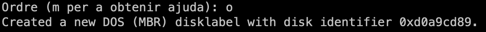
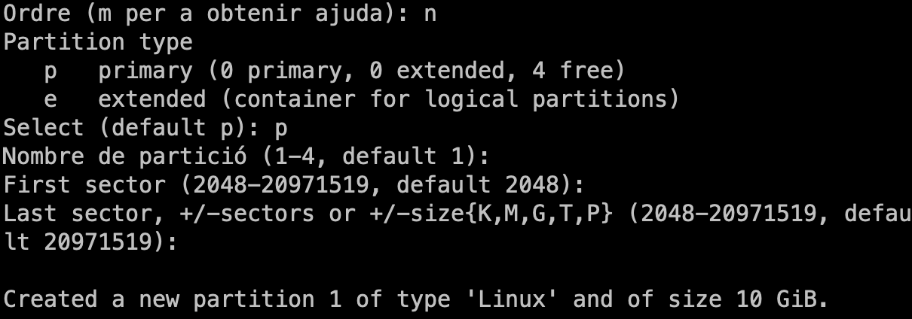
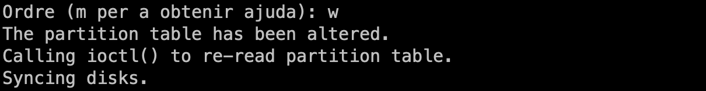
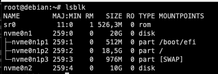
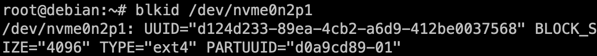
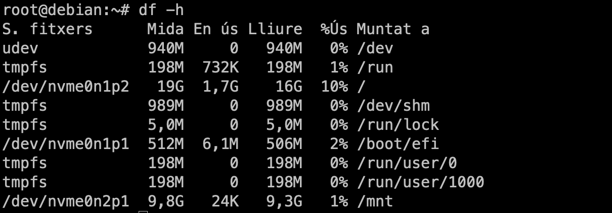
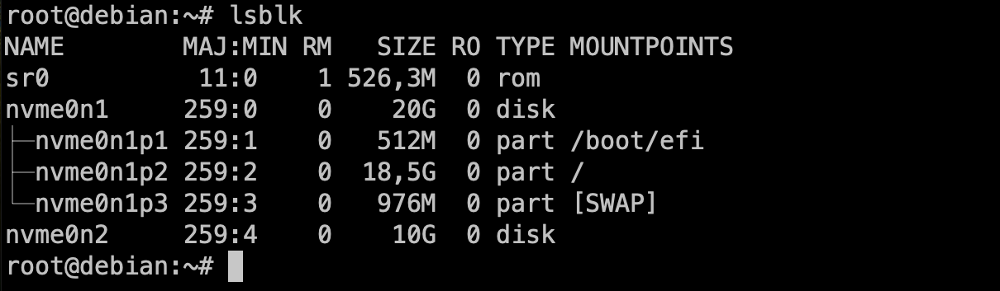

# Muntatge d'un disc extern per fer un backup

En aquest laboratori simularem que volem muntar un disc dur extern en el nostre servidor per a realitzar còpies de seguretat de les nostres dades. Crearem una partició en el disc dur i la formatejarem amb el sistema de fitxers `ext4`.

1. Connecta el disc dur extern a la màquina virtual.

2. Utilitza la comanda `lsblk` per a identificar el disc dur extern.

    

    > 👁️ **Observació**:
    >
    > En aquest cas, el disc dur extern s'identifica com a `/dev/nvme0n2`. La etiqueta `nvme` indica que el disc dur és un disc dur SSD NVMe. Aquesta etiqueta pot variar en funció del tipus de disc dur que tingueu connectat com ara `sda` per a disc dur SATA o `vda` per a disc dur virtual.

3. Utilitza la comanda `fdisk` per a crear una nova partició en el disc dur extern.

    ```bash
    fdisk /dev/nvme0n2
    ```

    

    La comanda ens mostrarà un missatge d'avís indicant que no hi ha cap taula de particions en el disc dur. Això és normal ja que el disc dur és nou i no té cap partició creada.

4. Crearem una nova taula de particions en el disc dur extern. Aquesta taula serà de tipus `msdos`.

    ```bash
    Command (m for help): o
    ```

    

    > 💫 **Recordatori**:
    >
    > Hi ha dos tipus de taula de particions: `msdos` i `gpt`. La taula `msdos` és més antiga i té limitacions en el nombre de particions que es poden crear. La taula `gpt` és més nova i permet crear més particions. Per tant, és recomanable utilitzar la taula `gpt` a no se que esteu treballant en un servidor antic.

    ---

    > 👁️ **Observació**:
    >
    > Com únicament volem fer una sola partició, la elecció de la taula de particions no afectarà en aquest cas.

5. Crearem una nova partició primària en el disc dur extern.

    ```bash
    Command (m for help): n
    Select (default p):
    Partition number (1-4): 1
    First sector (2048-20971519, default 2048):
    Last sector, +/-sectors or +/-size{K,M,G,T,P} (2048-20971519, default 20971519):
    ```

    En aquest cas, crearem una partició primària que ocuparà tot el disc dur. Per tant, acceptarem els valors per defecte. Podeu veure el procés a la següent imatge.

    

    Per a finalitzar la creació de la partició, premeu la tecla `w` per a guardar els canvis.

    

6. Comprova que la partició s'ha creat correctament.

    ```bash
    lsblk
    ```

    

    Com podeu veure, la partició s'ha creat correctament i s'identifica com a `/dev/nvme0n2p1`.

7. Formateja la partició amb el sistema de fitxers `ext4`.

    ```bash
    mkfs.ext4 /dev/nvme0n2p1
    ```

    

    > 👁️ **Observació**:
    >
    > La sortida de la comanda ens mostra el nombre d'inodes, blocs i tamany de blocs del sistema de fitxers creat i també l'identificador UUID del sistema de fitxers. Aquest identificador és únic per a cada sistema de fitxers i ens permet identificar-lo de forma unívoca.

    Podeu utilitzar la comanda `blkid` per a veure l'identificador UUID del sistema de fitxers en qualsevol moment.

    ```bash
    blkid /dev/nvme0n2p1
    ```

    

    També podeu utilitzar la comanda `tune2fs` per a canviar l'etiqueta del sistema de fitxers.

    ```bash
    tune2fs -L "Backup" /dev/nvme0n2p1
    ```

    Per a comprovar que l'etiqueta s'ha canviat correctament, podeu utilitzar la comanda `lsblk`.

    ```bash
    lsblk -o LABEL,UUID,FSTYPE,SIZE,MOUNTPOINT
    ```

    

    > 💡 **Nota**:
    >
    > L'etiqueta del sistema de fitxers ens permet identificar-lo de forma més fàcil i intuïtiva. A més, ens permet identificar el contingut del sistema de fitxers sense haver de muntar-lo.

    ---

    > 👁️ **Observació**:
    >
    > La comanda `lsblk` té moltes opcions per a mostrar informació dels discs i les particions. Podeu consultar la documentació de la comanda per a veure totes les opcions disponibles (`lsblk -h`). L'argument `-o` ens permet seleccionar les columnes que volem mostrar. En aquest cas, hem seleccionat les columnes `LABEL`, `UUID`, `FSTYPE`, `SIZE` i `MOUNTPOINT`.

8. Monta la partició en un directori del sistema de fitxers.

    ```bash
    mount /dev/nvme0n2p1 /mnt
    ```

9. Comprova que la partició s'ha muntat correctament o podeu fer amb `lsblk` o `df`.

    ```bash
    df -h
    ```

    

    En el meu cas, he utilitzat la comanda `df` per a comprovar que la partició s'ha muntat correctament. L'argument `-h` ens permet mostrar les dades en un format llegible per a humans.

10. Còpiem totes les dades del directori `/home` a la nova partició.

    ```bash
    cp -r /home/* /mnt
    ```

11. Comparem les dades del directori `/home` amb les dades de la partició.

    ```bash
    diff -r /home /mnt
    ```

    

    > 👁️ **Observació**:
    >
    > En aquest cas, la comanda `diff` ens mostrarà un missatge indicant que no hi ha cap diferència entre els dos directoris. Ara bé, en el meu cas es mostra el directori lost+found que únicament es troba al disc dur secundari (és a dir a `mnt`). Aquest directori és creat pel sistema de fitxers `ext4` i s'utilitza per a emmagatzemar els inodes dels fitxers que no estan associats a cap directori. Per tant, la seva presència és normal i com no hi ha cap altra diferència, podem assegurar que la còpia s'ha realitzat correctament.

12. Desmunta la partició per a poder treure el disc dur extern.

    ```bash
    umount /mnt
    ```

    
