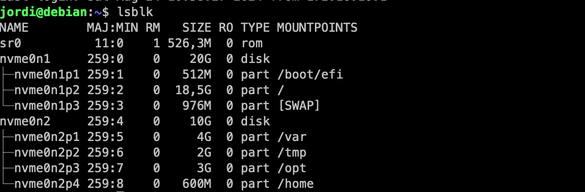
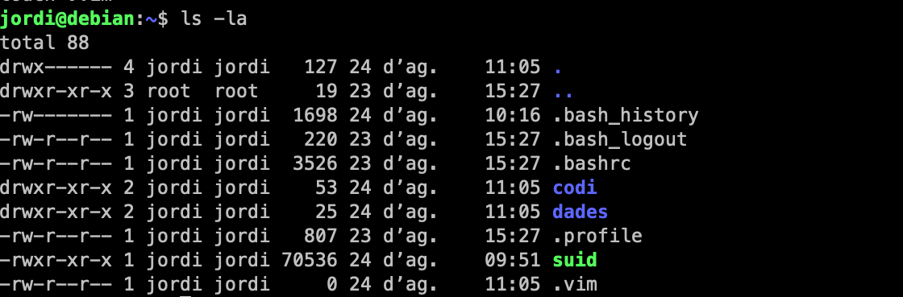
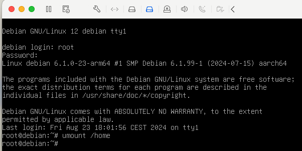
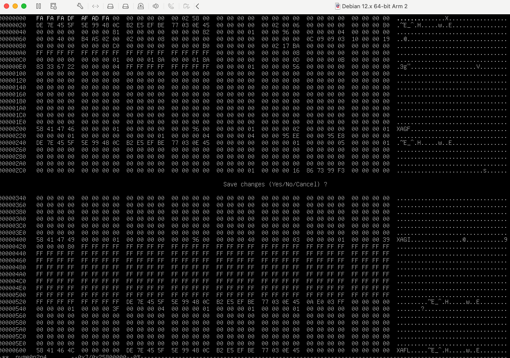
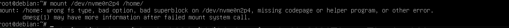

# Simulant una corrupció a `/home`

En aquest escenari simularem que hem patit una corrupció a la partició `/home` i quines eines podem utiltzar per intentar recuperar les dades.

## Preparació de l'escenari

El primer pas que farem serà migrar el directori `/home` a una partició diferent per a poder simular la corrupció. A continuació, simularem la corrupció i finalment recuperarem les dades.

1. Crearem una nova partició en el disc dur extern. Recorda que ja tenim 3 particions creades en aquest disc dur, per tant, la nova partició serà la quarta. Aquesta partició la farem de 600M de mida i la formatejarem amb el sistema de fitxers `xfs`.

    ```bash
    echo -e "n\np\n4\n\n+600M\nw" | fdisk /dev/nvme0n2
    mkfs.xfs /dev/nvme0n2p4
    ```

2. Crearem un directori on muntarem la nova partició.

    ```bash
    mkdir /mnt/home
    ```

3. Muntarem la nova partició en el directori `/mnt/home`.

    ```bash
    mount /dev/nvme0n2p4 /mnt/home
    ```

4. Copiarem totes les dades del directori `/home` a la nova partició.

    ```bash
    rsync -a /home/ /mnt/
    ```

5. Desmontarem la partició.

    ```bash
    umount /mnt/home
    ```

6. Modificarem el fitxer `/etc/fstab` per a que la partició es munti automàticament en l'arrencada del sistema.

    ```bash
    echo "/dev/nvme0n2p4 /home xfs defaults,nodev 0 0" >> /etc/fstab
    ```

7. Comprovarem que la partició es munta automàticament en l'arrencada del sistema.

    ```bash
    reboot
    ```

## Simulant la corrupció

Un cop hem migrat el directori `/home` a una partició diferent, si tot ha anat bé, hauriau de tenir el següent resultat:



Ara podem crear fitxers i directoris al directori `/home` del vostre usuari normal, en el meu cas `jordi`.

```bash
mkdir codi
mkdir dades
touch dades/pokemon.csv
touch codi/main.c
touch codi/Makefile
touch codi/README.md
touch .vim
```



Per a simular una corrupció editarem alguns valors de la partició `/home` amb un editor hexadecimal.

1. Desmuntem la partició `/home`.

    ```bash
    umount /home
    ```

    > **Compte!**: Si esteu connectats per SSH, no podreu desmuntar la partició `/home` ja que el vostre usuari està utilitzant aquesta partició. En la primera sessió. Per tant, haure de fer-ho a la consola de la màquina virtual.

    

2. Obrirem la partició `/home` amb un editor hexadecimal. Podeu instal·lar l'editor hexadecimal `hexedit` amb la comanda `apt install hexedit`.

    ```bash
    hexedit /dev/nvme0n2p4 
    ```

3. Modifiqueu bits a l'atzar i deseu els canvis. Per fer-ho escriviu damunt dels valors hexadecimals altres valors. Un cop fet guardeu amb **Ctrl + X i Y**.

    

    Fixeu-vos en els primers valors resaltats en negreta són els que he modificat.

4. Ara intentarem muntar la partició `/home` per a comprovar que ha estat corrompuda.

    ```bash
    mount /home
    ```

    Si la partició `/home` s'ha corromput, hauríeu de veure un missatge d'error com aquest:

    

5. Els diferents sistemes de fitxers tenen eines per a comprovar la integritat dels fitxers. Per exemple, el sistema de fitxers `xfs` té l'eina `xfs_ncheck` que permet comprovar la integritat dels fitxers.

    ```bash
    xfs_ncheck /dev/nvme0n2p4
    ```

6. Per a reparar la partició `/home` utilitzarem l'eina `xfs_repair`.

    ```bash
    xfs_repair /dev/nvme0n2p4
    ```

7. Un cop reparada la partició `/home`, la muntarem de nou.

    ```bash
    mount /home
    ```

8. Comprovarem que la partició `/home` s'ha muntat correctament i conté els fitxers que havíem creat.

    ```bash
    ls /home
    ```
