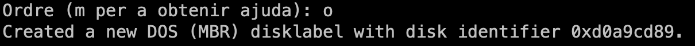
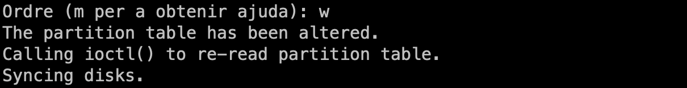
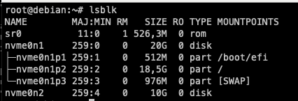
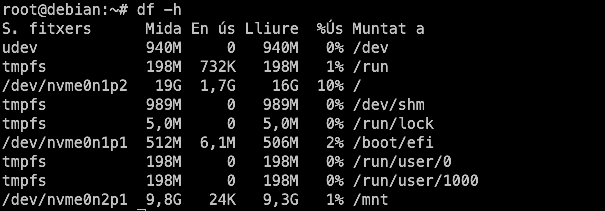
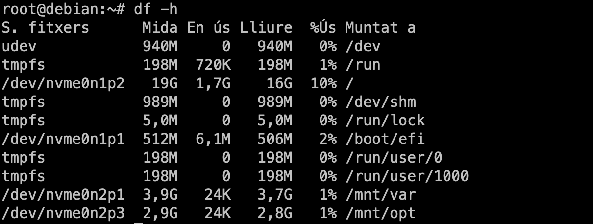
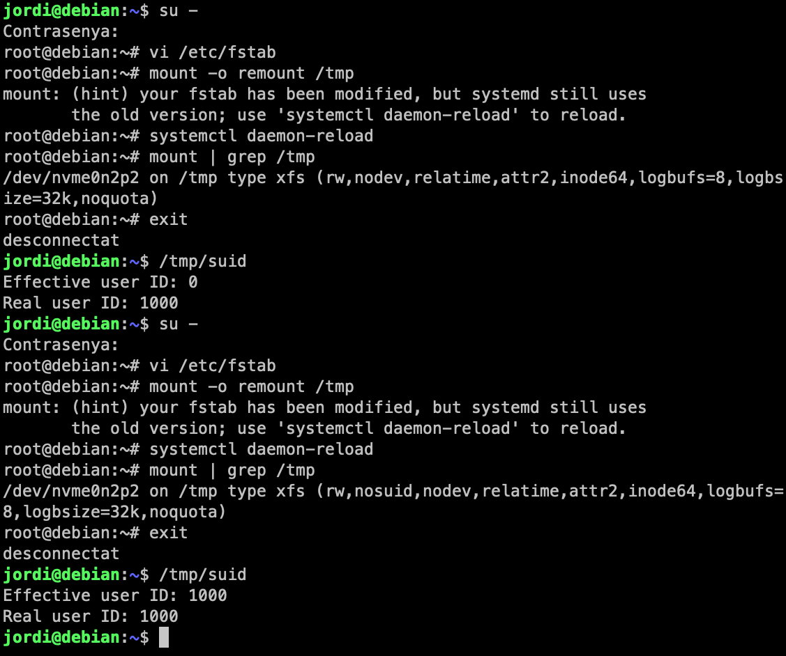
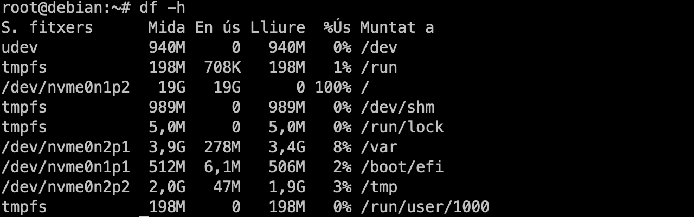
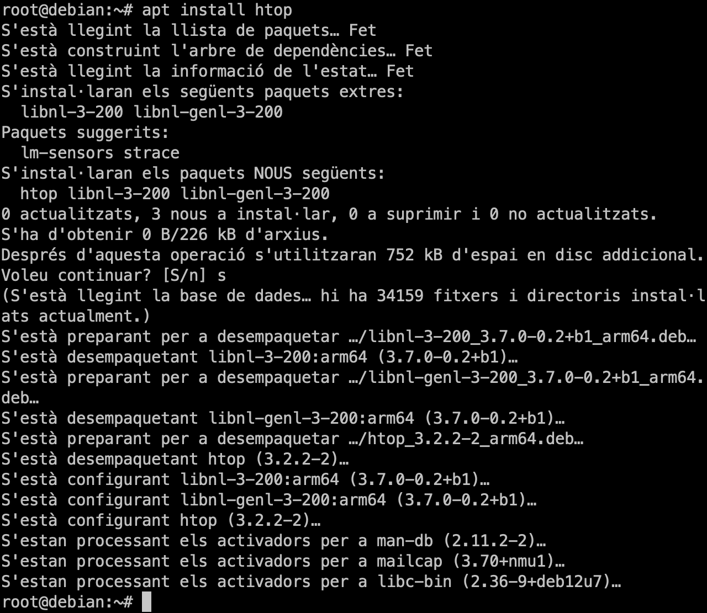

# Discs i particions

En aquest laboratori treballarem amb la comanda `fdisk` per a gestionar els discs i les particions en un servidor GNU/Linux.

## Tasques

### Escenari 1: Muntatge d'un disc extern per fer un backup

En aquest escenari simularem que volem muntar un disc dur extern en el nostre servidor per a realitzar còpies de seguretat de les nostres dades. Crearem una partició en el disc dur i la formatejarem amb el sistema de fitxers `ext4`.

1. Connecta el disc dur extern a la màquina virtual.

2. Utilitza la comanda `lsblk` per a identificar el disc dur extern.

    

    > **Observació**:
    >
    > En aquest cas, el disc dur extern s'identifica com a `/dev/nvme0n2`. La etiqueta `nvme` indica que el disc dur és un disc dur SSD NVMe. Aquesta etiqueta pot variar en funció del tipus de disc dur que tingueu connectat com ara `sda` per a disc dur SATA o `vda` per a disc dur virtual.

3. Utilitza la comanda `fdisk` per a crear una nova partició en el disc dur extern.

    ```bash
    fdisk /dev/nvme0n2
    ```

    

    La comanda ens mostrarà un missatge d'avís indicant que no hi ha cap taula de particions en el disc dur. Això és normal ja que el disc dur és nou i no té cap partició creada.

4. Crearem una nova taula de particions en el disc dur extern. Aquesta taula serà de tipus `msdos`.

    ```bash
    Command (m for help): o
    ```

    

    > **Recordatori**:
    >
    > Hi ha dos tipus de taula de particions: `msdos` i `gpt`. La taula `msdos` és més antiga i té limitacions en el nombre de particions que es poden crear. La taula `gpt` és més nova i permet crear més particions. Per tant, és recomanable utilitzar la taula `gpt` a no se que esteu treballant en un servidor antic.

    ---

    > **Observació**:
    >
    > Com únicament volem fer una sola partició, la elecció de la taula de particions no afectarà en aquest cas.

5. Crearem una nova partició primària en el disc dur extern.

    ```bash
    Command (m for help): n
    Select (default p):
    Partition number (1-4): 1
    First sector (2048-20971519, default 2048):
    Last sector, +/-sectors or +/-size{K,M,G,T,P} (2048-20971519, default 20971519):
    ```

    En aquest cas, crearem una partició primària que ocuparà tot el disc dur. Per tant, acceptarem els valors per defecte. Podeu veure el procés a la següent imatge.

    

    Per a finalitzar la creació de la partició, premeu la tecla `w` per a guardar els canvis.

    

6. Comprova que la partició s'ha creat correctament.

    ```bash
    lsblk
    ```

    

    Com podeu veure, la partició s'ha creat correctament i s'identifica com a `/dev/nvme0n2p1`.

7. Formateja la partició amb el sistema de fitxers `ext4`.

    ```bash
    mkfs.ext4 /dev/nvme0n2p1
    ```

    

    > **Observació**:
    >
    > La sortida de la comanda ens mostra el nombre d'inodes, blocs i tamany de blocs del sistema de fitxers creat i també l'identificador UUID del sistema de fitxers. Aquest identificador és únic per a cada sistema de fitxers i ens permet identificar-lo de forma unívoca.

    Podeu utilitzar la comanda `blkid` per a veure l'identificador UUID del sistema de fitxers en qualsevol moment.

    ```bash
    blkid /dev/nvme0n2p1
    ```

    

    També podeu utilitzar la comanda `tune2fs` per a canviar l'etiqueta del sistema de fitxers.

    ```bash
    tune2fs -L "Backup" /dev/nvme0n2p1
    ```

    Per a comprovar que l'etiqueta s'ha canviat correctament, podeu utilitzar la comanda `lsblk`.

    ```bash
    lsblk -o LABEL,UUID,FSTYPE,SIZE,MOUNTPOINT
    ```

    

    > **Nota**:
    >
    > L'etiqueta del sistema de fitxers ens permet identificar-lo de forma més fàcil i intuïtiva. A més, ens permet identificar el contingut del sistema de fitxers sense haver de muntar-lo.

    ---

    > **Observació**:
    >
    > La comanda `lsblk` té moltes opcions per a mostrar informació dels discs i les particions. Podeu consultar la documentació de la comanda per a veure totes les opcions disponibles (`lsblk -h`). L'argument `-o` ens permet seleccionar les columnes que volem mostrar. En aquest cas, hem seleccionat les columnes `LABEL`, `UUID`, `FSTYPE`, `SIZE` i `MOUNTPOINT`.

8. Monta la partició en un directori del sistema de fitxers.

    ```bash
    mount /dev/nvme0n2p1 /mnt
    ```

9. Comprova que la partició s'ha muntat correctament o podeu fer amb `lsblk` o `df`.

    ```bash
    df -h
    ```

    

    En el meu cas, he utilitzat la comanda `df` per a comprovar que la partició s'ha muntat correctament. L'argument `-h` ens permet mostrar les dades en un format llegible per a humans.

10. Còpiem totes les dades del directori `/home` a la nova partició.

    ```bash
    cp -r /home/* /mnt
    ```

11. Comparem les dades del directori `/home` amb les dades de la partició.

    ```bash
    diff -r /home /mnt
    ```

    

    > **Observació**:
    >
    > En aquest cas, la comanda `diff` ens mostrarà un missatge indicant que no hi ha cap diferència entre els dos directoris. Ara bé, en el meu cas es mostra el directori lost+found que únicament es troba al disc dur secundari (és a dir a `mnt`). Aquest directori és creat pel sistema de fitxers `ext4` i s'utilitza per a emmagatzemar els inodes dels fitxers que no estan associats a cap directori. Per tant, la seva presència és normal i com no hi ha cap altra diferència, podem assegurar que la còpia s'ha realitzat correctament.

12. Desmunta la partició per a poder treure el disc dur extern.

    ```bash
    umount /mnt
    ```

    

### Escenari 2: Migració de directoris a particions diferents

En aquest escenari assumirem que volem reorganitzar els directoris del nostre sistema de fitxers per a millorar el rendiment i la seguretat del sistema. Crearem 3 noves particions en el disc dur i migrarem els directoris `/var`, `/tmp` i `/opt` en aquestes noves particions.

1. Utilitzarem el mateix disc dur que en l'escenari anterior.

    Com que ja tenim dades el que farem serà destruir totes les dades per a començar de nou. Per fer-ho, una forma senzilla és sobreescriure les dades amb zeros. Podem sobreescriure els 10GB del disc dur amb zeros amb la comanda `dd`.

    ```bash
    dd if=/dev/zero of=/dev/nvme0n2 bs=1M count=10000
    ```

    > **Nota**:
    >
    > La comanda `dd` ens permet copiar dades d'un lloc a un altre. En aquest cas, estem copiant zeros (`/dev/zero`) al disc dur (`/dev/nvme0n2`) amb un tamany de 1MB (`bs=1M`) i tantes vegades com indiquem (`count=10000`). Això sobreescriurà les dades del disc dur amb zeros i eliminarà totes les dades existents.

2. Utilitzarem la comanda `fdisk` per a crear tres noves particions en el disc dur.

    - La primera partició serà per a `/var` amb el sistema de fitxers `ext4`, etiqueta `var` mida 4GB.
    - La segona partició serà per a `/tmp` amb el sistema de fitxers `xfs`,  sense etiqueta i mida 2GB.
    - La tercera partició serà per a `/opt` amb el sistema de fitxers `ext4`, etiqueta `opt` mida 3GB.

    1. Crearem les noves particions en el disc dur. Podeu utilzar una pipeline per a automatitzar la creació de les particions.

        ```bash
        echo -e "n\np\n\n\n+4G\nn\np\n\n\n+2G\nn\np\n\n\n+3G\nw" | fdisk /dev/nvme0n2
        ```

        

    2. Formateja les particions amb els sistemes de fitxers corresponents i assigna les etiquetes.

        ```bash
        tune2fs -L "var" /dev/nvme0n2p1
        mkfs.ext4 /dev/nvme0n2p1
        mkfs.xfs /dev/nvme0n2p2
        tune2fs -L "opt" /dev/nvme0n2p3
        mkfs.ext4 /dev/nvme0n2p3
        ```

        > **Nota**:
        >
        > El sistema de fitxers xfs no esta instal·lat per defecte a debian, per tant, haurem d'instal·lar-lo abans de poder utilitzar-lo (`apt install xfsprogs`).

3. Monta les particions en directoris del sistema de fitxers. Montarem les particions a `/mnt` per a poder migrar els directoris.

    ```bash
    mkdir /mnt/var
    mount /dev/nvme0n2p1 /mnt/var
    mkdir /mnt/opt
    mount /dev/nvme0n2p3 /mnt/opt
    ```

    

    > **Nota**:
    > Com que la partició `/tmp` és temporal, no la muntarem ja que no necessitem migrar cap dada.

4. Migrarem els directoris `/var`, `/tmp` i `/opt` a les noves particions. Per fer-ho podem utilitzar la comanda `cp` o `rsync`. En aquest cas utilitzarem rsync per a poder mostrar el progrés de la còpia. Normalment, la eina `rsync` no ve instal·lada per defecte en la majoria de distribucions, per tant, haurem d'instal·lar-la abans de poder utilitzar-la (`apt install rsync`).

    ```bash
    rsync -av /var /mnt
    cp -ax /opt /mnt
    ```

    > **Suggeriment**:
    >
    > Us recomano utilitzar la comanda `rsync` per a migrar els directoris ja que ens permet mostrar el progrés de la còpia i també ens permet reprendre la còpia en cas que es talli la connexió o hi hagi un error. A més, també ens permet excloure directoris o fitxers que no volem migrar i ens permet fer còpies incrementals. Podeu consultar la documentació de la comanda per a veure totes les opcions disponibles (`man rsync`).

5. Comprovem que les dades s'han migrat correctament.

    ```bash
    diff -r /var /mnt/var
    diff -r /opt /mnt/opt
    ```

6. Montarem les particions en els directoris corresponents del sistema de fitxers.

    ```bash
    umount /mnt/var
    mount /dev/nvme0n2p1 /var
    umount /mnt/opt
    mount /dev/nvme0n2p3 /opt
    mount /dev/nvme0n2p2 /tmp
    ```

    Ara ja teniu els directoris `/var`, `/tmp` i `/opt` muntats en les noves particions. Podem fer servir la comanda `df` per a comprovar que les particions s'han muntat correctament.

    

7. Ara reinicieu el sistema:

    ```bash
    reboot
    ```

    > **Nota**:
    >
    > Un cop reinicieu el sistema, els directoris `/var`, `/tmp` i `/opt` no estaran muntats en les noves particions. Podeu comprovar-ho amb la comanda `df`. Això és normal ja que hem muntat les particions manualment i no hem el fitxer `/etc/fstab` per a que es muntin automàticament en l'arrencada del sistema.

8. Modifica el fitxer `/etc/fstab` per a que les particions es muntin automàticament en l'arrencada del sistema.

    ```bash
    echo "/dev/nvme0n2p1 /var ext4 defaults 0 0" >> /etc/fstab
    echo "/dev/nvme0n2p2 /tmp xfs defaults 0 0" >> /etc/fstab
    echo "/dev/nvme0n2p3 /opt ext4 defaults 0 0" >> /etc/fstab
    ```

    > **Nota**:
    >
    > El fitxer `/etc/fstab` conté la informació de les particions que es muntaran automàticament en l'arrencada del sistema. Cada línia del fitxer conté la informació d'una partició. Els camps de cada línia són: dispositiu, punt de muntatge, sistema de fitxers, opcions, freqüència de comprovació i ordre de comprovació. Podeu consultar la documentació del fitxer per a més informació (`man fstab`).

9. Comprova que les particions es muntin automàticament en l'arrencada del sistema.

    ```bash
    reboot
    ```

    Un cop reinicieu el sistema, les particions `/var`, `/tmp` i `/opt` s'hauran muntat automàticament en els directoris corresponents. Podeu comprovar-ho amb la comanda `df`.


En aquest punt podriam optimitzar la configuració particions per a millorar el rendiment del sistema. 

1. Utiltizarem els UUIDs en lloc dels dispositius per a muntar les particions. Això ens permetrà identificar les particions de forma unívoca i evitar problemes en cas que els dispositius canviïn d'identificador. Per fer-ho podem utilitzar la comanda `sed` per actualitzar el fitxer `/etc/fstab`.

    ```bash
    sed -i "s|/dev/nvme0n2p1|UUID=$(blkid -s UUID -o value /dev/nvme0n2p1)|" /etc/fstab
    sed -i "s|/dev/nvme0n2p2|UUID=$(blkid -s UUID -o value /dev/nvme0n2p2)|" /etc/fstab
    sed -i "s|/dev/nvme0n2p3|UUID=$(blkid -s UUID -o value /dev/nvme0n2p3)|" /etc/fstab
    ```

    > En quins casos poden canviar els dispositius o tenir duplicats?
    >
    > Els dispositius poden canviar d'identificador en cas que es connectin més dispositius al sistema o es canvii l'ordre de connexió dels dispositius. Això pot provocar que les particions es muntin en llocs diferents dels esperats. Per a evitar aquest problema, és recomanable utilitzar els UUIDs en lloc dels dispositius per a muntar les particions.

2. Utilitzarem opcions més específiques per protegir la partició `/tmp` per a evitar que s’executin programes des de la partició. Utilitzant les opcions **nodev**, **nosuid**, i **noexec**:
  
    - Edita el fitxer `/etc/fstab` i afegeix les opcions `nodev`, `nosuid`, i `noexec` a la partició `/tmp`.

        > Què fan les opcions `nodev`, `nosuid`, i `noexec`?
        >
        > La opció **nodev** evita que es puguin executar dispositius en la partició. La opció **nosuid** evita que es puguin executar programes amb permisos de superusuari en la partició. La opció **noexec** evita que es puguin executar fitxers binaris des de la partició.

    - Comprova les opcions després d'editar el fitxer `/etc/fstab`.

        ```bash
        mount | grep /tmp
        ```

        

    - Per aplicar les opcions de muntatge a la partició `/tmp`, farem un `reboot` del sistema.

        
  
    - Testem les opcions de muntatge de la partició `/tmp`:
  
        1. Prova d'executar un programa des de la partició `/tmp` com a usuari no privilegiat.

            ```bash
            echo "echo 'Hello, World'" > /tmp/hello.sh
            chmod +x /tmp/hello.sh
            /tmp/hello.sh
            bash /tmp/hello.sh
             ```

            

        2. Prova de fer el mateix com a usuari privilegiat.

            ```bash
            su -
            /tmp/hello.sh
            bash /tmp/hello.sh
            ```

            

            > **Observació**:
            >
            > Observeu que la opció `noexec` impedeix la execució dels binaris però no ens protegeix contra l'execució de scripts de bash.

        3. Prova d'accedir a un dispositiu creat a `/tmp`:

            - Inicialitza un dispositiu a `/tmp` utilitzant la comanda `mknod`.

                ```bash
                mknod /tmp/dispositiu c 1 3
                ```

                > Compte: La comanda `mknod` única i exclusivament la poden fer els usuaris amb permisos de superusuari. Per tant, feu servir la comanda `su` per a canviar a l'usuari `root` abans de fer servir la comanda `mknod`.

            - Per accedir al dispositiu, utilitza la comanda `cat`.

                ```bash
                cat /tmp/dispositiu
                ```

                


            > **Observació**:
            >
            > Fixeu-vos que quan intento accedir a un dispositiu al directori actual, no hi ha cap problema. Però quan intento accedir al dispositiu creat a `/tmp`, rebre un missatge d'error indicant que no es pot accedir al dispositiu. Això és degut a la opció `nodev` que impedeix l'accés a dispositius en la partició.

        4. Per veure, les implicacions de la opció `nosuid`, podem realitzar el següent experiment:

            Per fer-ho, crearem un executable amb c que ens indicarà l'identificador de l'usuari real i l'identificador de l'usuari efectiu. On l'usuari real és l'usuari que ha iniciat la sessió i l'usuari efectiu és l'usuari que executa el programa. Si un programa té el bit `suid` activat, l'usuari efectiu serà l'usuari propietari del programa i no l'usuari que l'ha executat.

            ```c
            #include <stdio.h>
            #include <sys/types.h>
            #include <unistd.h>

            int main() {
                printf("Effective user ID: %d\n", geteuid());
                printf("Real user ID: %d\n", getuid());
                return 0;
            }
            ```

            Compilem el programa amb la comanda `gcc`.

            ```bash
            gcc -o /tmp/suid /tmp/suid.c
            ```

            > **Nota**:
            >
            > El paquet `gcc` no ve instal·lat per defecte en una instal·lació mínima de Debian, per tant, haurem d'instal·lar-lo abans de poder utilitzar-lo (`apt install build-essential`).

            - Desactiva la opció `nosuid` i també la opció `noexec` per a la partició `/tmp`. Per fer-ho, utilitza l'usuari `root` per a editar el fitxer `/etc/fstab`.

            - Remunta la partició `/tmp`.

            - Prova d'executar el programa com a usuari no privilegiat.

                ```bash
                /tmp/suid
                ```

            - Activa la opció `nosuid` i torna a provar d'executar el programa.

                ```bash
                /tmp/suid
                ```

            La següent imatge representa la seqüència de comandes per a provar la opció `nosuid`:

            

            > **Observació**:
            >
            > Fixeu-vos que quan la opció `nosuid` està activada, no es pot executar el programa amb permisos de superusuari. Això és important per a evitar que els usuaris no privilegiats puguin executar programes amb permisos de superusuari. Aquesta opció pot permetre escalar privilegis i comprometre la seguretat del sistema.

> **Pregunta** - Per què és important tenir els directoris `/var`, `/tmp` i `/opt` en particions diferents?
>
> La raó principal per a tenir els directoris `/var`, `/tmp` i `/opt` en particions diferents és per a millorar el rendiment i la seguretat del sistema. El directori `/var` conté dades variables com ara logs, bases de dades, correu electrònic, etc. Si aquest directori es queda sense espai, el sistema podria fallar. El mateix raonament s'aplica al directori `/tmp` i `/opt`. Per això, és important tenir-los en particions separades per a evitar que el sistema falli. A més, tenir els directoris `/var`, `/tmp` i `/opt` en particions separades també millora la seguretat del sistema ja que si una partició falla, les altres particions seguiran funcionant.

Anem a fer una simulació de com respon el sistema en cas de no tenir els directoris `/var`, `/tmp` i `/opt` en particions separades. Per a això, simularem que el directori `/opt` es va omplint fins a ocupar tot l'espai disponible en la partició principal del sistema.

1. Desmuntem la partició `/opt` per a poder continuar amb l'exercici.

    ```bash
    umount /opt
    ```

2. Creeu un fitxer de 20GB al directori `/opt`:

    ```bash
    dd if=/dev/urandom of=/opt/fitxer bs=1M count=20480
    ```

3. Comprova l'estat del sistema.

    ```bash
    df -h
    ```

    

4. Intenta instal·lar un paquet amb `apt` i comprova que el sistema falla.

    ```bash
    apt install htop
    ```

    

    Com podeu veure, el sistema fallarà ja que no té espai suficient per a instal·lar el paquet. Això és un problema greu ja que el sistema no podrà funcionar correctament fins que no alliberem espai en la partició principal.

5. Elimina el fitxer que has creat per a poder continuar amb la resta de l'exercici.

    ```bash
    rm /opt/fitxer
    ```

6. Munteu la partició `/opt` i torneu a crear el fitxer per a omplir el directori.

    ```bash
    mount /dev/nvme0n2p3 /opt
    dd if=/dev/urandom of=/opt/fitxer bs=1M count=20480
    ```

    

7. Ara únicament teniu la partició `/opt` plena; però el sistema pot continuar fent tasques:

    ```bash
    apt install htop
    ```

    
