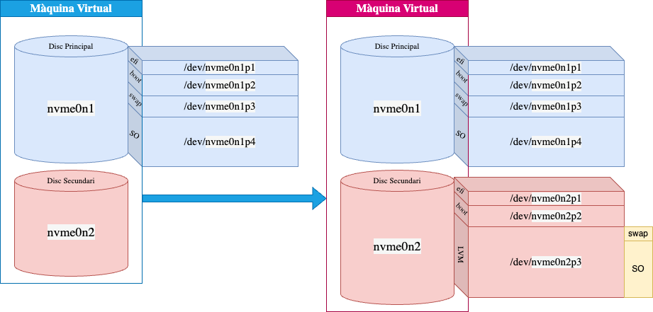

# Migració a LVM

En aquest laboratori, aprendreu a migrar un sistema de particions tradicionals instal·lat en un disc dur (*simulant un servidor funcional*) a un sistema basat en LVM. Per això, clonareu l'estructura del disc dur original a un disc dur secundari, creareu les particions necessàries per a LVM, configurareu LVM i actualitzareu el sistema per a utilitzar LVM. Finalment, actualitzareu el `grub` per a arrencar amb el nou sistema LVM.



La figura mostra l'estat inicial del sistema amb un disc dur de 20GB i un disc dur addicional de 20GB. El disc dur original té un sistema de particions tradicionals amb les particions `/boot/efi`, `/boot`, `swap` i `/`. El disc dur addicional està buit i es farà servir per a migrar el sistema a LVM. Al costat dret de la figura, es mostra l'estat final del sistema amb LVM. On es mostren les particions `/boot/efi`, `/boot` com a duplicats i particions originals i la partició 3 com a base per a LVM amb els volums lògics `swap` i `/`.

## Objectius

- Aprendre a migrar un sistema de particions tradicionals a LVM.
- Reforçar els coneixements sobre arrancada EFI i GRUB.
- Compendre la necessitat de migrar a sistemes semblants a LVM.

## Preparació

1. Inicialitzeu una nova màquina virtual amb un disc dur de 20 GB i instal·leu AlmaLinux. Feu servir el sistema de particions tradicionals per defecte. *Creeu una nova màquina virtual per realitzar aquest laboratori*.

2. Assegureu-vos que l'estat inicial del sistema és correcte. Utiltizeu la comanda `lsblk` per comprovar que teniu aquest estat inicial:

    ```bash
    NAME        MAJ:MIN RM  SIZE   RO TYPE  MOUNTPOINT
    nvme0n1     259:0    0   20G   0  disk
    ├─nvme0n1p1 259:1    0   600MB 0  part  /boot/efi
    ├─nvme0n1p2 259:2    0   1G    0  part  /boot
    ├─nvme0n1p3 259:3    0   2G    0  part  [SWAP]
    └─nvme0n1p4 259:4    0   16.4G 0  part  /
    nvme0n2     259:5    0   20G   0  disk
    ```

    **Nota**: *El nom del dispositiu pot variar segons les vostres opcions de virtualització.*

3. Afegiu 1 disc addicional de 20GB a la màquina virtual per a realitzar la migració a LVM. De manera que:

    ```bash
    NAME        MAJ:MIN RM  SIZE   RO TYPE  MOUNTPOINT
    nvme0n1     259:0    0   20G   0  disk
    ├─nvme0n1p1 259:1    0   600MB 0  part  /boot/efi
    ├─nvme0n1p2 259:2    0   1G    0  part  /boot
    ├─nvme0n1p3 259:3    0   2G    0  part  [SWAP]
    └─nvme0n1p4 259:4    0   16.4G 0  part  /
    nvme0n2     259:5    0   20G   0  disk
    ```

4. Instal·leu el paquet `lvm2` per a gestionar els volums lògics, si no està instal·lat executeu la següent comanda:

    ```bash
    ~dnf install lvm2 -y
    ```

5. Instal·leu el paquet `rsync` per a copiar les dades de la partició `/` a la nova partició:

    ```bash
    ~dnf install rsync -y
    ```

## Tasques

1. Prepareu el disc dur addicional amb l'eina `fdisk`. Heu de crear les particions `/boot/efi`, `/boot` i `root`. 

    - Tipus de taula: GPT.

    ```bash
    ~echo -e "g\nw" | fdisk /dev/nvme0n2
    ```

    - Partició 1: EFI System de 600MB.
  
    ```bash
    ~echo -e "n\n1\n\n+600M\nt\n1\nw" | fdisk /dev/nvme0n2
    ```

    - Partició 2: `/boot` de 1GB.
  
    ```bash
    ~echo -e "n\n2\n\n+1G\nw" | fdisk /dev/nvme0n2
    ```

    - Partició 3: `root` amb el restant de l'espai.

    ```bash
    ~echo -e "n\n3\n\n\nw" | fdisk /dev/nvme0n2
    ```

    - Comproveu que les particions s'han creat correctament amb la comanda `lsblk`:

    ```bash
    NAME        MAJ:MIN RM  SIZE RO TYPE MOUNTPOINTS
    sr0          11:0    1  1.7G  0 rom
    nvme0n1     259:0    0   20G  0 disk
    ├─nvme0n1p1 259:1    0  600M  0 part /boot/efi
    ├─nvme0n1p2 259:2    0    1G  0 part /boot
    ├─nvme0n1p3 259:3    0    2G  0 part [SWAP]
    └─nvme0n1p4 259:4    0 16.4G  0 part /
    nvme0n2     259:5    0   20G  0 disk
    ├─nvme0n2p1 259:11   0  600M  0 part
    ├─nvme0n2p2 259:12   0    1G  0 part
    └─nvme0n2p3 259:13   0 18.4G  0 part
    ```

2. Dupliqueu la partició original EFI a la nova partició EFI:

    - Formateu la partició EFI amb el sistema de fitxers `vfat`:

    ```bash
    ~mkfs.vfat /dev/nvme0n2p1
    ```

    - Creeu un directori temporal per muntar la partició EFI, per exemple `/tmp/boot-efi`:

    ```bash
    ~mkdir /tmp/boot-efi
    ```

    - Munteu la partició EFI:
  
    ```bash
    ~mount /dev/nvme0n2p1 /tmp/boot-efi/
    ```

    - Copieu el contingut de la partició EFI original a la nova partició EFI amb la comanda `rsync`:
  
    ```bash
    ~rsync -avx /boot/efi/ /tmp/boot-efi/
    ```

    - Desmonteu la partició EFI:

    ```bash
    ~umount /tmp/boot-efi
    ```

3. Dupliqueu la partició original `/boot` a la nova partició `/boot`:

    - Formateu la partició `/boot` amb el sistema de fitxers `xfs`:

    ```bash
    ~mkfs.xfs /dev/nvme0n2p2
    ```

    - Creeu un directori temporal per muntar la partició `/boot`, per exemple `/tmp/boot`:

    ```bash
    ~mkdir /tmp/boot
    ```

    - Munteu la partició `/boot`:

    ```bash
    ~mount /dev/nvme0n2p2 /tmp/boot/
    ```

    - Copieu el contingut de la partició `/boot` original a la nova partició `/boot`, utilitzant la comanda `rsync`:

    ```bash
    ~rsync -avx /boot/ /tmp/boot/
    ```

    - Desmonteu la partició `/boot`:

    ```bash
    ~umount /tmp/boot
    ```

4. Prepareu LVM per utiltizar la partició 3 i creeu els components necessaris:

    - Inicialitzeu la partició 3 (`/dev/nvme0n2p3`) com a un volum físic LVM:

    ```bash
    ~pvcreate /dev/nvme0n2p3
    ```

    - Creeu un grup de volums anomenat `almalinux` amb el volum físic anterior:

    ```bash
    ~vgcreate almalinux /dev/nvme0n2p3
    ```

    - Creeu un volum lògic per a la partició `swap` de 1GB dintre del grup de volums `almalinux`:

    ```bash
    ~lvcreate -n swap -L 1G almalinux
    ```

    - Creeu un volum lògic per a la partició `root` amb el restant de l'espai dintre del grup de volums `almalinux`:

    ```bash
    ~lvcreate -n root -l 100%FREE almalinux
    ```

5. Prepareu la partició `swap`:

    - Formateu la partició `swap` amb el sistema de fitxers `swap`, consulteu (`man mkswap`):

    ```bash
    ~mkswap /dev/almalinux/swap
    ```

    - Activeu la partició `swap`, consulteu (`man swapon`):

    ```bash
    ~swapon /dev/almalinux/swap
    ```

6. Prepareu la partició `root`:

    - Formateu la partició `root` amb el sistema de fitxers `xfs`:

    ```bash
    ~mkfs.xfs /dev/almalinux/root
    ```

    - Munteu la partició `root` a `/mnt`:

    ```bash
    ~mount /dev/almalinux/root /mnt
    ```

    - Copieu el contingut de la partició `/` original a la partició `root`, utilitzant la comanda `cp`:
  
    ```bash
    ~cp -avx / /mnt
    ```

7. Prepareu un chroot al directori `mnt`:

    - Munteu la partició `/boot` a `/mnt/boot`:

    ```bash
    ~mount /dev/nvme0n2p2 /mnt/boot
    ```

    - Munteu la partició `/boot/efi` a `/mnt/boot/efi`:

    ```bash
    ~mount /dev/nvme0n2p1 /mnt/boot/efi
    ```

    - Munteu els sistemes de fitxers `/dev`, `/proc` i `/sys` del sistema original al sistema de fitxers nou (`/mnt`). La finalitat és configurar el nou sistema operatiu utilitzant la comanda `chroot`, per tant, és necessari assegurar que els directoris especials del sistema original estiguin disponibles en el nou sistema de fitxers. Per tant, l'objectiu es tenir un mirall d'aquests directoris. Investigueu com fer-ho amb els arguments i opcions de la comanda `mount` (consulteu `man mount`):

    ```bash
    ~mount --bind /dev /mnt/dev
    ~mount --bind /proc /mnt/proc
    ~mount --bind /sys /mnt/sys
    ```

    - Inicialitzeu un chroot al directori `/mnt`, consulteu (`man chroot`):

    ```bash
    ~chroot /mnt
    ```

8. Actualitzeu el fitxer `/etc/fstab` per a utilitzar els nous dispositius:

    - Obteniu el UUID de la partició `root` del disc 1 (actual) i del disc 2 (nou):

    ```bash
    ~root_current_UUID=$(blkid -s UUID -o value /dev/nvme0n1p4)
    ~root_new_UUID=$(blkid -s UUID -o value /dev/almalinux/root)
    ```

    - Modifiqueu el fitxer `fstab` per a utilitzar el nou UUID de la partició `root`:

    ```bash
    ~sed -i "s|UUID=$root_current_UUID|UUID=$root_new_UUID |" /etc/fstab
    ```

    - Obteniu el UUID de la partició `boot` del disc 1 (actual) i del disc 2 (nou):
  
    ```bash
    ~BOOT_new_UUID=$(blkid -s UUID -o value /dev/nvme0n2p2)
    ~BOOT_current_UUID=$(blkid -s UUID -o value /dev/nvme0n1p2)
    ```

    - Modifiqueu el fitxer `fstab` per a utilitzar el nou UUID de la partició `boot`:

    ```bash
    ~sed -i "s|UUID=$BOOT_current_UUID|UUID=$BOOT_new_UUID |" /etc/fstab
    ```

    - Obteniu el UUID de la partició `EFI` del disc 1 (actual) i del disc 2 (nou):
  
    ```bash
    ~EFI_new_UUID=$(blkid -s UUID -o value /dev/nvme0n2p1)
    ~EFI_current_UUID=$(blkid -s UUID -o value /dev/nvme0n1p1)
    ```

    - Modifiqueu el fitxer `fstab` per a utilitzar el nou UUID de la partició `EFI`:

    ```bash
    ~sed -i "s|UUID=$EFI_current_UUID|UUID=$EFI_new_UUID |" /etc/fstab
    ```

    - Obteniu el UUID de la partició `swap` del disc 1 (actual) i del disc 2 (nou):

    ```bash
    ~SWAP_new_UUID=$(blkid -s UUID -o value /dev/almalinux/swap)
    ~SWAP_current_UUID=$(blkid -s UUID -o value /dev/nvme0n1p3)
    ```

    - Modifiqueu el fitxer `fstab` per a utilitzar el nou UUID de la partició `swap`:

    ```bash
    ~sed -i "s|UUID=$SWAP_current_UUID|UUID=$SWAP_new_UUID |" /etc/fstab
    ```

9. Actualitzeu la configuració del grub:

    - Modifiqueu el parametre GRUB_ENABLE_BLSCFG=true a GRUB_ENABLE_BLSCFG=false:

    ```bash
    ~sed -i "s|GRUB_ENABLE_BLSCFG=true|GRUB_ENABLE_BLSCFG=false |" /etc/default/grub
    ```

10. Instal·leu el `grub` al disc dur secundari:

    - Instal·leu els següents paquets si no estan instal·lats, `grub2-efi-modules`:

    ```bash
    ~dnf install -y grub2-efi-modules
    ```

    - Munteu el següent `/sys/firmware/efi/efivars`:
  
    ```bash
    mount -t efivarfs none /sys/firmware/efi/efivars
    ```

    - Instal·leu el `grub` al disc dur secundari, utilitzant la comanda `grub2-install`:

    ```bash
    ~grub2-install --efi-directory=/boot/efi --bootloader-id=almalinux --recheck --force
    ```

    - Actualitzeu el `grub` amb la comanda `grub2-mkconfig` i el fitxer de configuració `/boot/grub2/grub.cfg`:

    ```bash
    ~grub2-mkconfig -o /boot/grub2/grub.cfg
    ```

    - Actualitzeu el `initramfs` per a utilitzar el nou `grub`, podeu utilitzar la comanda `dracut`:

    ```bash
    ~dracut -f -v /boot/initramfs-$(uname -r).img $(uname -r) 
    ```

11. Sortiu del chroot:

    ```bash
    ~exit
    ```

12. Reinicieu la màquina virtual i comproveu que el sistema arrenca correctament amb LVM.

    ```bash
    ~reboot
    ```

13. Comproveu que el sistema arrenca correctament amb LVM. Utilitzeu la comanda `lsblk` per comprovar que el sistema arrenca correctament amb LVM:

    ```bash
    NAME               MAJ:MIN RM  SIZE RO TYPE MOUNTPOINTS
    sr0                 11:0    1  1.7G  0 rom
    nvme0n1            259:0    0   20G  0 disk
    ├─nvme0n1p1        259:1    0  600M  0 part
    ├─nvme0n1p2        259:2    0    1G  0 part
    ├─nvme0n1p3        259:3    0    2G  0 part
    └─nvme0n1p4        259:4    0 16.4G  0 part
    nvme0n2            259:5    0   20G  0 disk
    ├─nvme0n2p1        259:6    0  600M  0 part /boot/efi
    ├─nvme0n2p2        259:7    0    1G  0 part /boot
    └─nvme0n2p3        259:8    0 18.4G  0 part
    ├─almalinux-swap 253:0    0    1G  0 lvm  [SWAP]
    └─almalinux-root 253:1    0 17.4G  0 lvm  /
    ```

## Anàlis de la migració

Analitza i esquematitza el procés de migració realitzat i discuteix sobre els avantatges i inconvenients de combinar les particions tradicionals (`boot` i `efi`) mantenintl-es i migrar únicament la partició `root` i `swap` a LVM.
