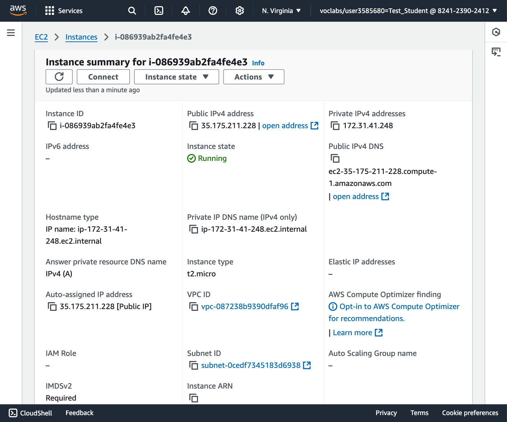
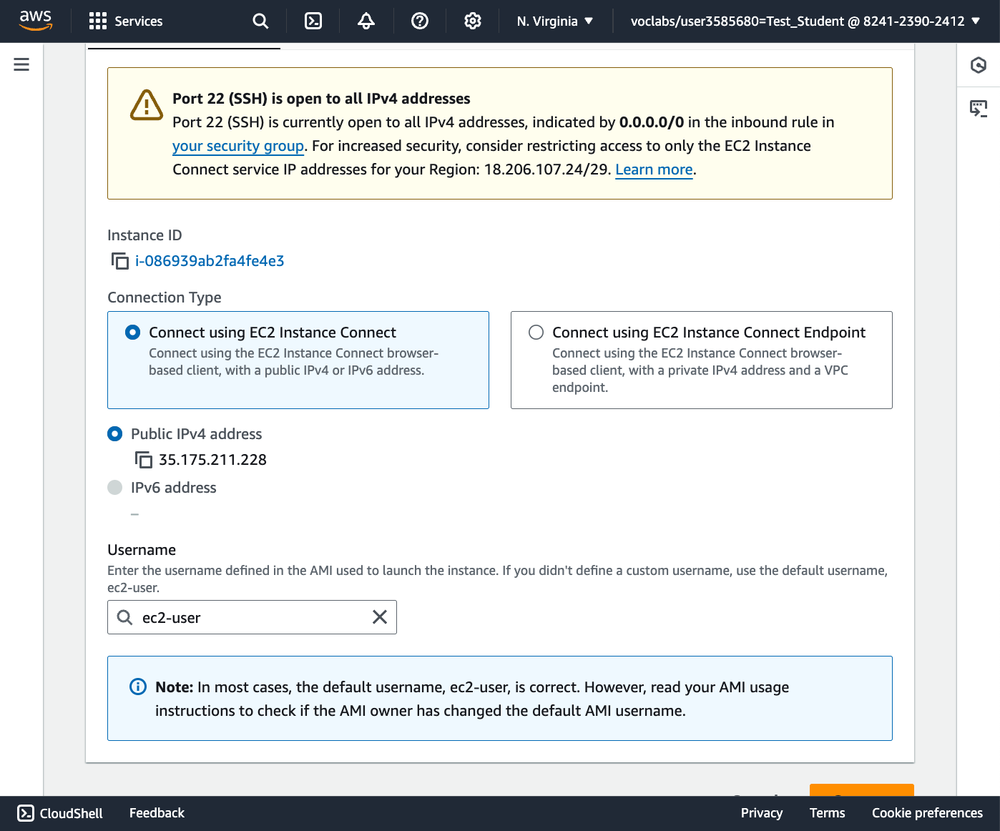
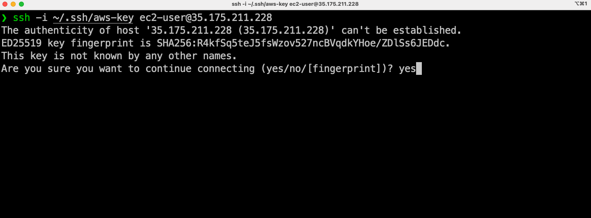
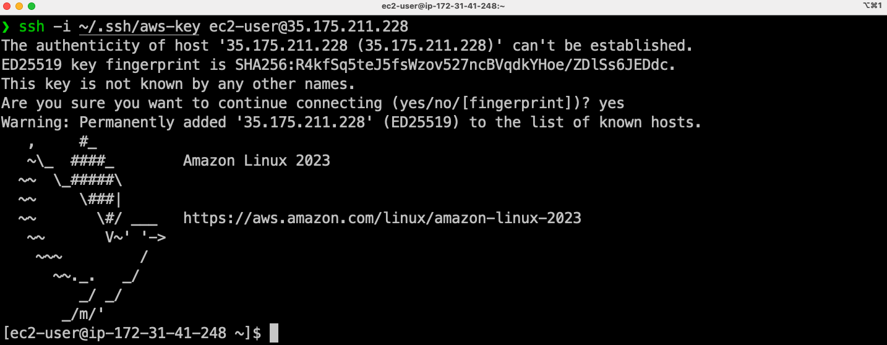
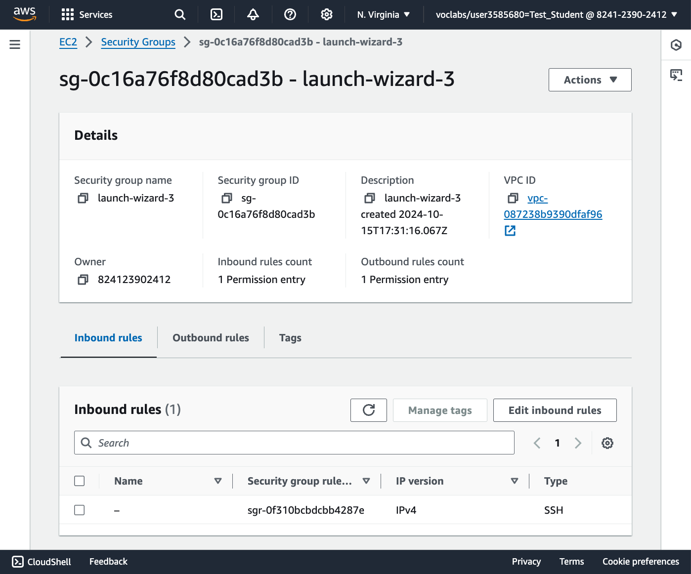
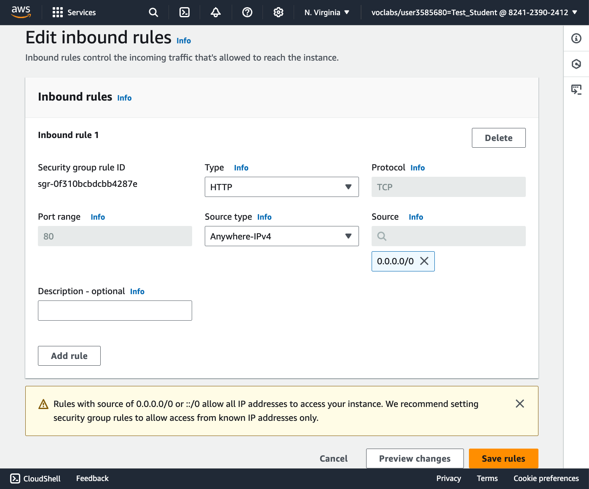
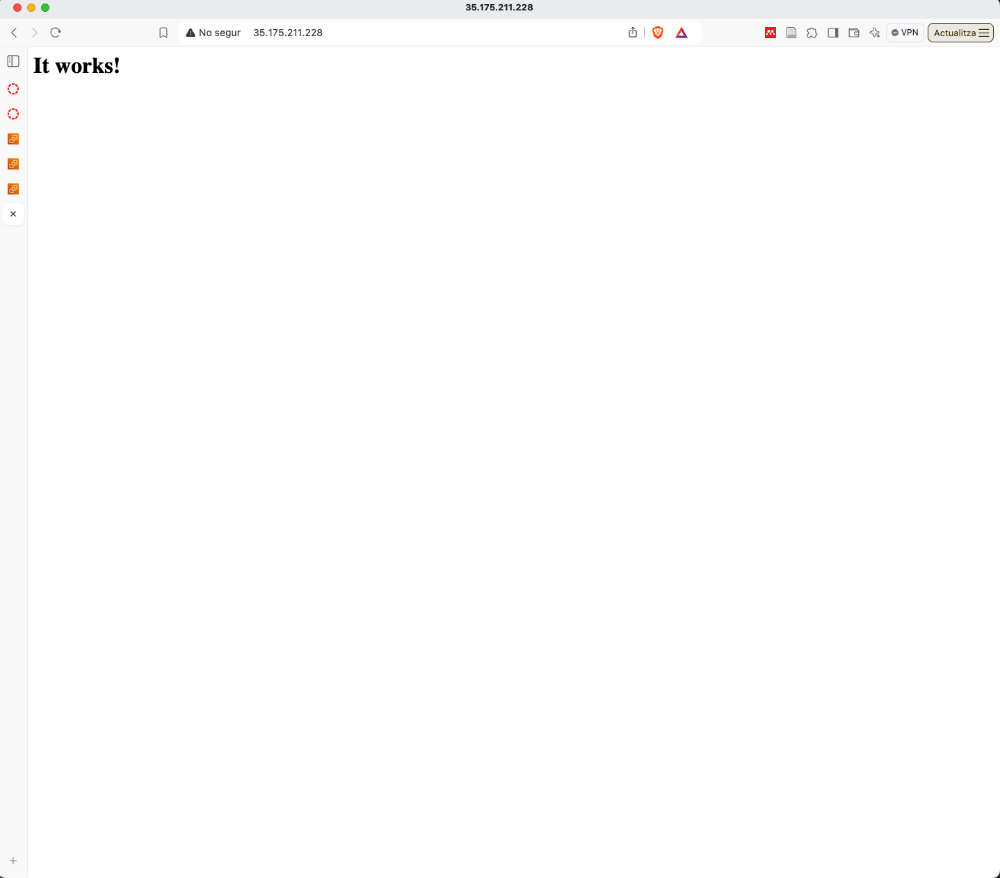

# Creació d'una instància EC2

1. Anem a la consola d'Amazon AWS i cerquem **EC2** a la barra de recerca.
2. A la consola d'Amazon EC2, fem clic a **Launch Instance**.
3. Omplim el formulari amb els paràmetres següents:

   * Name: `WP-01`
   * OS: `Amazon Linux 2023 AMI`
   * Instance Type: `t2.micro`
   * Key Pair: `AMSA`
   * Network: Per defecte
     * Activeu *Allow SSH traffic from anywhere*.

4. Cliqueu a **Launch**.
5. Espereu uns minuts fins que la instància estigui en marxa.
6. Un cop en marxa, feu clic al identificador de la instància per veure els detalls.

    

7. Feu clic a **Connect** per veure les instruccions per connectar-vos a la instància.

    

8. Obriu una terminal i connecteu-vos a la instància amb la comanda `ssh -i ~/.ssh/aws-key ec2-user@IP`.

    

9. Si tot ha anat bé, ja esteu connectats a la instància EC2.

    

10. Un cop connectats, ja podem repetir els passos per instal·lar **Apache** com vam fer a la màquina local.

    ```bash
    sudo dnf install httpd -y
    sudo systemctl start httpd
    sudo systemctl enable httpd
    ```

11. Obriu un navegador i poseu la IP de la instància EC2. En aquest punt, veureu que no podeu accedir a la pàgina web.

    * Si reviseu la màquina virtual, observareu que el firewall està desactivat i per tant, no és el culpable.
    * El núvol d'Amazon té un firewall per defecte que bloqueja el tràfic a les instàncies. Aquest firewall es diu **Security Group** i s'ha de configurar per permetre el tràfic HTTP.
  
12. Anem a la consola d'Amazon EC2 i als detalls de la instància, fem clic a **Security** i **Security Groups**.

    

13. Feu clic a **Edit inbound rules** i afegiu una regla nova per permetre el tràfic HTTP.

    * Type: `HTTP`
    * Source: `Anywhere`
    * Description: `Allow HTTP traffic`
    * Cliqueu a **Save rules**.

    

14. Torneu a la pàgina web i refresqueu-la. Ara ja veureu la pàgina web d'Apache.

    

    > **Nota**:
    >
    > Si feu clic als enllaços igual el navegador cerca *https* i no *http*. De moment no tenim configurat el certificat SSL i per tant, no funcionarà. Assegureu-vos de posar *http* a la barra d'adreces i si teniu https, eliminar la *s* manualment i refrescar la pàgina.

15. Ara ja podem instal·lar **PHP** igual que vam fer a la màquina local.

    ```bash
    sudo dnf install php8.1 -y
    sudo dnf install php-curl php-zip php-gd php-soap php-intl php-mysqlnd php-pdo -y
    sudo systemctl restart httpd
    ```
