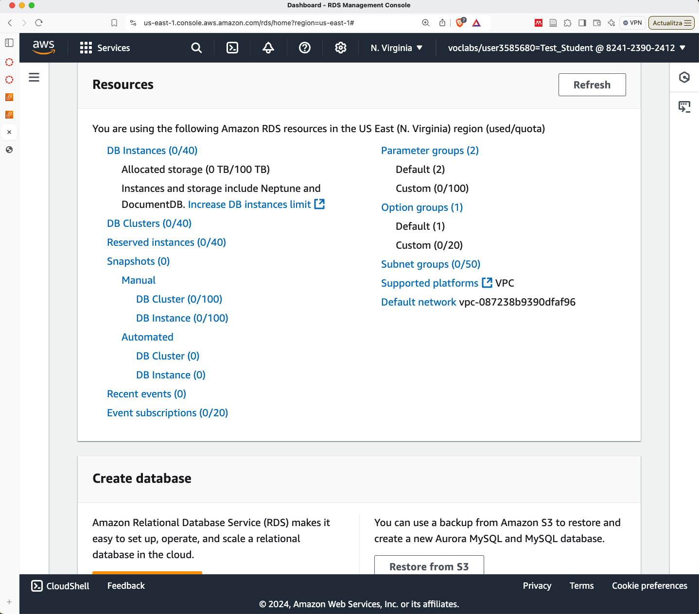
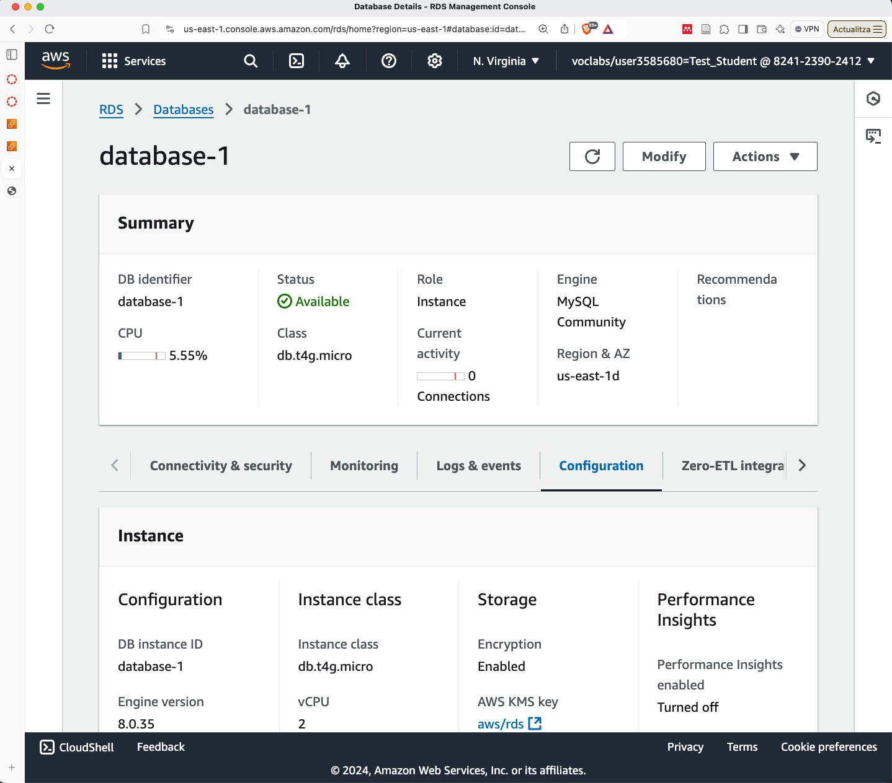

# Bases de dades RDS

El servei de bases de dades relacional d'Amazon Web Services (RDS) és una opció molt interessant per a desplegar bases de dades MySQL, MariaDB, PostgreSQL, Oracle, SQL Server i Aurora. Aquest servei ofereix una gestió fàcil i eficient de les bases de dades, així com la possibilitat de fer còpies de seguretat, escalabilitat i alta disponibilitat.

Per utiltizar RDS amb WordPress, seguirem els següents passos:

1. Anem a la consola de **Amazon RDS**.

    

2. A la consola de **Amazon RDS**, fem clic a **Create database**.

    * Seleccionem el mode **Standard Create**.
    * Seleccionem el motor de base de dades **MySQL**.
    * Seleccionem la versió de la base de dades **MySQL 8.0.25**.
    * Seleccionem la plantilla **Free tier**.
    * Nom de la base de dades **wordpress**.
    * Master username **admin**.
    * Seleccioneu *auto-generate a password*.

    La resta de paràmetres els deixarem per defecte.

    > **Recordatori**:
    >
    > Fer clic a Connection details per veure la password generada. Si no ho feu, haureu d'anar a modificar, regenerar la password i aplicar els canvis.

3. Espereu uns minuts fins que la base de dades estigui en marxa.

    

4. Ara ja podem connectar-nos a la base de dades amb un client MySQL com **MySQL Workbench** o **phpMyAdmin**.

    * Hostname: `database-1.cik8jidkherq.us-east-1.rds.amazonaws.com`
    * Port: `3306`
    * Username: `admin`
    * Password: `XXXXXXXXXXXXXXX`

    > **Nota**:
    >
    > Per simplicitat, instal·larem el client MySQL a la mateixa instància EC2 on tenim instal·lat **Apache** i **PHP**.
    > `sudo dnf install mariadb105 -y`

5. Un cop connectats, ja podem crear la base de dades **wordpress** i l'usuari **wordpress** amb tots els permisos.

    ```bash
    mysql -h database-1.cik8jidkherq.us-east-1.rds.amazonaws.com -u admin -p
    ```

    Ups! No ens podem connectar a la base de dades. Això és degut a que la base de dades està protegida per un **Security Group** que no permet connexions des de l'exterior. Per solucionar-ho, hem d'afegir una regla al **Security Group** de la base de dades per permetre connexions des de la instància EC2.

    ```sql
    CREATE DATABASE wordpress;
    CREATE USER 'wordpress'@'%' IDENTIFIED BY 'wordpress';
    GRANT ALL PRIVILEGES ON wordpress.* TO 'wordpress'@'%';
    FLUSH PRIVILEGES;
    ```