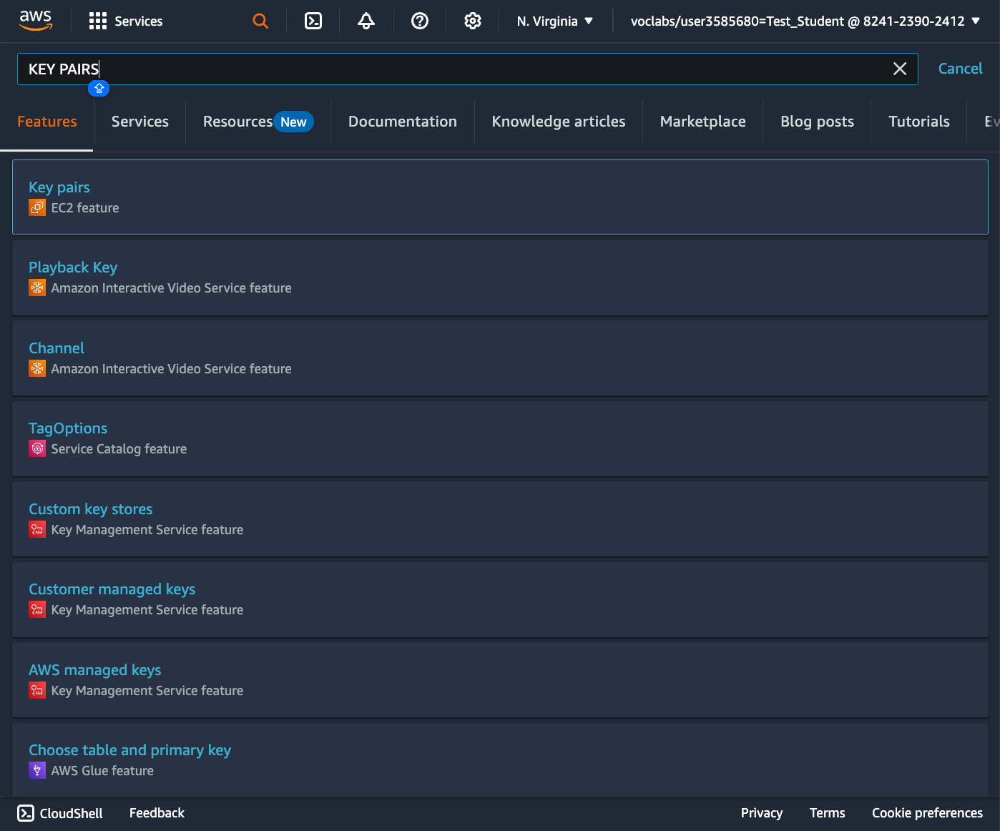
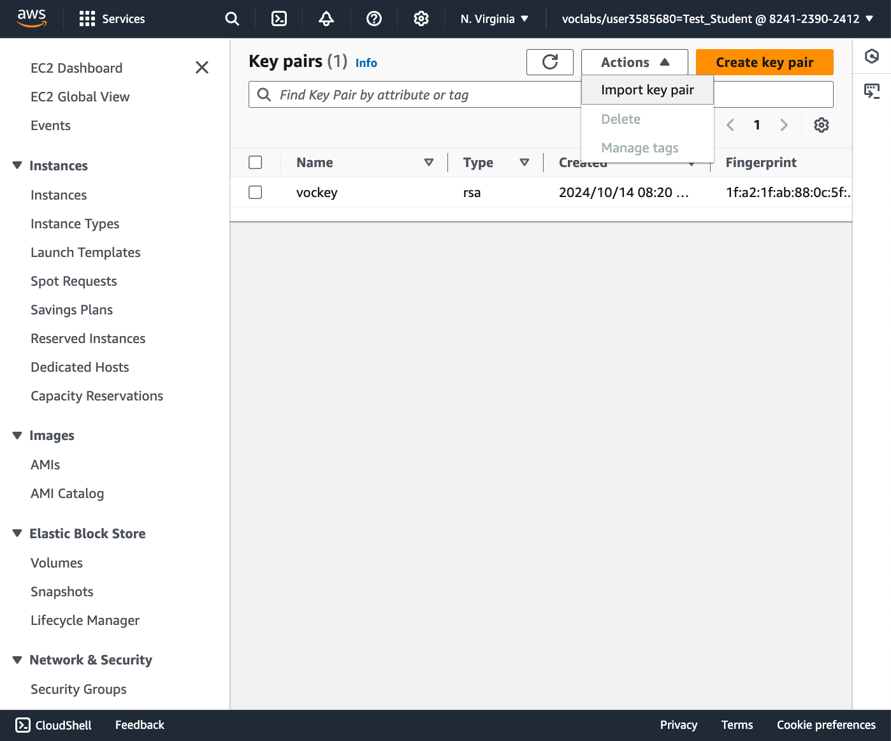
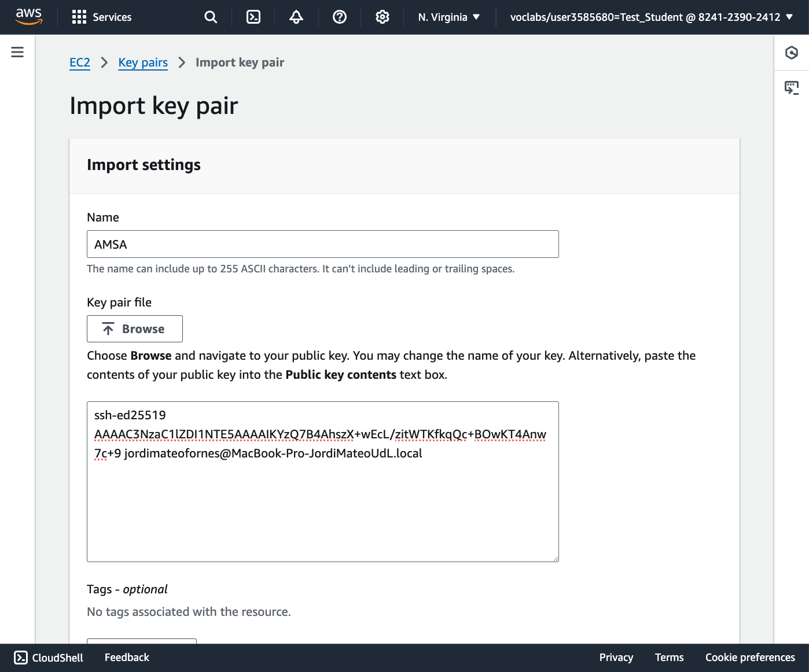
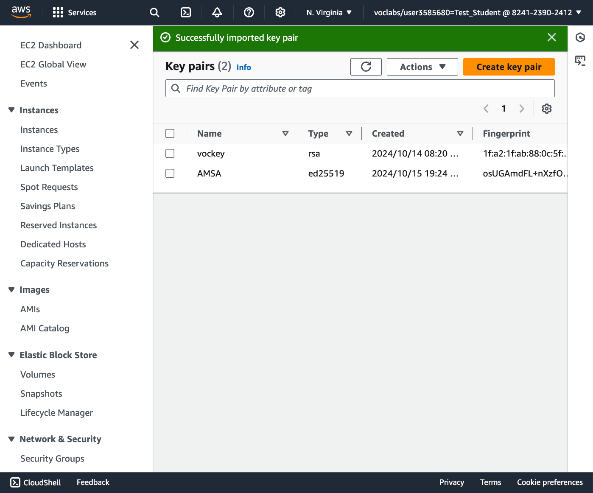

# Configuració de la clau SSH

La clau SSH és un mecanisme de seguretat que permet l'autenticació segura entre dos sistemes. Per a la connexió amb el servidor d'Amazon EC2, utilitzarem una clau SSH per autenticar-nos. Aquesta clau SSH es pot crear amb la utilitat `ssh-keygen` que ve amb la majoria de sistemes Linux o podeu fer servir una power shell de Windows.

En aquest mecanisme, el servidor d'Amazon EC2 té la clau pública i el client té la clau privada. Quan el client es connecta al servidor, el servidor comprova si la clau pública del client coincideix amb la clau privada del servidor. Si les claus coincideixen, el client es connecta al servidor. Per tant, la clau privada no s'ha de compartir amb ningú. Mentre que la clau pública es pot compartir amb qualsevol i la podeu fer servir en múltiples servidors. A dia d'avui, no hi ha cap mecanisme per obtenir la claue privada a partir de la clau pública.

## Creació de la clau SSH

La comanda `ssh-keygen` permet crear una clau SSH. Aquesta comanda té diversos paràmetres que permeten personalitzar la clau SSH. Els paràmetres més comuns són:

* `-t`: Especifica el tipus de xifratge de la clau. Els tipus més comuns són rsa, dsa, ecdsa i ed25519.
* `-f`: Especifica el nom del fitxer on es guardarà la clau.
* `-b`: Especifica la longitud de la clau en bits.

En el nostre cas crearem una clau SSH amb el tipus de xifratge `ed25519` i la guardarem al fitxer `~/.ssh/aws-key`.

```bash
ssh-keygen -t ed25519 -f ~/.ssh/aws-key
Enter passphrase (empty for no passphrase): 
Ener same passphrase again:
```

> **Nota**:
>
> Si no voleu posar una contrasenya a la clau, simplement premeu la tecla `Enter` quan us demani la contrasenya.

Aquesta comanda generarà dues claus, una clau privada `~/.ssh/aws-key` i una clau pública `~/.ssh/aws-key.pub`.

## Configuració de la clau SSH a Amazon EC2

1. Inicieu sessió al vostre compte d'Amazon Educate, aneu a moduls del Learner Lab. AWS. Fent clic a **Start lab** i quan el laboratori estigui en marxa, feu clic a la icona verda per obrir la consola d'Amazon AWS.

2. A la consola d'Amazon AWS, cerqueu **KEY PAIRS** a la barra de recerca i feu clic a **Key Pairs** relacionades amb el servei **EC2**.

    

3. Feu clic a **Actions** i seleccioneu **Import Key Pair**.

    

4. Copieu el contingut de la clau pública `~/.ssh/aws-key.pub` i enganxeu-lo al camp **Public key contents**.

    

5. Doneu un nom a la clau i feu clic a **Import key pair**.

6. La clau s'importarà amb èxit i la podreu veure a la llista de claus.

    
