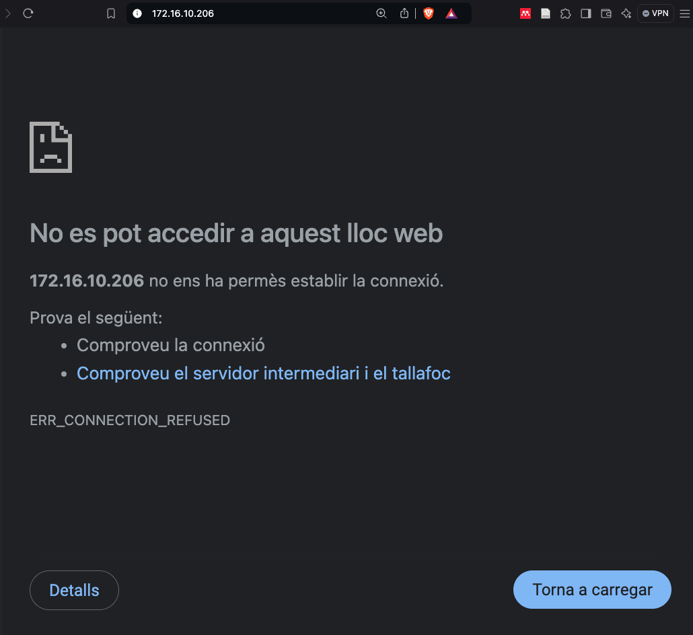
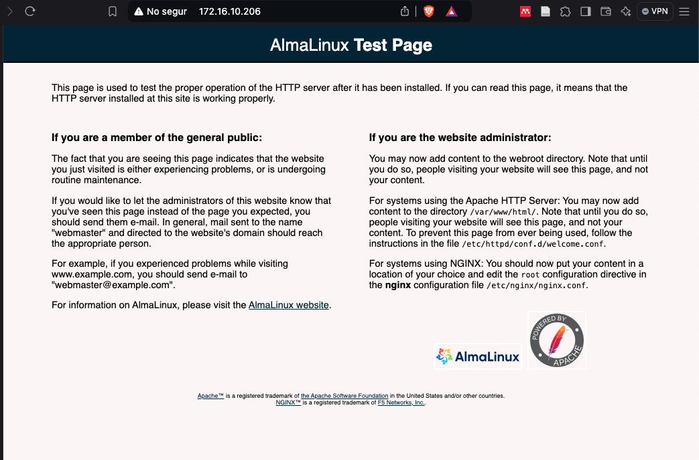

# Instal·lant i configurant Apache

El primer pas per desplegar un servidor web amb **WordPress** és instal·lar i configurar un servidor web. Necessitem la versió 2.4 o superior d'**Apache** per a la nostra instal·lació. 

1. Comprovem si el paquet **httpd** està disponible:

    ```sh
    dnf search httpd
    ```

    La sortida hauria de mostrar el paquet **httpd** i les seves dependències.

    ```text
    Last metadata expiration check: 0:00:00 ago on Tue 15 Feb 2022 09:00:00 PM UTC.
    ============== Name Exactly Matched: httpd ==============
    httpd.x86_64 : Apache HTTP Server
    ```

    Si el paquet esta disponible, primer revisarem la informació del paquet amb la comanda `dnf info httpd`.

    ```text
    Installed Packages
    Name         : httpd
    Version      : 2.4.57
    Release      : 11.el9_4.1
    Architecture : aarch64
    Size         : 155 k
    Source       : httpd-2.4.57-11.el9_4.1.src.rpm
    Repository   : @System
    From repo    : appstream
    Summary      : Apache HTTP Server
    URL          : https://httpd.apache.org/
    License      : ASL 2.0
    Description  : The Apache HTTP Server is a powerful, efficient, and extensible
                : web server.
    ```

    Un cop ens assegurem que el paquet està disponible amb la versió correcta, procedirem a la instal·lació.

2. Instal·lem el dimoni httpd:

    ```sh
    dnf install httpd -y
    ```

3. Comprovem l'estat del servei amb `systemctl`:

    ```sh
    systemctl status httpd
    ```

4. Visualitzem els fitxers de configuració del servei *httpd*:

    ```sh
    less /usr/lib/systemd/system/httpd.service
    ```

    ```text
    [Unit]
    Description=The Apache HTTP Server
    Wants=httpd-init.service
    After=network.target remote-fs.target nss-lookup.target httpd-init.service
    Documentation=man:httpd.service(8)

    [Service]
    Type=notify
    Environment=LANG=C

    ExecStart=/usr/sbin/httpd $OPTIONS -DFOREGROUND
    ExecReload=/usr/sbin/httpd $OPTIONS -k graceful
    # Send SIGWINCH for graceful stop
    KillSignal=SIGWINCH
    KillMode=mixed
    PrivateTmp=true
    OOMPolicy=continue

    [Install]
    WantedBy=multi-user.target
    ```

    Aquest fitxer de configuració conté instruccions com:

   * `ExecStart=/usr/sbin/httpd $OPTIONS -DFOREGROUND`: Defineix la comanda que s'utilitza per iniciar el servei. El mode foreground permet veure la sortida al terminal, útil per a la depuració.
   * `ExecReload=/usr/sbin/httpd $OPTIONS -k graceful`: Permet recarregar la configuració del servidor sense interrompre les connexions actives, garantint que els canvis es puguin aplicar de manera controlada.
   * `KillSignal=SIGWINCH`: El senyal que s'envia per aturar el servei, assegurant una parada segura.
   * `PrivateTmp=true`: Millora la seguretat creant un sistema de fitxers temporal privat per al servei.
   * `OOMPolicy=continue`: Defineix el comportament del sistema en cas de manca de memòria, permetent que el servei continuï executant-se.

5. Habiliteu el servei per iniciar cada cop que el sistema arranqui:

    ```sh
    systemctl enable httpd
    ```

6. Arranqueu i comproveu l'estat del servei:

    ```sh
    systemctl start httpd
    systemctl status httpd
    ```

Un cop aixecat el servei, podem comprovar que el servei està en marxa i funcionant correctament. Intenteu accedir al servidor web amb la vostra **IP** a través d'un navegador web. En el meu cas, la IP del servidor és **:127.16.10.206**. Recordeu que per veure la IP del vostre servidor podeu utilitzar la comanda `ip a`.



Observareu que no és possible accedir-hi i rebeu un missatge d'error **ERR_CONNECTION_REFUSED**. Això és normal, ja que AlmaLinux té un firewall activat per defecte que bloqueja el tràfic al port 80, que és el port per defecte del servidor web Apache.

```sh
systemctl status firewalld
```

```text
● firewalld.service - firewalld - dynamic firewall daemon
     Loaded: loaded (/usr/lib/systemd/system/firewalld.service; enabled; vendor preset: enabled)
     Active: active (running) since Tue 2022-02-15 21:00:00 UTC; 1h 30min ago
```

Si desactiveu el servei de **firewalld**, podreu accedir al servidor web Apache. No obstant això, això no és una pràctica segura, ja que el **firewall** és una capa de seguretat important per protegir el vostre servidor.

```sh
systemctl stop firewalld
```



En aquest punt, podeu comprovar que el servidor web Apache està funcionant correctament.

## Configuració del firewall

El firewall és un servei o programa que protegeix la xarxa del vostre servidor control·lant el tràfic de xarxa que entra i surt del servidor. Això és important per garantir que el vostre servidor sigui segur i protegit contra atacs maliciosos. Permetre només el tràfic necessari i bloquejar el tràfic no desitjat és una pràctica de seguretat recomanada per mantenir el vostre servidor segur. En aquest cas, necessitem permetre el tràfic HTTP (port 80) perquè el servidor web Apache sigui accessible des de l'exterior però bloquejar altres ports i serveis no necessaris.

En tots els sistmes linux el firewall es configura utilitzant les `iptables`. En el nostre cas, podem veure les regles amb la comanda `iptables -L`. Permetre el tràfic HTTP (port 80) amb les `iptables` seria:

```sh
iptables -A INPUT -m state --state NEW -m tcp -p tcp --dport 80 -j ACCEPT
iptables -A INPUT -m state --state NEW -m udp -p udp --dport 80 -j ACCEPT
```

on:

* `-A INPUT`: Afegeix una regla a la cadena INPUT (paquets que entren al servidor).
* `-m state --state NEW`: Només s'aplica a paquets nous.
* `-m tcp -p tcp`: Només s'aplica a paquets TCP.
* `-M udp -p udp`: Només s'aplica a paquets UDP.
* `--dport 80`: Només s'aplica als paquets que arriben al port 80.
* `-j ACCEPT`: Accepta els paquets que compleixen les condicions anteriors.

Però, tenim eines que ens faciliten la tasca com `firewalld` o `ufw`. En aquest cas, utilitzarem `firewalld`. Firewalld és un firewall dinàmic per a sistemes Linux que proporciona una interfície de línia de comandes i una interfície gràfica per gestionar les regles del firewall. Firewalld té un programa de comandament anomenat `firewall-cmd` que us permet gestionar les regles del firewall de manera senzilla i eficaç. Per permetre el tràfic HTTP (port 80) amb `firewalld`, podeu utilitzar la comanda següent:

```sh
firewall-cmd --add-service=http --permanent
```

on:

* `--add-service=http`: Afegeix una regla per permetre el tràfic HTTP.
* `--permanent`: Afegeix la regla de manera permanent, la qual cosa significa que es mantindrà després de reiniciar el sistema.

Per aplicar els canvis, cal recarregar el **firewall** amb la comanda següent:

```sh
firewall-cmd --reload
```

Amb aquesta configuració, el vostre **firewall** està configurat per permetre el tràfic *HTTP (port 80)* al vostre servidor. Per verificar que la configuració del **firewall** s'ha aplicat correctament i que el servei HTTP està habilitat, podeu utilitzar la següent comanda:

```sh
firewall-cmd --list-all
```

Aquesta comanda mostrarà la sortida amb informació detallada sobre la configuració actual del **firewall**. Per identificar si el servei HTTP està habilitat, busqueu la secció services i verifiqueu que aparegui el servei http com a un dels serveis habilitats.

La sortida hauria de semblar-se així:

```yaml
public
  target: default
  icmp-block-inversion: no
  interfaces:
  sources:
  services: cockpit dhcpv6-client http ssh
  ports:
  protocols:
  forward: no
  masquerade: no
  forward-ports:
  source-ports:
  icmp-blocks:
  rich rules:
```

En aquest exemple, podeu veure que el servei HTTP està habilitat, la qual cosa significa que el tràfic HTTP hauria de ser permès a través del firewall. A més a més, podeu veure altres serveis com el servei SSH, el servei DHCPv6-client i el servei Cockpit que també estan habilitats. Aquests serveis són necessaris per a la gestió del servidor i per a la connectivitat de xarxa.

Com deshabilitareu la regla per bloquejar el tràfic?

```sh
firewall-cmd --remove-service=http --permanent
firewall-cmd --reload
```
