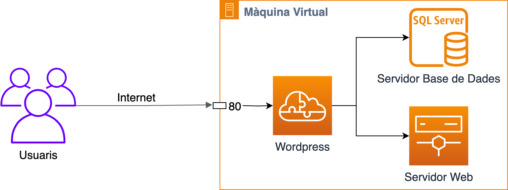

# Desplegant un servidor web: Wordpress

En aquest laboratori, desplegarem un servidor web senzill amb **WordPress**, una de les plataformes de gestió de continguts (CMS) més populars del món. WordPress permet crear i gestionar llocs web de manera intuïtiva i eficient, i és ideal per a projectes com blocs, botigues en línia, portals de notícies, i molt més.

Per a aquest desplegament, utilitzarem una **arquitectura monolítica**, una solució senzilla on tots els components del lloc web es troben en una sola màquina virtual. Aquesta configuració és adequada per a llocs web petits o amb poc trànsit, ja que ofereix una implementació ràpida i fàcil de gestionar. No obstant això, a mesura que el lloc web creixi o augmenti el trànsit, caldrà considerar opcions més complexes, com ara l'escalabilitat horitzontal o vertical.

Si consulteu la web oficial de [**Wordpress**](https://wordpress.org/download), veureu que la versió actual és la 6.6.2. I els seus [requeriments per la instal·lació](https://developer.wordpress.org/advanced-administration/before-install/) són els següents:

* **PHP**: Versió 7.4 o superior.
* **MySQL** o **MariaDB**: MySQL versió 5.7 o superior o MariaDB versió 10.3 o superior.
* **Apache** o **Nginx**: Versió 2.4 o superior per a Apache o versió 1.26 o superior per a Nginx.
* **HTTPS**: Recomanat per a la seguretat del lloc web.

Per tant, haurem de preparar un servidor que compleixi aquests requeriments abans de procedir a la instal·lació de **Wordpress**.

## Requisits

* Màquina virtual amb sistema operatiu **AlmaLinux**.

## Objectius

* Desplegar un servidor web senzill amb **Wordpress**.
* Configurar un servidor web amb **Apache**.
* Configurar una base de dades amb **MariaDB**.
* Configurar un servidor PHP amb **PHP**.
* Instal·lar i configurar **Wordpress**.
* Provar el lloc web de **Wordpress**.
