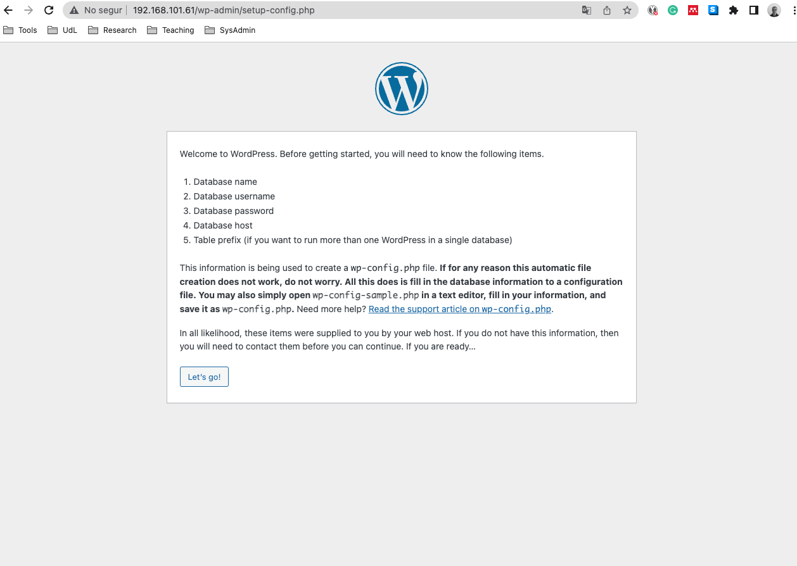
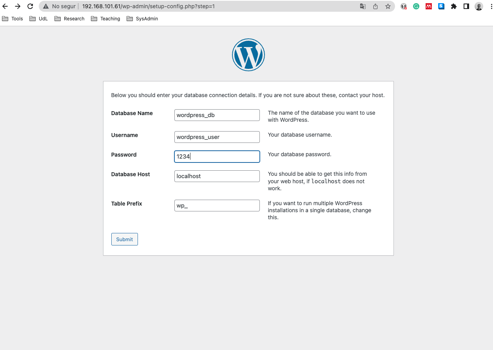
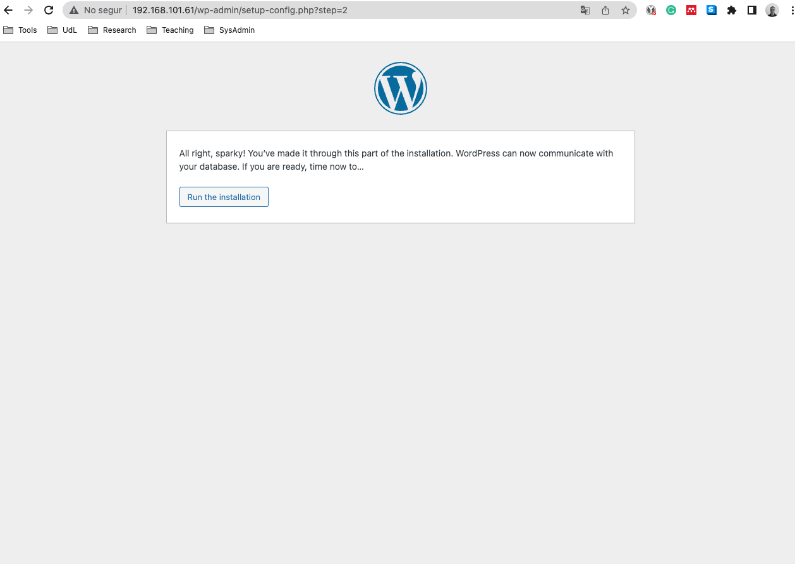
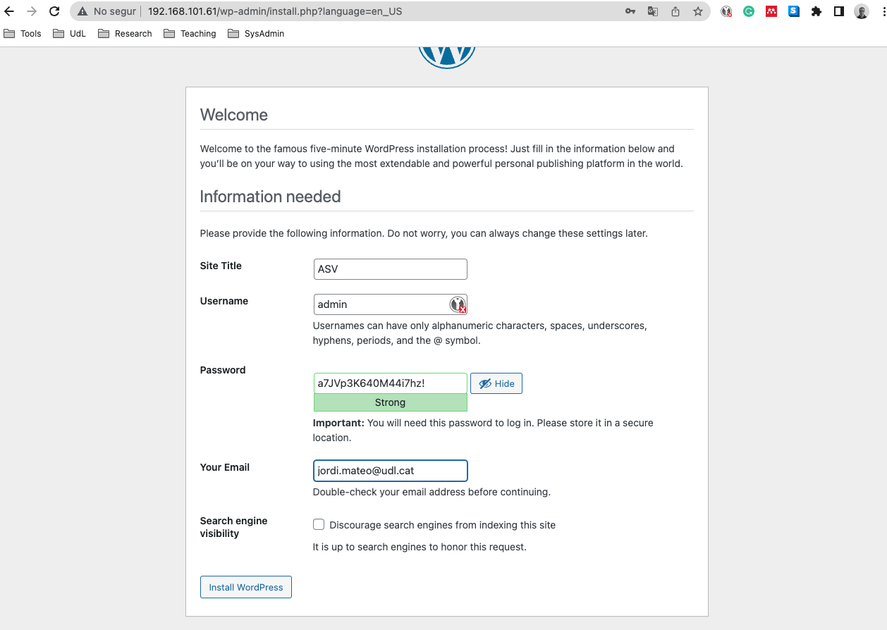
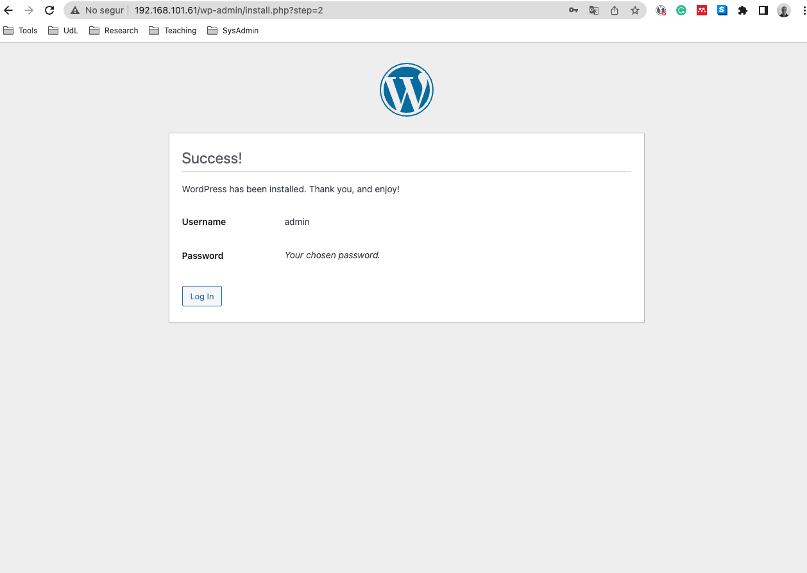
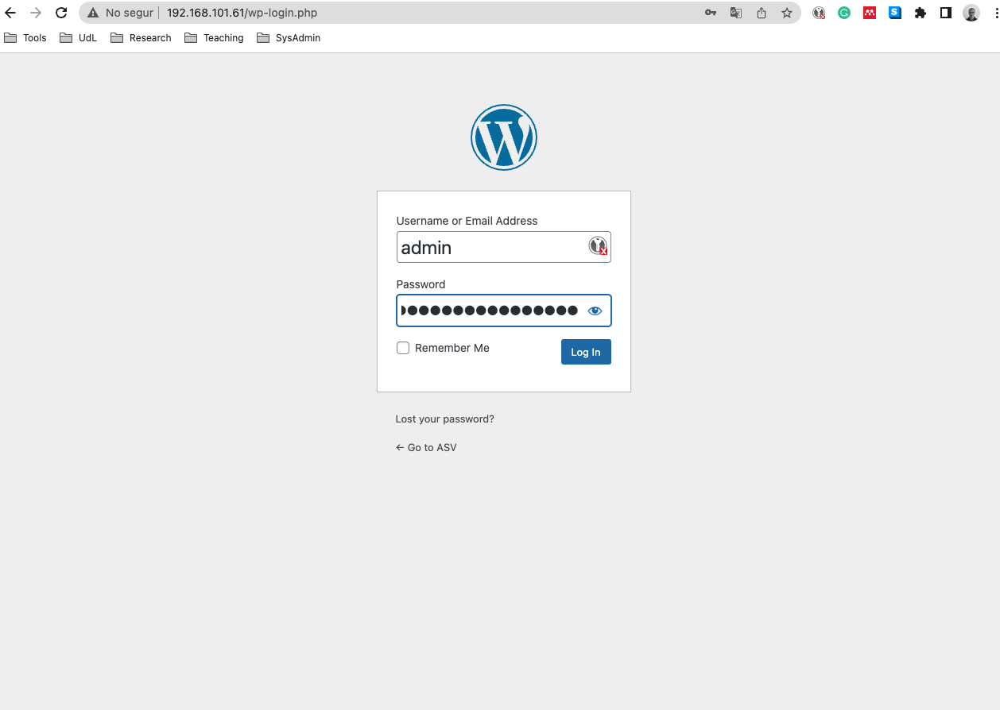
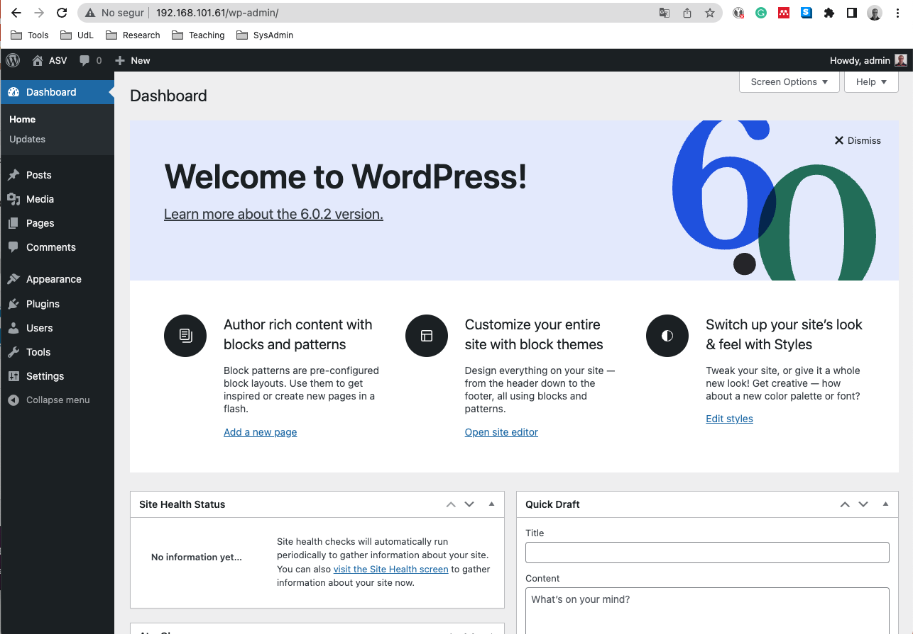

# Instal·lant i configurant Wordpress

Per instal·lar **WordPress** ens hem de baixar el paquet de la web oficial. Per fer-ho podem utilitzar la comanda `wget` per descarregar el paquet de **WordPress**.

1. Instal·lem el paquet **wget**:

    ```sh
    dnf install wget -y
    ```

2. Descarreguem el paquet de **WordPress**:

    Es una bona pràctica utilitzar el directori temporal (*/tmp*) per descarregar el programari a instal·lar com el *Wordpress*. L'ús d'aquest directori ens proporciona:

   * **Espai de disc temporal**: Ubicació on es poden emmagatzemar fitxers sense preocupar-se pel seu ús posterior. És una ubicació amb prou espai de disc disponible, generalment, i sol estar netejada periòdicament pels sistemes operatius per evitar l'acumulació de fitxers temporals innecessaris.

   * **Evitar problemes de permisos**: El directori temporal (*/tmp*) sol tenir permisos que permeten a tots els usuaris crear fitxers temporals sense problemes de permisos. Això és important quan estàs treballant amb fitxers que poden ser manipulats per diversos usuaris o processos.

   * **Seguretat**: Com que el directori temporal és netejat periòdicament, hi ha menys risc de deixar fitxers temporals sensibles o innecessaris al sistema després d'una operació. Això ajuda a prevenir la acumulació de residus i a minimitzar els problemes de seguretat relacionats amb fitxers temporals.

   * **Evitar col·lisions de noms de fitxers**: Utilitzant el directori temporal, es redueixen les possibilitats de col·lisions de noms de fitxers. En altres paraules, si molts usuaris estan descarregant fitxers a la mateixa ubicació, utilitzar el directori temporal ajuda a garantir que els noms de fitxers siguin únics.

   En resum, garanteix l'espai, la seguretat i la gestió adequats per a aquest tipus de fitxers, com és el cas de la descàrrega i descompressió de paquets com WordPress.

    ```sh
    cd /tmp
    wget https://wordpress.org/latest.tar.gz -O wordpress.tar.gz
    ```

3. Després d'haver descarregat el paquet, el descomprimim amb la comanda `tar`:

    ```sh
    dnf install tar -y
    tar -xvf wordpress.tar.gz
    ```

4. Copiem els continguts a la carpeta del servidor **Apache**:

    ```sh
    cp -R wordpress /var/www/html/
    ```

5. Assignem el ownership al usuari **apache**:

    ```sh
    chown -R apache:apache /var/www/html/wordpress
    ```

    El servei **Apache** s'executa amb l'usuari **apache** i el grup **apache** per defecte. Per tant, és important assegurar-se que els fitxers i directoris del lloc web tinguin el propietari i el grup correctes perquè el servidor web pugui accedir-hi i gestionar-los correctament. Aquesta informació la podeu trobar al fitxer de configuració del servidor web, normalment a */etc/httpd/conf/httpd.conf*.

    ```sh
    less /etc/httpd/conf/httpd.conf
    ```

6. Donem permisos (rwx) a l'usuari **apache** i el seu grup i permisos rw per qualsevol altre usuari:

    ```sh
    chmod -R 775 /var/www/html/wordpress
    ```

    Aquesta comanda estableix permisos de lectura, escriptura i execució per a l'usuari **apache** i el seu grup, i permisos de lectura i escriptura per a qualsevol altre usuari. Això permet que l'usuari **apache** pugui llegir, escriure i executar els fitxers i directoris del lloc web, mentre que altres usuaris poden llegir i escriure-hi. Aquesta configuració és adequada per a la majoria dels llocs web i proporciona un equilibri entre la seguretat i la facilitat d'ús. No obstant això, si teniu necessitats específiques de seguretat o de permisos, podeu ajustar aquests permisos segons les vostres necessitats. L'argument `-R` indica que els permisos s'aplicaran de manera recursiva a tots els fitxers i directoris dins de la carpeta especificada.

7. Reiniciem el servei **Apache**:

    ```sh
    systemctl restart httpd
    ```

## Instal·lació del Wordpress

Un cop hàgiu completat aquests passos, ja podeu accedir a la instal·lació web de **WordPress** navegant a [http://ip/wordpress/](http://ip/wordpress/). On *ip* és la ip del vostre servidor. En el nostre cas, la ip del servidor és **172.16.10.206**. Per tant: **http://172.16.10.206/wordpress/**. O bé podeu utilitzar el nom de domini si teniu un configurat.

El primer pas serà completar un formulari amb la informació de la base de dades que hem creat anteriorment. Aquesta informació és necessària per connectar **WordPress** a la base de dades i emmagatzemar-hi la informació del lloc web.

* **Nom de la base de dades**: `wordpress-db`
* **Nom d'usuari de la base de dades**: `wordpress-user`
* **Contrasenya de la base de dades**: `password`
* **Servidor de la base de dades**: `localhost`
* **Prefix de la taula**: `wp_`

Un cop hàgiu introduït aquesta informació, podeu continuar amb el procés d'instal·lació de **WordPress**.

En aquest punt, observareu el missatge d'error *Unable to write to wp-config.php file*  és típic d'un problema de permisos en el sistema de fitxers quan s'intenta escriure un fitxer com el **wp-config.php** durant la instal·lació de **WordPress**. 

Ara bé, ja hem donat permisos a l'usuari **apache** perquè pugui escriure a la carpeta de **WordPress**. El problema resideix en els permisos de **SELinux**.

SELinux és un sistema de seguretat que proporciona controls addicionals de seguretat basats en polítiques. Impedeix que els processos realitzin certes accions que no estan permeses per la política de seguretat. Ho podem comprovar amb la comanda:

```sh
getenforce
```

Aquesta comanda et mostrarà l'estat actual de SELinux, que pot ser **Enforcing**, **Permissive** o **Disabled**. 

Una solució ràpida seria desactivar **SELinux** amb la comanda:

```sh
setenforce 0
```

No obstant això, és millor entendre com funciona i com gestionar-lo adequadament. Aquesta és la manera més segura de resoldre problemes relacionats amb permisos sense comprometre la seguretat del sistema. Quan es configuren les etiquetes **SELinux** correctes i es gestionen els permisos de fitxers de manera adequada, **SELinux** pot oferir una protecció addicional per al vostre sistema.

Mes endavant al curs veurem com configurar **SELinux** de manera adequada. De moment us deixo la resolució del problema amb **SELinux**.

1. Instal·lem les eines de **SELinux** en cas de no tenir-les:

    ```sh
    dnf install policycoreutils-python-utils -y
    ```

2. Configurem les etiquetes **SELinux** per a la carpeta de **WordPress**:

    ```sh
    semanage fcontext -a -t httpd_sys_rw_content_t '/var/www/html/wordpress(/.*)?'
    ```

    on:
    * `-a`: Afegeix una nova regla.
    * `-t httpd_sys_rw_content_t`: Estableix l'etiqueta **SELinux** per als fitxers i directoris de la carpeta de **WordPress**.
    * `'/var/www/html/wordpress(/.*)?'`: Ruta de la carpeta de **WordPress**.


3. Aplicar les etiquetes **SELinux** configurades:

    ```sh
    restorecon -Rv /var/www/html/wordpress
    ```

    on:
    * `-R`: Aplica els canvis de manera recursiva a tots els fitxers i directoris dins de la carpeta especificada.
    * `-v`: Mostra la sortida detallada de les accions realitzades.
    * `/var/www/html/wordpress`: Ruta de la carpeta de **WordPress**.

Amb aquestes accions hem creat una política que permet als processos del servei **httpd** llegir i escriure a la carpeta de **WordPress**.

1. Inici de la configuració:

    

2. Introdueix les dades de la base de dades:

    

3. Realitza la instal·lació:

    

4. Configuració del lloc web:

    

    on:

    * **Site Title**: Títol del lloc.
    * **Username**: Nom d'usuari per accedir al panell d'administració.
    * **Password**: Contrasenya per accedir al panell d'administració.
    * **Your Email**: Correu electrònic per a la recuperació de la contrasenya.

    Un cop hàgiu introduït aquesta informació, podeu continuar amb el procés d'instal·lació de WordPress. Després d'instal·lar amb èxit WordPress, podreu iniciar la sessió al panell d'administració amb el nom d'usuari i la contrasenya que heu triat i començar a personalitzar i gestionar el vostre lloc web.
  
5. Inicia sessió amb les credencials creades:

    

6. Panell d'administració:

    

7. Visualització del lloc web:

    

En aquest punt tenim 2 accessos al nostre servidor web. Un és el panell d'administració de **WordPress** i l'altre és el lloc web en si mateix:

* **Panell d'administració**: [http://ip/wordpress/wp-admin/](http://ip/wordpress/wp-admin/)
* **Lloc web**: [http://ip/wordpress/](http://ip/wordpress/)

On *ip* és la ip del vostre servidor o el vostre nom de domini si teniu un configurat.
